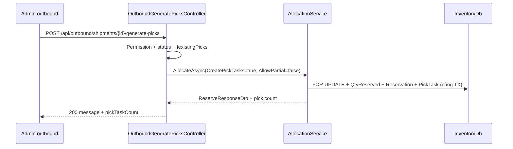

# PHASE 36: Inventory Integrity Hardening (L2-P0)

## Execution Spec Maturity

| Mục | Giá trị |
|---|---|
| **Mức hiện tại** | **✅ Module DoD 100%** (`rp4`+`rp5` 2026-07-22 · dbm 13/0 · verify 14/0) |
| **Trước execute** | 100% Ready (`rp1`+`rp2`+`rp3`) |
| **Trạng thái triển khai** | ✅ **ĐÓNG tài liệu** — L2-P0 CLOSED · §25–§26 |
| **Dev-days** | **3–5** (1 Developer) |
| **Critical Path** | Mở khóa P37 L3 |
| **Port verify API** | `http://localhost:5024/api` |

### Changelog plan

| Ngày | Thay đổi |
|---|---|
| 2026-07-22 | Tạo phase từ SoT `ACCEPTANCE_L2_GENERIC_WMS_FOUNDATION.md` L2-P0-01…03 |
| 2026-07-22 | Auto-critique §19 đóng; maturity **95%** |
| 2026-07-22 | **`rp1` 100% Ready:** Disk freeze §20 — circular ref Inventory↛Allocation; CHECK đã có; route `api/outbound`; CreatePickTasks cùng TX; response FE; CompletePick reserved guard |
| 2026-07-22 | **`rp2` /17-auto-plan:** Function index + brain EP0–EP6 + critic **9.5**; §21; maturity giữ **100% Ready** |
| 2026-07-22 | **`rp3` PASS:** §22 đóng BS-R3-01…18 (Wave picks, QC seed verify, DI/ef/copy-paste); brain plan refine; **0 điểm mù block** |
| 2026-07-22 | **`/18-auto-execute`:** EP0–EP6 DONE; verify_l2_p0 **14/0**; verify_allocation PASS; Module DoD **100%**; §23 |
| 2026-07-22 | **`dbm` PASS:** browser **13/0** · video · walkthrough `evidence/phase_36_dbm/` · §24 · DoD §14 all `[x]` |
| 2026-07-22 | **`rp4`+`rp5`:** Disk reindex **FAIL=0**; Module DoD **100%**; đóng tài liệu phase/master/brain §25–§26; function_index → `planning/` |

### Quyết định khóa

| Câu hỏi | Quyết định |
|---|---|
| Engine SoT | Chỉ `IAllocationService.AllocateAsync` |
| **Circular project ref** | Inventory **không** reference Allocation. **P0-01:** chuyển `GeneratePicks` sang module **Allocation** (controller mới); **xóa** method cũ khỏi `OutboundController` |
| URL FE | **Giữ** `POST /api/outbound/shipments/{id}/generate-picks` (`frontend/.../outbound/page.tsx`) |
| Strategy mặc định | **FEFO**; query optional `?strategy=FIFO` |
| AllowPartial | **false** |
| PickTask | **`CreatePickTasks=true` trong cùng transaction Allocate** (không materialize sau Commit — tránh orphan reservation) |
| `ReserveRequestDto` | Thêm `CreatePickTasks` (bool, default false) — Wave/reserve API cũ không đổi hành vi |
| Invariant app | `InventoryIntegrityInterceptor` trên `InventoryDbContext` |
| Invariant DB | **Đã có** `chk_inventory_balances_qty_reserved` + `chk_inventory_balances_qty_available`. P36 **chỉ thêm** `qty_on_hand >= 0` nếu thiếu |
| CompletePick | Thêm guard `QtyReserved >= PickedQty` → `RESERVED_UNDERFLOW` (P0-02) |
| DF-01 | Offline MOVE: `(QtyOnHand - QtyReserved) >= qty` + `INSUFFICIENT_QTY` |
| Response GeneratePicks | Giữ field `message` (FE hiện tại); **thêm** `shipmentId`, `status`, `pickTaskCount` (non-breaking) |
| M1 / UI | **Out of scope** |

---

## 1. Mục tiêu

Đóng **L2-P0** trước pilot khách generic:

1. **P0-01** — Một luồng cấp phát (bỏ FIFO `LotNo` trong `GeneratePicks`).  
2. **P0-02** — Invariant tồn tập trung (không âm / reserved không vượt on-hand).  
3. **P0-03** — DF-01: offline MOVE khớp available online.

---

## 2. Phạm vi (Scope)

### In scope

| # | Deliverable |
|---|---|
| 1 | `ReserveRequestDto.CreatePickTasks` + logic tạo `PickTask` **trong** `AllocationService.AllocateAsync` (cùng TX) |
| 2 | Controller mới module Allocation: `OutboundGeneratePicksController` route `api/outbound` — method GeneratePicks |
| 3 | **Xóa** `OutboundController.GeneratePicks` (Inventory) — tránh duplicate endpoint |
| 4 | `InventoryIntegrityInterceptor` + đăng ký DI cạnh `AuditInterceptor` |
| 5 | Migration **chỉ** `chk_inventory_balances_qty_on_hand` (`qty_on_hand >= 0`) nếu chưa có trên DB |
| 6 | `CompletePick`: guard `QtyReserved >= PickedQty` → `RESERVED_UNDERFLOW` |
| 7 | Fix `MobileController` SyncOffline MOVE (DF-01) |
| 8 | `tests/verify_l2_p0_integrity.ps1` |
| 9 | Cập nhật `ACCEPTANCE_L2_…` P0 = CLOSED + re-score |
| 10 | Evidence `planning/evidence/phase_36/` |

### Non-negotiable output

- Mọi generate-picks / allocate+pick dùng **QC Release + FEFO/FIFO** của `AllocationService`.  
- Không circular `Inventory.csproj` → `Allocation.csproj`.  
- Không path ghi `inventories` vượt invariant (app interceptor + DB check).  
- Offline MOVE không cướp reserved.  
- Regression: `tests/verify_allocation.ps1` + `tests/verify_wave_picking.ps1` PASS; FE outbound generate-picks vẫn 200.  
- **Không** tồn tại `verify_outbound.ps1` trên disk — không lấy làm gate.

### Out of scope

- UI redesign (P38) · L3 UAT/cutover (P37) · Serial hybrid · OrderNo sequence · M1 · đổi URL FE · tạo `Allocation.Abstractions` (Option B dự phòng, không P0).

---

## 3. Điều kiện đầu vào (Readiness)

- [x] Phase 13 Allocation ✅ · Phase 07/Outbound ✅ · Phase 09 Mobile ✅ · Phase 34 QcGate ✅  
- [x] L2 SoT đã công bố P0  
- [ ] FOUNDER **Proceed** Phase 36  
- [ ] Branch sạch / API local chạy được cho verify

---

## 4. Setup / cấu trúc

```text
backend/modules/Nexustock.Modules.Allocation/
  Dtos/AllocationDtos.cs                      # EXTEND CreatePickTasks
  Services/AllocationService.cs               # EXTEND CreatePickTasks trong TX
  Controllers/OutboundGeneratePicksController.cs  # NEW — Route api/outbound

backend/modules/Nexustock.Modules.Inventory/
  Controllers/OutboundController.cs           # DELETE GeneratePicks method only
  Controllers/MobileController.cs             # FIX DF-01 + CompletePick reserved guard cùng file Outbound
  Controllers/OutboundController.cs           # FIX CompletePick RESERVED_UNDERFLOW
  Interceptors/InventoryIntegrityInterceptor.cs  # NEW
  Exceptions/InventoryInvariantException.cs   # NEW
  DependencyInjection.cs                      # WIRE interceptor
  Migrations/YYYYMMDDHHMMSS_AddQtyOnHandNonNegativeCheck.cs  # NEW (chỉ on_hand>=0)
  Contexts/InventoryDbContext.cs              # Fluent thêm check on_hand>=0

tests/verify_l2_p0_integrity.ps1              # NEW
planning/evidence/phase_36/                   # NEW khi execute
```

**Cấm:** thêm `ProjectReference` Inventory → Allocation (circular với Allocation → Inventory).

Quy chuẩn: comment tiếng Việt; JSON camelCase; errorCode UPPER_SNAKE.

---

## 5. Permissions

**Không seed permission mới.** Giữ:

- `Outbound.Picks.Execute` — GeneratePicks  
- Mobile sync — permission hiện có Phase 09  

---

## 6. Database

### 6.1 Không đổi bảng nghiệp vụ

Giữ `inventories`, `allocation_reservations`, `pick_tasks`, `shipments`, `shipment_items`.

### 6.2 CHECK hiện có trên disk (KHÔNG tạo lại)

Evidence: `InventoryDbContext` + migration `20260714012515_AddAllocationIndexAndConstraints`:

| Constraint | SQL |
|---|---|
| `chk_inventory_balances_qty_reserved` | `qty_reserved >= 0.0` |
| `chk_inventory_balances_qty_available` | `qty_on_hand >= qty_reserved` |

### 6.3 Migration P36 (bổ sung duy nhất)

```sql
-- UP (idempotent: chỉ ADD nếu chưa tồn tại)
ALTER TABLE inventories
  ADD CONSTRAINT chk_inventory_balances_qty_on_hand
  CHECK (qty_on_hand >= 0.0);

-- DOWN
ALTER TABLE inventories DROP CONSTRAINT IF EXISTS chk_inventory_balances_qty_on_hand;
```

Fluent đồng bộ trong `InventoryDbContext`:

```csharp
t.HasCheckConstraint("chk_inventory_balances_qty_on_hand", "qty_on_hand >= 0.0");
```

**Pre-check:** `SELECT COUNT(*) FROM inventories WHERE qty_on_hand < 0` → phải 0 trước migrate.

### 6.4 Computed `qty_available`

Giữ `qty_on_hand - qty_reserved` stored — không đổi.

---

## 7. Backend & API Contract

### 7.1 Endpoint (disk + FE đúng)

`POST /api/outbound/shipments/{id}/generate-picks`  
Auth: Bearer + `Outbound.Picks.Execute`  
Query optional: `strategy` = `FEFO` | `FIFO` (default `FEFO`)  
Controller: **Allocation** `OutboundGeneratePicksController` — **không** còn trong `OutboundController`.

**Response 200 (non-breaking với FE hiện tại chỉ cần 2xx):**

```json
{
  "message": "Sinh pick tasks thành công",
  "shipmentId": "3fa85f64-5717-4562-b3fc-2c963f66afa6",
  "status": "Allocated",
  "pickTaskCount": 3
}
```

**400/404:**

| errorCode | Khi |
|---|---|
| `SHIPMENT_NOT_FOUND` | 404 |
| `INVALID_SHIPMENT_STATUS` | Không thuộc `{ Open }` **hoặc** (edge) đã Allocated nhưng không có reservation ACTIVE để materialize-only — xem §10 |
| `INSUFFICIENT_INVENTORY` | Allocate fail (`AllowPartial=false`) |
| `PICKS_ALREADY_EXIST` | Đã có PickTask `Status != Cancelled` |
| `RESERVED_UNDERFLOW` | CompletePick (P0-02) |
| `INSUFFICIENT_QTY` | CompletePick / MOVE |

### 7.2 Mobile Sync MOVE

Path giữ Phase 09. Validate:

`(QtyOnHand - QtyReserved) >= qty` → else fail item với `INSUFFICIENT_QTY`.

### 7.3 Allocate contract (mở rộng tương thích ngược)

```json
{
  "shipmentId": "...",
  "strategy": "FEFO",
  "allowPartial": true,
  "reservationTtlMinutes": 1440,
  "createPickTasks": false
}
```

GeneratePicks gọi với `allowPartial: false`, `createPickTasks: true`.

### 7.4 CompletePick guard (cùng phase)

Trước `QtyReserved -= dto.PickedQty`:

```csharp
if (inventory.QtyReserved < dto.PickedQty)
  return BadRequest(new { errorCode = "RESERVED_UNDERFLOW", message = "..." });
```

---

## 8. Frontend / Mobile / RF

- **Admin outbound:** `api.post(\`/outbound/shipments/${id}/generate-picks\`)` — **không đổi**.  
- **Mobile:** không đổi UX; sync MOVE có thể fail đúng hơn.  
- Loading/empty/error: không đổi P36.

---

## 9. Luồng thực thi (Execution Flow)



### Pseudo-code P0-01 — DTO + Allocate (cùng TX)

```csharp
// AllocationDtos.cs
public class ReserveRequestDto
{
    public Guid ShipmentId { get; set; }
    public string Strategy { get; set; } = "FEFO";
    public bool AllowPartial { get; set; } = true;
    public int ReservationTtlMinutes { get; set; } = 1440;
    public bool CreatePickTasks { get; set; } = false; // NEW
}

// Trong AllocateAsync, sau khi tạo từng AllocationReservation (trước SaveChanges/Commit):
if (dto.CreatePickTasks)
{
    _inventoryContext.PickTasks.Add(new PickTask
    {
        Id = Guid.NewGuid(),
        TenantId = tenantId,
        ShipmentId = dto.ShipmentId,
        ItemId = line.ItemId,
        LotNo = balance.LotNo,
        FromLocationId = balance.LocationId,
        Qty = allocatedQty,
        PickedQty = 0,
        Status = "Pending",
        CreatedAt = DateTime.UtcNow,
        CreatedBy = username
    });
}
// Commit một lần — không materialize sau Commit
```

### Pseudo-code P0-01 — Controller (module Allocation)

```csharp
[Authorize]
[ApiController]
[Route("api/outbound")]
public class OutboundGeneratePicksController : ControllerBase
{
    // Inject InventoryDbContext + IAllocationService + permissions (giống pattern AllocationController)

    [HttpPost("shipments/{id:guid}/generate-picks")]
    public async Task<IActionResult> GeneratePicks(Guid id, [FromQuery] string strategy = "FEFO")
    {
        if (!await HasPermissionAsync("Outbound.Picks.Execute")) return Forbid();
        var tenantId = GetTenantId();
        var username = User.Identity?.Name ?? "System";

        var shipment = await _db.Shipments.FirstOrDefaultAsync(s => s.Id == id && s.TenantId == tenantId);
        if (shipment == null)
            return NotFound(new { errorCode = "SHIPMENT_NOT_FOUND", message = "Không tìm thấy đơn xuất" });

        if (shipment.Status != "Open")
            return BadRequest(new { errorCode = "INVALID_SHIPMENT_STATUS", message = "Trạng thái đơn xuất không hợp lệ để phân bổ" });

        if (await _db.PickTasks.AnyAsync(p => p.ShipmentId == id && p.TenantId == tenantId && p.Status != "Cancelled"))
            return BadRequest(new { errorCode = "PICKS_ALREADY_EXIST", message = "Đã có nhiệm vụ pick" });

        try
        {
            var alloc = await _allocationService.AllocateAsync(tenantId, new ReserveRequestDto
            {
                ShipmentId = id,
                Strategy = strategy.Equals("FIFO", StringComparison.OrdinalIgnoreCase) ? "FIFO" : "FEFO",
                AllowPartial = false,
                ReservationTtlMinutes = 1440,
                CreatePickTasks = true
            }, username);

            var pickCount = await _db.PickTasks.CountAsync(p =>
                p.ShipmentId == id && p.TenantId == tenantId && p.Status == "Pending");

            return Ok(new
            {
                message = "Sinh pick tasks thành công",
                shipmentId = id,
                status = alloc.Status,
                pickTaskCount = pickCount
            });
        }
        catch (InvalidOperationException ex)
        {
            return BadRequest(new { errorCode = "INSUFFICIENT_INVENTORY", message = ex.Message });
        }
        catch (KeyNotFoundException)
        {
            return NotFound(new { errorCode = "SHIPMENT_NOT_FOUND", message = "Không tìm thấy đơn xuất" });
        }
    }
}
```

**Xóa** toàn bộ method `GeneratePicks` + khối FIFO `OrderBy(LotNo)` trong `Inventory/.../OutboundController.cs`.

### Pseudo-code P0-02 — Interceptor + DI

```csharp
// DependencyInjection Inventory — trong cả 2 nhánh Npgsql/InMemory:
options.AddInterceptors(
    sp.GetRequiredService<InventoryIntegrityInterceptor>(),
    ...); // giữ AuditInterceptor nếu có

services.AddSingleton<InventoryIntegrityInterceptor>(); // hoặc Scoped — Singleton OK cho interceptor stateless
```

(Interceptor validate như bản 95%; exception `InventoryInvariantException`.)

### Pseudo-code P0-02 — CompletePick

```csharp
if (inventory.QtyReserved < dto.PickedQty)
    return BadRequest(new { errorCode = "RESERVED_UNDERFLOW",
        message = "Số lượng giữ chỗ không đủ để hoàn thành pick" });
// rồi mới: QtyOnHand -= ; QtyReserved -= ;
```

### Pseudo-code P0-03

```csharp
var available = inventory.QtyOnHand - inventory.QtyReserved;
if (available < moveData.Qty)
    throw new Exception("INSUFFICIENT_QTY: Số lượng khả dụng không đủ để dịch chuyển");
```

---

## 10. Validation & Business Rules

| Rule | Chi tiết |
|---|---|
| Tenant | Mọi query `TenantId == current` |
| QC | Chỉ `AllocationService` filter `LotQcStatus.Release` |
| Lock location | Hành vi SoT = Allocation (mọi `LocationLocks`) — **khác** GeneratePicks cũ (chỉ OUTBOUND/ALL); **chấp nhận** siết hơn |
| Strategy | FEFO/FIFO theo ProductionDate/ExpiryDate — **không** `OrderBy(LotNo)` |
| Concurrency | `FOR UPDATE` + `RowVersion` trong Allocate |
| Idempotent picks | `PICKS_ALREADY_EXIST` nếu còn pick non-cancelled |
| CreatePickTasks cùng TX | Bắt buộc — cấm materialize sau Commit |
| Wave / Reserve API | `CreatePickTasks=false` mặc định — không đổi |
| CompletePick | `RESERVED_UNDERFLOW` + interceptor |
| Shipment GeneratePicks | Chỉ `Status == Open` (giữ hành vi cũ disk) |

---

## 11. Exception Handling

| errorCode | HTTP | Hành vi |
|---|---:|---|
| `INSUFFICIENT_INVENTORY` | 400 | Không tạo pick / rollback allocate |
| `INSUFFICIENT_QTY` | 400 / sync fail | MOVE/pick |
| `RESERVED_UNDERFLOW` | 400 | CompletePick |
| `INVENTORY_INVARIANT_VIOLATION` | 400/500 | Rollback SaveChanges |
| `PICKS_ALREADY_EXIST` | 400 | No-op an toàn |
| `INVALID_SHIPMENT_STATUS` | 400 | Giữ message VN hiện có |
| `SHIPMENT_NOT_FOUND` | 404 | |

---

## 12. Observability & KPI

- Log: `TraceId`, `shipmentId`, `strategy`, `pickTaskCount`, `allocation.Status`.  
- Audit: không bảng mới; dùng log structured.  
- KPI verify: số test case P0 PASS / FAIL trong evidence JSON.

---

## 13. Test Plan

| Loại | Case |
|---|---|
| Unit | Interceptor: reserved > onHand → throw |
| Unit | CreatePickTasks=true → N reservations = N PickTasks cùng TX |
| Integration | GeneratePicks FEFO (seed 2 lot expiry khác nhau) |
| Integration | GeneratePicks thiếu tồn → 400, 0 pick mới |
| Integration | Gọi 2 lần → lần 2 `PICKS_ALREADY_EXIST` |
| Integration | Offline MOVE onHand đủ nhưng available thiếu → fail |
| Integration | CompletePick reserved thiếu → `RESERVED_UNDERFLOW` |
| Regression | `tests/verify_allocation.ps1` PASS |
| Regression | `tests/verify_wave_picking.ps1` PASS (`CreatePickTasks=false`) |
| Smoke FE | Outbound page Generate Picks 200 (manual hoặc dbm optional) |
| Pre-migrate | `qty_on_hand < 0` count = 0 |

`verify_l2_p0_integrity.ps1`: ≥6 assert; base URL `http://localhost:5024/api` (confirm port với FOUNDER trước chạy).

**Không** gate `verify_outbound.ps1` (file không tồn tại trên disk).

---

## 14. Acceptance Criteria (DoD)

- [x] Không còn `OrderBy(i => i.LotNo)` allocate trong GeneratePicks path  
- [x] `GeneratePicks` method **không** còn trong `Inventory/.../OutboundController.cs`  
- [x] `OutboundGeneratePicksController` + `CreatePickTasks` cùng TX  
- [x] Inventory.csproj **không** reference Allocation  
- [x] Interceptor đăng ký DI  
- [x] CHECK `chk_inventory_balances_qty_on_hand` applied (Fluent + migration)  
- [x] CompletePick `RESERVED_UNDERFLOW`  
- [x] DF-01 closed  
- [x] `verify_l2_p0_integrity.ps1` + verify_allocation + verify_wave PASS  
- [x] `ACCEPTANCE_L2_…` P0 CLOSED + re-score Allocation/Inventory  
- [x] Evidence `planning/evidence/phase_36/` + `phase_36_dbm/` (dbm 2026-07-22)  

---

## 15. Out of Scope

P37/P38 · hybrid serial · WorkflowApproval · WarehouseId reservation Guid.Empty fix (P1) · UI.

---

## 16. Downstream Dependencies

| Downstream | Ảnh hưởng |
|---|---|
| **P37 L3** | **Unblocked** — P36 DoD 100% (`rp4`+`rp5`) |
| Wave | Đã dùng AllocateAsync — regression bắt buộc |
| P38 UI | Không phụ thuộc |
| FE Generate Picks | URL giữ; response có thể thêm field — FE cũ vẫn OK nếu ignore |

---

## 17. Maintenance & Rollback

| Layer | Rollback |
|---|---|
| Code | Revert PR; endpoint GeneratePicks trở lại Inventory (emergency only) |
| DB | `DROP CONSTRAINT chk_inventory_balances_qty_on_hand` only |
| Data | Không destructive |

**Sự cố migrate:** pre-check `qty_on_hand < 0` trước UP.

---

## 18. Auto-Critique (bắt buộc)

| # | Câu hỏi | Trả lời trong spec |
|---|---|---|
| 1 | Write concurrency 2 GeneratePicks? | Picks-exist + FOR UPDATE + 1 TX CreatePickTasks |
| 2 | Hardware failure? | N/A |
| 3 | Network retry trùng? | `PICKS_ALREADY_EXIST` |
| 4 | Third-party? | N/A |
| 5 | **Circular csproj?** | **rp1:** chuyển controller sang Allocation — **đóng** |
| 6 | Orphan reservation nếu materialize sau Commit? | **rp1:** CreatePickTasks trong cùng TX — **đóng** |
| 7 | Duplicate CHECK migration? | **rp1:** chỉ thêm on_hand≥0 — **đóng** |

**Residual P1 (không block Ready):** `WarehouseId = Guid.Empty` trên reservation.

**Maturity sau rp1 critique:** **100% Ready**.

---

## 19. Sign-off

| Vai trò | Quyết định | Ngày |
|---|---|---|
| JARVIS | Spec **100% Ready** (`rp1`+`rp2`+`rp3` PASS) | 2026-07-22 |
| FOUNDER | ☐ Proceed execute · ☐ Hold · ☐ Sửa scope | ____ |

---

## 20. `rp1` Disk freeze — gap đã đóng (2026-07-22)

| ID | Phát hiện disk | Xử lý trong spec |
|---|---|---|
| RP1-01 | `Inventory.csproj` **không** ref Allocation; Allocation **có** ref Inventory → inject `IAllocationService` vào OutboundController = **circular** | Chuyển GeneratePicks → Allocation module |
| RP1-02 | Route thật + FE: `/api/outbound/shipments/{id}/generate-picks` (không phải `/api/inventory/...`) | Sửa contract §7 |
| RP1-03 | Response hiện tại chỉ `{ message }` | Giữ `message` + thêm field |
| RP1-04 | CHECK reserved/available **đã có**; thiếu on_hand≥0 | Migration chỉ 1 constraint |
| RP1-05 | Materialize sau `AllocateAsync` Commit → orphan risk | `CreatePickTasks` trong TX |
| RP1-06 | `IPickTaskMaterializer` trong Inventory không khả thi (cần Allocation) | Bỏ; logic trong AllocationService |
| RP1-07 | `verify_outbound.ps1` **không tồn tại** | Bỏ khỏi DoD; dùng allocation + wave |
| RP1-08 | CompletePick `QtyReserved -=` không guard | `RESERVED_UNDERFLOW` P0-02 |
| RP1-09 | DI Inventory chỉ `AuditInterceptor` | Wire thêm Integrity interceptor |
| RP1-10 | Lock filter cũ OUTBOUND/ALL vs Allocation mọi lock | Khóa SoT = Allocation (siết hơn) |

**Kết luận rp1:** Đủ để 1 Developer code không hỏi thêm nghiệp vụ/kiến trúc. **Không execute** đến khi FOUNDER Proceed.

---

## 21. `rp2` — Function index + EP atomic (/17-auto-plan)

| Artifact | Path |
|---|---|
| Function index | [`planning/function_index_phase36_inventory_integrity.md`](../function_index_phase36_inventory_integrity.md) |
| Master plan (brain) | `C:\Users\mes\.gemini\antigravity\brain\17cf2960-4583-44a5-918a-5eb1c709dc96\implementation_plan.md` |
| Critic | `...\critic_report.md` — **9.5/10 PASS** |
| Copy evidence | `planning/evidence/phase_36_37_38_planner/rp2_implementation_plan.md` |

### EP0–EP6 (thứ tự bắt buộc)

| EP | Tên | Risk | Validation |
|---|---|---|---|
| **EP0** | `CreatePickTasks` trên DTO + `AllocateAsync` cùng TX | MED | Build; PickTask trước Commit |
| **EP1** | `OutboundGeneratePicksController` + **xóa** `OutboundController.GeneratePicks` (cùng PR) | HIGH | 1 endpoint; FE URL giữ; không circular csproj |
| **EP2** | `InventoryIntegrityInterceptor` + DI | MED | Build; throw khi qty lệch |
| **EP3** | Migration + Fluent `chk_inventory_balances_qty_on_hand` | LOW | Pre-check on_hand&lt;0 = 0; migrate |
| **EP4** | `CompletePick` `RESERVED_UNDERFLOW` + Mobile DF-01 | LOW | Code + verify cases |
| **EP5** | `tests/verify_l2_p0_integrity.ps1` + allocation + wave | LOW | 3 script PASS |
| **EP6** | ACCEPTANCE_L2 P0 CLOSED + evidence `phase_36/` | LOW | DoD §14 |

### Critic residual đã đóng

- C-01 duplicate route → EP1 cùng PR  
- C-02 orphan reservation → EP0 cùng TX  
- C-03 interceptor DI → EP2 Singleton + options factory  

### Executor gate

```text
FOUNDER Proceed P36
  → /18-auto-execute theo EP0…EP6 + function_index
  → rp4/rp5 + dbm (nếu cần) đóng Module DoD
```

**Maturity sau rp2:** vẫn **100% Ready** (plan chi tiết; chưa execute).

---

## 23. `/18-auto-execute` — đóng Module DoD (2026-07-22)

| EP | Kết quả |
|---|---|
| EP0–EP4 | Code landed · Inventory+Allocation build PASS · API build PASS |
| EP5 | `verify_l2_p0_integrity.ps1` **PASS 14/0** · `verify_allocation.ps1` PASS |
| EP6 | L2 P0 CLOSED · evidence `planning/evidence/phase_36/` |

**Self-heal khi execute:** guard `PICKS_ALREADY_EXIST` trước Status Open; verify raw JSON (tránh `$pid`); LOC-SORT-01 capacity.

**L2-P0-01…03:** CLOSED.

---

## 24. `dbm` — browser + evidence (2026-07-22)

| Mục | Kết quả |
|---|---|
| Script | `tests/helpers/dbm_phase36_l2_p0_browser.mjs` |
| Browser | **PASS 13/0** |
| Video | `planning/evidence/phase_36_dbm/walkthrough-l2-p0.webm` |
| Walkthrough | `planning/evidence/phase_36_dbm/walkthrough.md` |
| API re-gate | verify_l2_p0 **14/0** · allocation PASS |
| FE Generate Picks | URL giữ · `pickTaskCount=1` · duplicate `PICKS_ALREADY_EXIST` |
| Mobile DF-01 | `/mobile/movement` (không dùng `/mobile/tasks` — 404) · anti-404 assert |

**Verdict DBM:** **PASS 100%** DoD §14. Evidence shot 04 đã sửa 2026-07-22.

---

## 25. `rp4` — reindex + đóng tài liệu (2026-07-22)

### 25.1 Câu hỏi gate

> Đã triển khai đúng đủ chuẩn **100%** plan/phase chưa? Nếu đủ → cập nhật hoàn thành tài liệu.

### 25.2 Disk reindex — FILE

| Path | Exists | Verdict |
|---|---|---|
| `Allocation/.../OutboundGeneratePicksController.cs` | ✅ | PASS |
| `Allocation/.../AllocationService.cs` (`CreatePickTasks`) | ✅ | PASS |
| `Allocation/.../AllocationDtos.cs` | ✅ | PASS |
| `Inventory/.../InventoryIntegrityInterceptor.cs` | ✅ | PASS |
| Migration `20260722073000_AddQtyOnHandNonNegativeCheck` | ✅ | PASS |
| `tests/verify_l2_p0_integrity.ps1` | ✅ | PASS |
| `tests/helpers/dbm_phase36_l2_p0_browser.mjs` | ✅ | PASS |
| `planning/function_index_phase36_inventory_integrity.md` | ✅ | PASS (promote từ `temp/`) |
| `planning/evidence/phase_36/` + `phase_36_dbm/` (+ video) | ✅ | PASS |
| `ACCEPTANCE_L2_GENERIC_WMS_FOUNDATION.md` | ✅ | PASS |

**FILE_FAIL = 0** · JSON: `planning/evidence/phase_36_rp45/disk_reindex.json`

### 25.3 Disk reindex — CONTENT

| Check | Verdict |
|---|---|
| Không còn `HttpPost(.../generate-picks)` trong Inventory OutboundController | PASS |
| `CreatePickTasks=true` trên GeneratePicks path | PASS |
| Không `OrderBy(LotNo)` trên controller GeneratePicks | PASS |
| Inventory.csproj **không** reference Allocation | PASS |
| Interceptor DI · DF-01 · `RESERVED_UNDERFLOW` | PASS |
| FE URL `/outbound/shipments/{id}/generate-picks` giữ | PASS |
| L2 P0 CLOSED · scores 82.1 / 86.9 | PASS |
| DoD §14 tất cả `[x]` (11/11) | PASS |
| dbm browser 13/0 · verify_l2 14/0 · allocation · wave | PASS |

**CONTENT_FAIL = 0**

### 25.4 Docs cập nhật (`rp4`)

- phase_36 maturity **Module DoD 100%** + §25  
- IMPLEMENTATION_PLAN catalog + progress row P36  
- ACCEPTANCE_L2 roadmap P36 ĐÓNG + dbm  
- P37 điều kiện đầu vào: P36 DoD → `[x]`  
- function_index SoT dưới `planning/`  
- brain task_tracking / change_log / execution_state  

### 25.5 Verdict `rp4`

**PASS — Module DoD 100%.** Phase 36 **đóng tài liệu hoàn thành**.

---

## 26. `rp5` — xác nhận độc lập (2026-07-22)

### 26.1 Đối chiếu lại

Reindex độc lập cùng matrix §25.2–25.3 → **FILE_FAIL=0 · CONTENT_FAIL=0**.  
Không phát hiện regression so với execute/dbm.

### 26.2 Residual OOS (không reopen)

| ID | Nội dung | Ghi chú |
|---|---|---|
| OOS-01 | `WarehouseId = Guid.Empty` reservation | P1 |
| OOS-02 | Map `InventoryInvariantException` → 400 | P1 |
| OOS-03 | `dbm` browser | **CLOSED** §24 |

### 26.3 Verdict `rp5`

**PASS — xác nhận độc lập Module DoD 100%.** Roadmap giữ **✅ Hoàn thành**. Downstream: **P37** (FOUNDER Proceed).

---

## 22. `rp3` — Blind-spot close (PASS xuyên suốt)

**Ngày:** 2026-07-22 · **Verdict:** **PASS — 0 điểm mù block execute**

### BS-R3 checklist (đóng hết)

| ID | Điểm mù | Đóng bằng |
|---|---|---|
| BS-R3-01 | Wave đã tự materialize PickTask sau Allocate (`WaveService` ~L279–318) | **Cấm** `CreatePickTasks=true` từ Wave; default false; EP0 MUST NOT đổi Wave |
| BS-R3-02 | `adjust` **không** tạo Lot Release → GeneratePicks `AllowPartial=false` fail | EP5 seed **bắt buộc** inbound receive + `POST /api/qc/{lotId}/result` isPassed=true (copy `verify_wave_picking.ps1` L100–140) |
| BS-R3-03 | `verify_allocation` chỉ check `success` (partial 0 line vẫn pass) | EP5 assert `pickTaskCount -gt 0` |
| BS-R3-04 | Vị trí insert PickTask trong Allocate | **Ngay sau** `_inventoryContext.AllocationReservations.Add(reservation);` (~L180), trước `SaveChangesAsync`/`Commit` |
| BS-R3-05 | ErrorCode GeneratePicks vs Reserve | GeneratePicks: `INSUFFICIENT_INVENTORY`; Reserve API giữ `INSUFFICIENT_QTY` — **không gộp** |
| BS-R3-06 | DI interceptor order | `AddSingleton<InventoryIntegrityInterceptor>()` **trước** `AddDbContext`; trong options: luôn `AddInterceptors(integrity)` + audit nếu ≠ null |
| BS-R3-07 | EF migration command | Xem §22.2 — exact CLI |
| BS-R3-08 | Controller discovery | Allocation đã có `AllocationController` live → controller mới **cùng assembly** OK; không cần ApplicationPart mới |
| BS-R3-09 | Permission GeneratePicks | `Outbound.Picks.Execute` (không dùng `allocation_reservation.create`) |
| BS-R3-10 | Usings EP1 | `Inventory.Contexts`, `Inventory.Entities`, `Allocation.Dtos/Services`, `Identity.Services` |
| BS-R3-11 | Duplicate endpoint | EP1: **cùng commit** xóa `OutboundController.GeneratePicks` (L257–360) |
| BS-R3-12 | CompletePick order | Guard reserved **trước** trừ onHand/reserved |
| BS-R3-13 | Offline MOVE | Chỉ nhánh `StepType == "MOVE"`; format message chứa `INSUFFICIENT_QTY:` |
| BS-R3-14 | Interceptor → HTTP | Unhandled → 500 OK P0; không bắt buộc exception filter |
| BS-R3-15 | `PickTask.Status != "Cancelled"` | Harmless nếu chưa có Cancelled |
| BS-R3-16 | Reallocate / Reserve DTO | Property mới default false — không sửa call-site |
| BS-R3-17 | Port API | `$env:NEXUSTOCK_API_URL` fallback `http://localhost:5024/api` |
| BS-R3-18 | Docs EP6 timing | Chỉ sau EP5 PASS |

### 22.1 Copy-paste — đoạn CreatePickTasks (EP0)

Chèn **ngay sau** `AllocationReservations.Add(reservation);`:

```csharp
// P36: tạo PickTask cùng TX khi GeneratePicks yêu cầu (Wave giữ false)
if (dto.CreatePickTasks)
{
    _inventoryContext.PickTasks.Add(new PickTask
    {
        Id = Guid.NewGuid(),
        TenantId = tenantId,
        ShipmentId = dto.ShipmentId,
        ItemId = line.ItemId,
        LotNo = balance.LotNo,
        FromLocationId = balance.LocationId,
        Qty = allocatedQty,
        PickedQty = 0,
        Status = "Pending",
        CreatedAt = DateTime.UtcNow,
        CreatedBy = username
    });
}
```

### 22.2 EF migration (EP3) — lệnh khóa

```powershell
cd d:\1_Project\48_Nexustock\backend\Nexustock.Api
dotnet ef migrations add AddQtyOnHandNonNegativeCheck `
  --project ..\modules\Nexustock.Modules.Inventory\Nexustock.Modules.Inventory.csproj `
  --context InventoryDbContext `
  --output-dir Migrations
# Pre-check SQL: SELECT COUNT(*) FROM inventories WHERE qty_on_hand < 0;
# Apply theo pipeline migrate hiện có của repo (không invent quy trình mới)
```

Fluent thêm trong `InventoryDbContext` cùng 2 check hiện có:

```csharp
t.HasCheckConstraint("chk_inventory_balances_qty_on_hand", "qty_on_hand >= 0.0");
```

### 22.3 DI interceptor (EP2) — skeleton

```csharp
services.AddSingleton<InventoryIntegrityInterceptor>();

services.AddDbContext<InventoryDbContext>((sp, options) =>
{
    options.UseNpgsql(...);
    options.AddInterceptors(sp.GetRequiredService<InventoryIntegrityInterceptor>());
    var audit = sp.GetService<AuditInterceptor>();
    if (audit != null) options.AddInterceptors(audit);
});
// Lặp tương tự nhánh InMemory
```

### 22.4 EP5 seed QC — bắt buộc

1. Tạo inbound order + receive lot (như wave verify).  
2. `POST /api/qc/{lotId}/result` `{ qcRequestId, isPassed: true }`.  
3. Tạo shipment Open + `POST /api/outbound/shipments/{id}/generate-picks`.  
4. Assert `pickTaskCount -gt 0`.  
5. Gọi lần 2 → expect `PICKS_ALREADY_EXIST`.  

### 22.5 Residual OOS (không block)

| ID | Nội dung |
|---|---|
| OOS-01 | `WarehouseId = Guid.Empty` trên reservation — P1 |
| OOS-02 | Map `InventoryInvariantException` → 400 filter — P1 |
| OOS-03 | `dbm` browser — optional sau execute | **CLOSED** §24 |

### Sign-off rp3

| Vai trò | Kết luận | Ngày |
|---|---|---|
| JARVIS | **rp3 PASS** — plan đủ chi tiết xuyên EP0–EP6, 0 blind spot block | 2026-07-22 |
| FOUNDER | ☐ Proceed `/18-auto-execute` · ☐ Hold | ____ |
