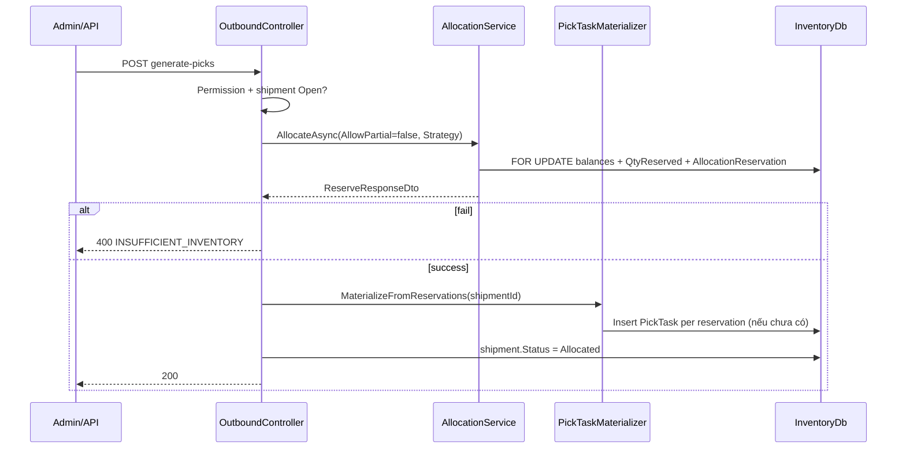

# PHASE 36: Inventory Integrity Hardening (L2-P0)

## Execution Spec Maturity

| Mục | Giá trị |
|---|---|
| **Mức hiện tại** | **95% Execution-Ready** (`/30-auto-project-planner` 2026-07-22) |
| **Điều kiện 95%** | Pseudo-code P0-01…03 · contract API giữ nguyên · test plan · rollback · critique đóng |
| **Trạng thái triển khai** | ⬜ Chưa execute — chờ FOUNDER **Proceed** |
| **Dev-days** | **3–5** (1 Developer) |
| **Critical Path** | **Có** — block P37 L3 |

### Changelog plan

| Ngày | Thay đổi |
|---|---|
| 2026-07-22 | Tạo phase từ SoT `ACCEPTANCE_L2_GENERIC_WMS_FOUNDATION.md` L2-P0-01…03 |
| 2026-07-22 | Auto-critique §19 đóng; maturity **95%** |

### Quyết định khóa

| Câu hỏi | Quyết định |
|---|---|
| Engine SoT | Chỉ `IAllocationService.AllocateAsync` |
| `POST .../generate-picks` | **Giữ URL** — body orchestration mới (không breaking FE) |
| Strategy mặc định GeneratePicks | **FEFO** (khớp `ReserveRequestDto`); optional query `?strategy=FIFO` |
| AllowPartial GeneratePicks | **false** (giữ hành vi cũ: thiếu tồn → 400; không partial im lặng) |
| PickTask | Materialize từ `AllocationReservations` ACTIVE sau allocate |
| Invariant | `SaveChanges` interceptor + CHECK DB (migration) |
| DF-01 | Offline MOVE dùng `QtyOnHand - QtyReserved` |
| M1 / UI polish | **Out of scope** |

---

## 1. Mục tiêu

Đóng **L2-P0** trước pilot khách generic:

1. **P0-01** — Một luồng cấp phát (bỏ FIFO `LotNo` trong `GeneratePicks`).  
2. **P0-02** — Invariant tồn tập trung (không âm / reserved không vượt on-hand).  
3. **P0-03** — DF-01: offline MOVE khớp available online.

---

## 2. Phạm vi (Scope)

### In scope

| # | Deliverable |
|---|---|
| 1 | Refactor `OutboundController.GeneratePicks` → `AllocateAsync` + materialize `PickTask` |
| 2 | Helper `IPickTaskMaterializer` (Inventory module) hoặc method private rõ ràng |
| 3 | `InventoryIntegrityInterceptor` / override `SaveChanges` trên `InventoryDbContext` |
| 4 | Migration CHECK: `qty_on_hand >= 0`, `qty_reserved >= 0`, `qty_reserved <= qty_on_hand` |
| 5 | Fix `MobileController` SyncOffline MOVE available check + errorCode |
| 6 | `tests/verify_l2_p0_integrity.ps1` (API) |
| 7 | Cập nhật `ACCEPTANCE_L2_…` P0 = CLOSED + re-score Allocation/Inventory |
| 8 | Evidence `planning/evidence/phase_36/` |

### Non-negotiable output

- Mọi allocate/pick ra cùng rule **QC Release + FEFO/FIFO** của `AllocationService`.  
- Không path nào ghi `inventories` vượt invariant (app + DB).  
- Offline MOVE không “cướp” reserved.  
- Regression: `verify_allocation.ps1`, `verify_outbound.ps1` PASS.

### Out of scope

- UI redesign (P38) · L3 UAT/cutover (P37) · Serial hybrid · OrderNo sequence · M1 · đổi URL API.

---

## 3. Điều kiện đầu vào (Readiness)

- [x] Phase 13 Allocation ✅ · Phase 07/Outbound ✅ · Phase 09 Mobile ✅ · Phase 34 QcGate ✅  
- [x] L2 SoT đã công bố P0  
- [ ] FOUNDER **Proceed** Phase 36  
- [ ] Branch sạch / API local chạy được cho verify

---

## 4. Setup / cấu trúc

```text
backend/modules/Nexustock.Modules.Inventory/
  Controllers/OutboundController.cs          # REFACTOR GeneratePicks
  Controllers/MobileController.cs            # FIX DF-01
  Services/IPickTaskMaterializer.cs          # NEW
  Services/PickTaskMaterializer.cs           # NEW
  Interceptors/InventoryIntegrityInterceptor.cs  # NEW
  Contexts/InventoryDbContext.cs             # WIRE interceptor
  Migrations/YYYYMMDD_AddInventoryQtyChecks.cs   # NEW

backend/modules/Nexustock.Modules.Allocation/
  (không đổi contract public; chỉ được gọi)

tests/verify_l2_p0_integrity.ps1             # NEW
planning/evidence/phase_36/                  # NEW khi execute
```

Quy chuẩn: comment tiếng Việt; JSON camelCase; errorCode UPPER_SNAKE.

---

## 5. Permissions

**Không seed permission mới.** Giữ:

- `Outbound.Picks.Execute` — GeneratePicks  
- Mobile sync — permission hiện có Phase 09  

---

## 6. Database

### 6.1 Không đổi bảng nghiệp vụ

Giữ `inventories`, `allocation_reservations`, `pick_tasks`, `shipments`.

### 6.2 Migration CHECK (PostgreSQL)

```sql
-- UP
ALTER TABLE inventories
  ADD CONSTRAINT ck_inventories_qty_on_hand_nonneg CHECK (qty_on_hand >= 0),
  ADD CONSTRAINT ck_inventories_qty_reserved_nonneg CHECK (qty_reserved >= 0),
  ADD CONSTRAINT ck_inventories_reserved_le_onhand CHECK (qty_reserved <= qty_on_hand);

-- DOWN
ALTER TABLE inventories DROP CONSTRAINT IF EXISTS ck_inventories_reserved_le_onhand;
ALTER TABLE inventories DROP CONSTRAINT IF EXISTS ck_inventories_qty_reserved_nonneg;
ALTER TABLE inventories DROP CONSTRAINT IF EXISTS ck_inventories_qty_on_hand_nonneg;
```

**Pre-check bắt buộc trước migrate:** script đếm row vi phạm; nếu >0 → sửa data hoặc abort (ghi runbook §18).

### 6.3 Computed `qty_available`

Đã có cột generated — không đổi; invariant vẫn siết `on_hand`/`reserved`.

---

## 7. Backend & API Contract

### 7.1 Giữ endpoint (hành vi đúng hơn)

`POST /api/inventory/shipments/{id}/generate-picks`  
Auth: Bearer + `Outbound.Picks.Execute`  
Query optional: `strategy` = `FEFO` | `FIFO` (default `FEFO`)

**Response 200 (giữ shape hiện có nếu FE đang dùng; nếu chỉ status — giữ):**

```json
{
  "shipmentId": "3fa85f64-5717-4562-b3fc-2c963f66afa6",
  "status": "Allocated",
  "pickTaskCount": 3,
  "allocation": {
    "success": true,
    "status": "ALLOCATED",
    "message": "..."
  }
}
```

**400:**

| errorCode | Khi |
|---|---|
| `INVALID_SHIPMENT_STATUS` | Không Open / không đủ điều kiện |
| `INSUFFICIENT_INVENTORY` | Allocate fail (AllowPartial=false) |
| `PICKS_ALREADY_EXIST` | Đã có PickTask Pending/Active (idempotent guard) |
| `INVENTORY_INVARIANT_VIOLATION` | Interceptor chặn (hiếm nếu service đúng) |

### 7.2 Mobile Sync MOVE (nội bộ)

Không đổi URL sync. Trong payload MOVE:

- Validate: `(QtyOnHand - QtyReserved) >= qty`  
- error escalate: `INSUFFICIENT_QTY` (thay message thuần tiếng Việt không mã)

### 7.3 Allocate contract (không đổi)

```json
{
  "shipmentId": "...",
  "strategy": "FEFO",
  "allowPartial": false,
  "reservationTtlMinutes": 1440
}
```

---

## 8. Frontend / Mobile / RF

- **Admin:** không đổi UI bắt buộc; Generate Picks button giữ nguyên.  
- **Mobile:** không đổi UX; chỉ backend sync chặt hơn → có thể tăng tỷ lệ fail đúng (hiển thị toast lỗi hiện có).  
- Loading/empty/error: không đổi P36.

---

## 9. Luồng thực thi (Execution Flow)



### Pseudo-code P0-01 (bắt buộc)

```csharp
// OutboundController.GeneratePicks — thay khối FIFO LotNo
public async Task<IActionResult> GeneratePicks(Guid id, [FromQuery] string strategy = "FEFO")
{
    if (!await HasPermissionAsync("Outbound.Picks.Execute")) return Forbid();
    var tenantId = GetTenantId();
    var username = User.Identity?.Name ?? "System";

    var shipment = await _context.Shipments
        .FirstOrDefaultAsync(s => s.Id == id && s.TenantId == tenantId);
    if (shipment == null) return NotFound(...);
    if (shipment.Status != "Open")
        return BadRequest(new { errorCode = "INVALID_SHIPMENT_STATUS", ... });

    var existingPicks = await _context.PickTasks
        .AnyAsync(p => p.ShipmentId == id && p.TenantId == tenantId
            && p.Status != "Cancelled");
    if (existingPicks)
        return BadRequest(new { errorCode = "PICKS_ALREADY_EXIST", ... });

    ReserveResponseDto alloc;
    try
    {
        alloc = await _allocationService.AllocateAsync(tenantId, new ReserveRequestDto
        {
            ShipmentId = id,
            Strategy = strategy.Equals("FIFO", StringComparison.OrdinalIgnoreCase) ? "FIFO" : "FEFO",
            AllowPartial = false,
            ReservationTtlMinutes = 1440
        }, username);
    }
    catch (InvalidOperationException ex)
    {
        return BadRequest(new { errorCode = "INSUFFICIENT_INVENTORY", message = ex.Message });
    }
    catch (KeyNotFoundException)
    {
        return NotFound(...);
    }

    if (!alloc.Success)
        return BadRequest(new { errorCode = "INSUFFICIENT_INVENTORY", message = alloc.Message });

    var pickCount = await _pickMaterializer.MaterializeFromActiveReservationsAsync(
        tenantId, id, username);

    shipment.Status = "Allocated";
    shipment.UpdatedAt = DateTime.UtcNow;
    shipment.UpdatedBy = username;
    await _context.SaveChangesAsync();

    return Ok(new { shipmentId = id, status = shipment.Status, pickTaskCount = pickCount, allocation = alloc });
}
```

```csharp
// PickTaskMaterializer — 1 PickTask / AllocationReservation ACTIVE của shipment
public async Task<int> MaterializeFromActiveReservationsAsync(
    Guid tenantId, Guid shipmentId, string username)
{
    var lineIds = await _context.ShipmentItems
        .Where(i => i.ShipmentId == shipmentId && i.TenantId == tenantId)
        .Select(i => i.Id).ToListAsync();

    var reservations = await _context.AllocationReservations
        .Where(r => r.TenantId == tenantId && lineIds.Contains(r.ShipmentLineId)
            && r.Status == "ACTIVE")
        .ToListAsync();

    var count = 0;
    foreach (var r in reservations)
    {
        var balance = await _context.Inventories
            .FirstAsync(i => i.Id == r.InventoryBalanceId && i.TenantId == tenantId);
        var line = await _context.ShipmentItems.FirstAsync(i => i.Id == r.ShipmentLineId);

        _context.PickTasks.Add(new PickTask
        {
            Id = Guid.NewGuid(),
            TenantId = tenantId,
            ShipmentId = shipmentId,
            ItemId = line.ItemId,
            LotNo = balance.LotNo,
            FromLocationId = balance.LocationId,
            Qty = r.Qty,
            PickedQty = 0,
            Status = "Pending",
            CreatedAt = DateTime.UtcNow,
            CreatedBy = username
            // ReservationId optional P1 nếu cột chưa có — không bắt buộc P0
        });
        count++;
    }
    await _context.SaveChangesAsync();
    return count;
}
```

### Pseudo-code P0-02

```csharp
public class InventoryIntegrityInterceptor : SaveChangesInterceptor
{
    public override InterceptionResult<int> SavingChanges(
        DbContextEventData eventData, InterceptionResult<int> result)
    {
        Validate(eventData.Context);
        return base.SavingChanges(eventData, result);
    }

    public override ValueTask<InterceptionResult<int>> SavingChangesAsync(...)
    {
        Validate(eventData.Context);
        return base.SavingChangesAsync(eventData, result, cancellationToken);
    }

    private static void Validate(DbContext? ctx)
    {
        if (ctx == null) return;
        foreach (var entry in ctx.ChangeTracker.Entries<Inventory>())
        {
            if (entry.State is EntityState.Deleted) continue;
            var e = entry.Entity;
            if (e.QtyOnHand < 0 || e.QtyReserved < 0 || e.QtyReserved > e.QtyOnHand)
                throw new InventoryInvariantException(
                    "INVENTORY_INVARIANT_VIOLATION",
                    $"Inventory {e.Id}: onHand={e.QtyOnHand}, reserved={e.QtyReserved}");
        }
    }
}
```

### Pseudo-code P0-03

```csharp
// MobileController SyncOffline MOVE — thay:
// if (inventory.QtyOnHand < moveData.Qty)
var available = inventory.QtyOnHand - inventory.QtyReserved;
if (available < moveData.Qty)
    throw new Exception("INSUFFICIENT_QTY: Số lượng khả dụng không đủ để dịch chuyển");
```

---

## 10. Validation & Business Rules

| Rule | Chi tiết |
|---|---|
| Tenant | Mọi query `TenantId == current` |
| QC | Chỉ qua `AllocationService` (Release lots) |
| Concurrency | Giữ `FOR UPDATE` + `RowVersion` trong Allocate |
| GeneratePicks idempotent | Có picks non-cancelled → `PICKS_ALREADY_EXIST` |
| Double reserve | AllocateAsync đã skip line Status Allocated — không gọi GeneratePicks 2 lần |
| Complete pick reserved | (P1 nếu còn) `QtyReserved >= PickedQty` — không bắt buộc nếu đã có guard; regression test |

---

## 11. Exception Handling

| errorCode | HTTP | Hành vi |
|---|---:|---|
| `INSUFFICIENT_INVENTORY` | 400 | Không tạo pick |
| `INSUFFICIENT_QTY` | 400 / sync fail item | Offline MOVE fail item; không commit op đó |
| `INVENTORY_INVARIANT_VIOLATION` | 500/400 | Rollback transaction |
| `PICKS_ALREADY_EXIST` | 400 | No-op an toàn |
| `QC_LOT_*` | — | Chỉ qua Allocate path |

---

## 12. Observability & KPI

- Log: `TraceId`, `shipmentId`, `strategy`, `pickTaskCount`, `allocation.Status`.  
- Audit: không bảng mới; dùng log structured.  
- KPI verify: số test case P0 PASS / FAIL trong evidence JSON.

---

## 13. Test Plan

| Loại | Case |
|---|---|
| Unit | Interceptor: reserved > onHand → throw |
| Unit | Materializer: 2 reservations → 2 picks |
| Integration | GeneratePicks FEFO chọn lot expiry sớm hơn (seed 2 lot) |
| Integration | GeneratePicks thiếu tồn → 400, 0 pick, reserved không tăng lệch |
| Integration | Offline MOVE qty trong onHand nhưng > available → fail |
| Integration | Online Move vẫn `(onHand-reserved)` |
| Regression | `verify_allocation.ps1`, `verify_outbound.ps1`, `verify_wave_picking.ps1` |
| Negative | Concurrent GeneratePicks 2 request — một success / một conflict hoặc picks exist |
| Pre-migrate | COUNT vi phạm CHECK = 0 |

`verify_l2_p0_integrity.ps1`: tối thiểu 6 assert tương ứng 3 P0.

---

## 14. Acceptance Criteria (DoD)

- [ ] P0-01: Không còn sort `OrderBy(LotNo)` allocate trong `GeneratePicks`  
- [ ] P0-01: GeneratePicks gọi `IAllocationService`  
- [ ] P0-01: PickTask tạo từ reservation ACTIVE  
- [ ] P0-02: Interceptor đăng ký DI + CHECK migration applied  
- [ ] P0-03: DF-01 closed (code + test)  
- [ ] verify_l2_p0 + regression allocation/outbound/wave PASS  
- [ ] `ACCEPTANCE_L2_…` cập nhật P0 CLOSED; Allocation ≥80, Inventory ≥82 (ước)  
- [ ] Evidence folder phase_36  

---

## 15. Out of Scope

P37/P38 · hybrid serial · WorkflowApproval · WarehouseId reservation Guid.Empty fix (P1) · UI.

---

## 16. Downstream Dependencies

| Downstream | Ảnh hưởng |
|---|---|
| **P37 L3** | **Blocked** đến khi P36 DoD |
| Wave | Đã dùng AllocateAsync — regression bắt buộc |
| P38 UI | Không phụ thuộc |
| FE Generate Picks | URL giữ; response có thể thêm field — FE cũ vẫn OK nếu ignore |

---

## 17. Maintenance & Rollback

| Layer | Rollback |
|---|---|
| Code | Revert PR; tạm thời không deploy |
| DB CHECK | `DOWN` migration 3 DROP CONSTRAINT |
| Data | Không destructive; materializer chỉ insert |

**Sự cố migrate fail vì data bẩn:** chạy repair SQL giảm reserved hoặc điều chỉnh trước UP.

---

## 18. Auto-Critique (bắt buộc)

| # | Câu hỏi | Trả lời trong spec |
|---|---|---|
| 1 | Write concurrency 2 GeneratePicks? | Picks-exist guard + Allocate FOR UPDATE + transaction |
| 2 | Hardware failure? | N/A P36 (không đụng agent) |
| 3 | Network retry trùng GeneratePicks? | `PICKS_ALREADY_EXIST` / Allocate idempotent lines |
| 4 | Third-party? | N/A |

**Residual rủi ro (chấp nhận P0):** `WarehouseId = Guid.Empty` trên reservation — P1; không block integrity qty.

**Maturity sau critique:** **95%**.

---

## 19. Sign-off

| Vai trò | Quyết định | Ngày |
|---|---|---|
| JARVIS | Spec 95% Ready | 2026-07-22 |
| FOUNDER | ☐ Proceed execute · ☐ Hold · ☐ Sửa scope | ____ |
