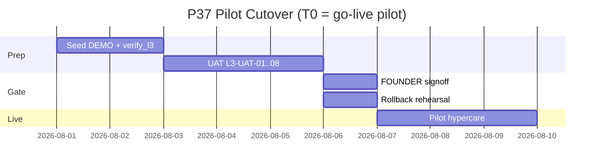

# PHASE 37: Go-Live Gate L3 — Customer Pilot (Generic)

## Execution Spec Maturity

| Mục | Giá trị |
|---|---|
| **Mức hiện tại** | **95% Execution-Ready** (`/30-auto-project-planner` 2026-07-22) |
| **Điều kiện 95%** | UAT pack generic · runbook cutover · evidence schema · critique · không phụ thuộc SAP |
| **Trạng thái triển khai** | ⬜ Chờ **P36 DoD** + FOUNDER Proceed |
| **Dev-days** | **5–8** (1 Dev + FOUNDER ký UAT) |
| **Critical Path** | **Có** — sau P36; trước bán/pilot khách |

### Changelog plan

| Ngày | Thay đổi |
|---|---|
| 2026-07-22 | Tạo P37 = L3 delta; **không** mở lại P30 lịch sử |
| 2026-07-22 | Auto-critique §19; maturity **95%** |

### Quyết định khóa

| Câu hỏi | Quyết định |
|---|---|
| Quan hệ P30 | P30 = Module Readiness (đã ✅). P37 = **Pilot khách generic** + đóng AC pack vận hành còn lại |
| SAP / AC-08 | **Vẫn waived** trừ FOUNDER hủy waiver khi sandbox sẵn |
| Tenant demo | Bắt buộc 1 tenant `DEMO-GENERIC` seed sạch |
| UI polish P38 | **Không block** P37; pilot chấp nhận UI “đủ” |
| M1 Sharp | Không UAT M1 |
| Phạm vi pilot | Inbound → QC gate → Move → Allocate/Pick → Pack → (optional Wave) |

---

## 1. Mục tiêu

Chứng minh Nexustock **sẵn sàng pilot** cho công ty khác (nền generic): UAT có biên bản, cutover/rollback rehearsal, hypercare — **sau** khi L2-P0 đã đóng.

---

## 2. Phạm vi (Scope)

### In scope

| # | Deliverable |
|---|---|
| 1 | UAT pack **L3-UAT-01…08** (generic) + biên bản ký |
| 2 | Seed script/tenant `DEMO-GENERIC` (products, locations, users, sample PO/shipment) |
| 3 | Cutover runbook **pilot** (T-7 → T+3) — tham chiếu P26/P30 |
| 4 | Rollback rehearsal checklist (DB restore RTO mục tiêu < 2h) — evidence |
| 5 | Hypercare 3 ngày: channel, severity, owner |
| 6 | Go-live AC pack evidence: map từ P30 AC-02/03/06/09–11/13/14 còn thiếu |
| 7 | `tests/verify_l3_pilot_smoke.ps1` (API smoke E2E happy path) |
| 8 | Evidence `planning/evidence/phase_37/` |

### Non-negotiable output

- Biên bản UAT FOUNDER (hoặc đại diện khách) **PASS** hoặc **PASS có điều kiện** liệt kê rõ.  
- Rollback rehearsal có timestamp + kết quả.  
- Không Critical/High mở trên invariant tồn (P36).  

### Out of scope

- Code feature mới ngoài hotfix P0 regression  
- P38 UI redesign  
- M1 / ja/zh / Handy COM  
- Multi-region HA đầy đủ  

---

## 3. Điều kiện đầu vào

- [ ] **Phase 36 DoD 100%** (L2-P0 CLOSED)  
- [x] Phase 26 deploy ✅ · Phase 30 module ✅  
- [x] L2 Weighted ≥ 80  
- [ ] Môi trường staging/pilot Docker lên được  
- [ ] FOUNDER Proceed P37  

---

## 4. Setup

```text
planning/evidence/phase_37/
  uat_signoff.md
  cutover_runbook_pilot.md
  rollback_rehearsal.md
  hypercare.md
  ac_pack_status.json
  verify_l3_results.json

tests/verify_l3_pilot_smoke.ps1
tests/seed/demo_generic_tenant.sql   # hoặc ps1 seed qua API
scripts/cutover/                     # checklist steps
```

Không bắt buộc module C# mới. Readiness API P30 tái dùng nếu còn.

---

## 5. Permissions

Không seed mới. UAT dùng role:

| Role | Dùng cho |
|---|---|
| Admin | Master + approve |
| Operator | Receive / move / pick / pack |
| QC | Hold/Release/Result |

---

## 6. Database

- **Không** migration bắt buộc.  
- Optional: bảng `uat_runs` nếu P30 đã có — ghi run P37; nếu chưa → evidence file đủ (không block).  

Seed tối thiểu:

| Entity | Số lượng gợi ý |
|---|---:|
| Warehouse / zones / locations | 1 WH · ≥8 loc |
| Products + UoM | ≥5 (1 serial-flagged optional) |
| Users | 3 role trên |
| Open PO + lines | 1 |
| Open Shipment + lines | 1 |

---

## 7. Backend & API (smoke contract)

Không API mới bắt buộc. Smoke gọi chuỗi hiện có (camelCase):

```text
POST /api/inbound/... receive
POST /api/qc/... result|release
POST /api/inventory/move
POST /api/allocation/reserve  OR  POST .../generate-picks
POST /api/inventory/... complete-pick
POST /api/inventory/... pack (nếu có)
```

Mock payload receive (ví dụ):

```json
{
  "orderId": "00000000-0000-0000-0000-000000000001",
  "itemId": "00000000-0000-0000-0000-000000000010",
  "lotNo": "LOT-L3-001",
  "receivedQty": 100,
  "locationId": "00000000-0000-0000-0000-000000000020"
}
```

---

## 8. Frontend / RF

| Touchpoint | UAT |
|---|---|
| `/admin/inbound` | Nhận hàng |
| `/admin/qc` | Release lot |
| `/admin/allocation` hoặc outbound generate-picks | Cấp phát |
| `/mobile/*` | Ít nhất 1 scan MOVE hoặc pick |
| Ops nav (P35) | Operator tìm đúng nhóm Ops |

States: ghi screenshot loading/error nếu fail — evidence.

---

## 9. Execution Flow — Cutover pilot



### Pseudo-runbook (T0)

```text
T-7: Freeze feature (chỉ hotfix P36 regress)
T-5: Backup staging + restore drill dry-run
T-3: UAT signoff signed
T-1: Final backup; announce hypercare channel
T0:  Enable pilot tenant users; smoke verify_l3
T+1..T+3: Hypercare; daily severity review
```

---

## 10. Business Rules UAT

| ID | Kịch bản | Pass khi |
|---|---|---|
| L3-UAT-01 | Nhận hàng tạo Lot | Lot tồn tại; txn RECEIPT |
| L3-UAT-02 | QC Hold chặn move | Move → `QC_LOT_ON_HOLD` |
| L3-UAT-03 | QC Release + move | Move OK |
| L3-UAT-04 | Generate-picks / Allocate | FEFO đúng; PickTask tạo |
| L3-UAT-05 | Complete pick | Reserved giảm; onHand đúng |
| L3-UAT-06 | Insufficient available | 400 `INSUFFICIENT_*` |
| L3-UAT-07 | Offline MOVE vs reserved | Không vượt available (P36) |
| L3-UAT-08 | Tenant isolation | User tenant A không thấy data B |

---

## 11. Exception Handling (vận hành)

| Severity | Ví dụ | SLA hypercare |
|---|---|---|
| Sev-1 | Âm kho / sai reserved hàng loạt | 15 phút phản hồi |
| Sev-2 | Không allocate được cả kho | 1 giờ |
| Sev-3 | UI glitch | 1 ngày |

Rollback trigger: Sev-1 không khắc phục trong 2h → restore backup theo runbook.

---

## 12. Observability

- TraceId trên mọi UAT step (copy vào `uat_signoff.md`).  
- Dashboard P25: xác nhận alert cơ bản sống.  
- `ac_pack_status.json`:

```json
{
  "phase": 37,
  "l2P0": "CLOSED",
  "uat": { "passed": 8, "failed": 0, "blocked": 0 },
  "rollbackRehearsal": { "rtoMinutes": 0, "status": "PENDING" },
  "ac08Sap": "WAIVED"
}
```

---

## 13. Test Plan

| Loại | Nội dung |
|---|---|
| Smoke API | `verify_l3_pilot_smoke.ps1` |
| UAT manual | L3-UAT-01…08 + screenshots |
| Security | Spot IDOR tenant (2 token) |
| Load | Optional smoke 10 concurrent move — không bắt buộc full 50 RF |
| Regression | verify_l2_p0 + allocation + outbound |

---

## 14. Acceptance Criteria (DoD)

- [ ] P36 CLOSED proven  
- [ ] UAT 01–08 PASS (hoặc PASS* có điều kiện FOUNDER chấp nhận)  
- [ ] Rollback rehearsal documented (RTO ghi số)  
- [ ] Cutover + hypercare docs trong evidence  
- [ ] `ac_pack_status.json` cập nhật  
- [ ] FOUNDER ký `uat_signoff.md`  

**Verdict P37:** `PILOT_READY` | `PILOT_READY_CONDITIONAL` | `NOT_READY`

---

## 15. Out of Scope

Production multi-site toàn quốc · P38 · ERP sandbox bắt buộc · M1.

---

## 16. Downstream

| Item | Phụ thuộc |
|---|---|
| Bán/pilot khách thật | P37 `PILOT_READY*` |
| P38 | Song song hoặc sau; không block pilot kỹ thuật |

---

## 17. Maintenance & Rollback

```text
1. docker compose down (app)
2. Restore PostgreSQL từ backup T-1
3. docker compose up
4. Chạy verify_l3_pilot_smoke.ps1
5. Thông báo hypercare channel
```

---

## 18. Auto-Critique

| # | Hỏi | Trả lời |
|---|---|---|
| 1 | Concurrency UAT? | Seed + single operator steps; Allocate đã FOR UPDATE |
| 2 | Hardware? | Agent/scale: smoke optional; không block nếu waived như P30 |
| 3 | Network retry? | verify script idempotent nơi có ClientOperationId |
| 4 | Third-party SAP? | Waived AC-08 — ghi rõ không phải FAIL L3 generic |

**Maturity:** **95%**.

---

## 19. Sign-off

| Vai trò | Quyết định | Ngày |
|---|---|---|
| JARVIS | Spec 95% | 2026-07-22 |
| FOUNDER | ☐ Proceed sau P36 · ☐ Hold | ____ |
