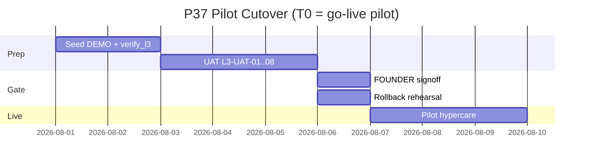

# PHASE 37: Go-Live Gate L3 — Customer Pilot (Generic)

## Execution Spec Maturity

| Mục | Giá trị |
|---|---|
| **Mức hiện tại** | **✅ Module DoD / Pilot 100%** (`rp4`+`rp5` 2026-07-22 · dbm 21/0 · verify_l3 12/0) · `PILOT_READY_ACCEPTED_CONDITIONAL` |
| **Trước execute** | 100% Ready (`rp1`+`rp2`+`rp3`) |
| **Trạng thái triển khai** | ✅ **ĐÓNG tài liệu** — §23–§26 · FOUNDER ký chấp nhận PASS* ngày 2026-08-02 |
| **Dev-days** | **5–8** (1 Dev + FOUNDER ký UAT) |
| **Critical Path** | Sau P36; mở khóa bán/pilot có điều kiện |
| **Port verify API** | `http://localhost:5024/api` (`$env:NEXUSTOCK_API_URL`) |
| **Pilot env tối thiểu** | `docker compose up -d` (postgres:5435 + redis) + API `:5024` + FE `:3003` |

### Changelog plan

| Ngày | Thay đổi |
|---|---|
| 2026-07-22 | Tạo P37 = L3 delta; **không** mở lại P30 lịch sử |
| 2026-07-22 | Auto-critique §19; maturity **95%** |
| 2026-07-22 | P36 `rp4`+`rp5` Module DoD 100% → **unblocked** điều kiện P36 |
| 2026-07-22 | **`rp1` 100% Ready:** Disk freeze §20 — API SoT, DEMO-GENERIC = logical seed, L3-UAT-08 tenant Guid, scripts P26, EP0–EP6, AC pack map |
| 2026-07-22 | **`rp2` /17-auto-plan:** Function index + brain EP0–EP6 + critic **9.5**; §21; maturity giữ **100% Ready** |
| 2026-07-22 | **`rp3` PASS:** §22 BS-R3-01…18 — Hold lot tách, Register→Login, seed reuse product, pack body, offline payload; brain refine |
| 2026-07-22 | **`/18-auto-execute`:** EP0–EP6 DONE · verify_l3 **12/0** (SKIP 2) · l2 **14/0** · freeze PASS · **PILOT_READY_CONDITIONAL** · §23 |
| 2026-07-22 | **`dbm`:** browser **21/0** · video · walkthrough · §24 · fix mobile `asChild`→`render` |
| 2026-07-22 | **`rp4`+`rp5`:** Disk **FAIL=0**; Module DoD/Pilot **100%** kỹ thuật; đóng tài liệu §25–§26 · `evidence/phase_37_rp45/` |

### Quyết định khóa

| Câu hỏi | Quyết định |
|---|---|
| Quan hệ P30 | P30 = Module Readiness (đã ✅). P37 = **Pilot khách generic** + đóng AC pack vận hành còn lại |
| SAP / AC-08 | **Vẫn waived** trừ FOUNDER hủy waiver khi sandbox sẵn |
| Tenant demo | **Logical pack** `DEMO-GENERIC` trên tenant mặc định `00000000-0000-0000-0000-000000000001` (codes `DEMO-*` / `WH-DEMO`). **Không** bắt buộc entity Tenant mới (disk: không API create-tenant). |
| UI polish P38 | **Không block** P37; pilot chấp nhận UI “đủ” |
| M1 Sharp | Không UAT M1 |
| Phạm vi pilot | Inbound → QC gate → Move → Allocate/Pick → Pack → (optional Wave) |
| Roles UAT | Smoke/`verify_l3` dùng **Admin** (seed sẵn). Operator/QC = **optional** tạo qua Identity Roles UI — không block DoD nếu Admin cover đủ L3-UAT-01…08 |
| Staging Docker | Gate §3: **PASS** nếu local `docker compose` (postgres+redis) + API/FE sống. Host staging riêng = **optional** FOUNDER |
| SAP / AC-08 | **WAIVED** (giữ P30); không FAIL L3 generic |

---

## 1. Mục tiêu

Chứng minh Nexustock **sẵn sàng pilot** cho công ty khác (nền generic): UAT có biên bản, cutover/rollback rehearsal, hypercare — **sau** khi L2-P0 đã đóng.

---

## 2. Phạm vi (Scope)

### In scope

| # | Deliverable |
|---|---|
| 1 | UAT pack **L3-UAT-01…08** (generic) + biên bản ký |
| 2 | Seed script/tenant `DEMO-GENERIC` (products, locations, users, sample PO/shipment) |
| 3 | Cutover runbook **pilot** (T-7 → T+3) — tham chiếu P26/P30 |
| 4 | Rollback rehearsal checklist (DB restore RTO mục tiêu < 2h) — evidence |
| 5 | Hypercare 3 ngày: channel, severity, owner |
| 6 | Go-live AC pack evidence: map từ P30 AC-02/03/06/09–11/13/14 còn thiếu |
| 7 | `tests/verify_l3_pilot_smoke.ps1` (API smoke E2E happy path) |
| 8 | Evidence `planning/evidence/phase_37/` |

### Non-negotiable output

- Biên bản UAT FOUNDER (hoặc đại diện khách) **PASS** hoặc **PASS có điều kiện** liệt kê rõ.  
- Rollback rehearsal có timestamp + kết quả.  
- Không Critical/High mở trên invariant tồn (P36).  

### Out of scope

- Code feature mới ngoài hotfix P0 regression  
- P38 UI redesign  
- M1 / ja/zh / Handy COM  
- Multi-region HA đầy đủ  

---

## 3. Điều kiện đầu vào

- [x] **Phase 36 DoD 100%** (L2-P0 CLOSED — `rp4`+`rp5` 2026-07-22)  
- [x] Phase 26 deploy ✅ · Phase 30 module ✅  
- [x] L2 Weighted ≥ 80 (sau P36: **86.9**)  
- [x] Môi trường pilot tối thiểu: `docker compose` local (postgres:5435) — **rp1** (staging remote optional)  
- [x] FOUNDER Proceed P37  

---

## 4. Setup

```text
planning/evidence/phase_37/
  uat_signoff.md
  cutover_runbook_pilot.md
  rollback_rehearsal.md
  hypercare.md
  ac_pack_status.json
  verify_l3_results.json
  shots/                         # UAT screenshots

tests/verify_l3_pilot_smoke.ps1          # NEW — EP5
tests/seed/demo_generic_tenant.ps1       # NEW — EP1 (API seed, không SQL bắt buộc)

# Tái dùng P26 (không tạo scripts/cutover/ trống):
scripts/db-backup.sh
scripts/db-restore.sh
scripts/deploy-rollback.sh

# Tái dùng P30 Readiness:
POST /api/admin/cutover/freeze|unfreeze   # FF_CUTOVER_FREEZE_ENABLED
POST /api/admin/readiness/uat-runs        # optional ghi UatRun
```

Không bắt buộc module C# mới. Không migration bắt buộc.

**DEMO-GENERIC seed (EP1) — tối thiểu:**

| Entity | Quy ước |
|---|---|
| Warehouse | code `WH-DEMO` (hoặc reuse WH hiện có + tag note evidence) |
| Locations | ≥8; ưu tiên `LOC-SORT-01` capacity cao (copy P36 verify) |
| Products | ≥5 codes `DEMO-SKU-*` (1 serial optional) |
| Users | Admin sẵn; optional `operator@demo.local` / `qc@demo.local` |
| Open PO + Shipment | 1 mỗi loại codes `PO-DEMO-*` / `SO-DEMO-*` |

---

## 5. Permissions

Không seed mới. UAT dùng role:

| Role | Dùng cho |
|---|---|
| Admin | Master + approve |
| Operator | Receive / move / pick / pack |
| QC | Hold/Release/Result |

---

## 6. Database

- **Không** migration bắt buộc.  
- Optional: bảng `uat_runs` nếu P30 đã có — ghi run P37; nếu chưa → evidence file đủ (không block).  

Seed tối thiểu:

| Entity | Số lượng gợi ý |
|---|---:|
| Warehouse / zones / locations | 1 WH · ≥8 loc |
| Products + UoM | ≥5 (1 serial-flagged optional) |
| Users | 3 role trên |
| Open PO + lines | 1 |
| Open Shipment + lines | 1 |

---

## 7. Backend & API (smoke contract) — **disk SoT `rp1`**

Không API mới. Port: `http://localhost:5024/api`. camelCase JSON.

| Bước | Method + path (thật) | Body / ghi chú |
|---|---|---|
| Login | `POST /api/auth/login` | `{ email, password }` → `token` |
| Create inbound | `POST /api/inbound/orders` | `{ orderNo, partnerId, items:[{ itemId, uomId, expectedQty, tolerance }] }` |
| Receive | `POST /api/inbound/{orderId}/receive` | `{ itemId, lotNo, receivedQty, toLocationId }` — **không** nhét `orderId` trong body |
| QC result | `POST /api/qc/{lotId}/result` | `{ qcRequestId, isPassed, metrics }` — lấy `qcRequestId` từ `GET /api/qc/queue` |
| Move online | `POST /api/inventory/move` | `{ itemId, lotNo, fromLocationId, toLocationId, qty, reasonCode }` — QC gate → `QC_LOT_ON_HOLD` nếu Hold |
| Generate picks | `POST /api/outbound/shipments/{id}/generate-picks` | Query `?strategy=FEFO` · P36 SoT |
| Complete pick | `POST /api/outbound/picks/{pickTaskId}/complete` | body theo FE pick-dialog |
| Pack complete | `POST /api/outbound/packing/{shipmentId}/complete` | |
| Offline MOVE | `POST /api/mobile/offline-sync` | StepType `MOVE` · DF-01 available |
| Freeze (cutover) | `POST /api/admin/cutover/freeze` | Cần `FF_CUTOVER_FREEZE_ENABLED` + permission |

**Cấm dùng trong verify (sai disk):** `/api/inbound/...` receive với `orderId` trong body; `/api/inventory/.../generate-picks`; path pack dưới `/api/inventory/`.

Mock receive (đúng disk):

```json
{
  "itemId": "00000000-0000-0000-0000-000000000010",
  "lotNo": "LOT-L3-001",
  "receivedQty": 100,
  "toLocationId": "00000000-0000-0000-0000-000000000020"
}
```

---

## 8. Frontend / RF

| Touchpoint | UAT |
|---|---|
| `/admin/inbound` | Nhận hàng |
| `/admin/qc` | Release lot |
| `/admin/outbound` | Generate pick tasks (URL P36) |
| `/admin/allocation` | Optional Reserve |
| `/mobile/movement` | MOVE / DF-01 surface (**không** `/mobile/tasks` — 404) |
| `/mobile/picking` | Optional pick scan |
| `/admin/readiness` + `/admin/cutover` | Gate + freeze board (P30) |
| Ops nav (P35) | Operator tìm đúng nhóm Ops |

States: ghi screenshot loading/error nếu fail — evidence.

---

## 9. Execution Flow — Cutover pilot



### Pseudo-runbook (T0)

```text
T-7: Freeze feature (chỉ hotfix P36 regress)
T-5: Backup staging + restore drill dry-run
T-3: UAT signoff signed
T-1: Final backup; announce hypercare channel
T0:  Enable pilot tenant users; smoke verify_l3
T+1..T+3: Hypercare; daily severity review
```

---

## 10. Business Rules UAT

| ID | Kịch bản | Pass khi |
|---|---|---|
| L3-UAT-01 | Nhận hàng tạo Lot | Lot tồn tại; txn RECEIPT |
| L3-UAT-02 | QC Hold chặn move | Move → `QC_LOT_ON_HOLD` |
| L3-UAT-03 | QC Release + move | Move OK |
| L3-UAT-04 | Generate-picks / Allocate | FEFO đúng; PickTask tạo |
| L3-UAT-05 | Complete pick | Reserved giảm; onHand đúng |
| L3-UAT-06 | Insufficient available | 400 `INSUFFICIENT_*` |
| L3-UAT-07 | Offline MOVE vs reserved | Không vượt available (P36) |
| L3-UAT-08 | Tenant isolation | User tenant B (`TenantId=00000000-0000-0000-0000-000000000002` qua `POST /api/auth/register`) **không** thấy shipment/product tenant A (`...0001`) — list rỗng hoặc 404/Forbid |

---

## 11. Exception Handling (vận hành)

| Severity | Ví dụ | SLA hypercare |
|---|---|---|
| Sev-1 | Âm kho / sai reserved hàng loạt | 15 phút phản hồi |
| Sev-2 | Không allocate được cả kho | 1 giờ |
| Sev-3 | UI glitch | 1 ngày |

Rollback trigger: Sev-1 không khắc phục trong 2h → restore backup theo runbook.

---

## 12. Observability

- TraceId trên mọi UAT step (copy vào `uat_signoff.md`).  
- Dashboard P25: xác nhận alert cơ bản sống.  
- `ac_pack_status.json`:

```json
{
  "phase": 37,
  "l2P0": "CLOSED",
  "uat": { "passed": 8, "failed": 0, "blocked": 0 },
  "rollbackRehearsal": { "rtoMinutes": 0, "status": "PENDING" },
  "ac08Sap": "WAIVED"
}
```

---

## 13. Test Plan

| Loại | Nội dung |
|---|---|
| Smoke API | `verify_l3_pilot_smoke.ps1` — copy flow verify_l2_p0 + move + pick complete + pack + IDOR spot |
| UAT manual | L3-UAT-01…08 + screenshots `evidence/phase_37/shots/` |
| Security | Spot IDOR tenant (2 token) = L3-UAT-08 |
| Load | Optional — **không** block (AC-05 P30 SKIP vẫn giữ) |
| Regression | `verify_l2_p0_integrity.ps1` + `verify_allocation.ps1` (+ wave optional) |
| Cutover freeze | Smoke `POST freeze` → write API 423/403 → `unfreeze` (nếu flag bật) |

---

## 14. Acceptance Criteria (DoD)

- [x] P36 CLOSED proven (re-run `verify_l2_p0` trong EP5)  
- [x] UAT 01–08 PASS / PASS* (FOUNDER chấp nhận điều kiện trên `uat_signoff.md`)  
- [x] Rollback rehearsal documented (RTO ~15 · PASS* `RESTORE_SKIPPED_SAFE`)  
- [x] Cutover + hypercare docs trong `planning/evidence/phase_37/`  
- [x] `ac_pack_status.json` cập nhật  
- [x] FOUNDER ký `uat_signoff.md` — chấp nhận PASS* ngày 2026-08-02
- [x] `verify_l3_pilot_smoke.ps1` PASS  

**Verdict P37:** **`PILOT_READY_ACCEPTED_CONDITIONAL`**

---

## 15. Out of Scope

Production multi-site toàn quốc · P38 · ERP sandbox bắt buộc · M1.

---

## 16. Downstream

| Item | Phụ thuộc |
|---|---|
| Bán/pilot khách thật | P37 `PILOT_READY*` |
| P38 | Song song hoặc sau; không block pilot kỹ thuật |

---

## 17. Maintenance & Rollback

```text
1. docker compose down (app)
2. Restore PostgreSQL từ backup T-1
3. docker compose up
4. Chạy verify_l3_pilot_smoke.ps1
5. Thông báo hypercare channel
```

---

## 18. Auto-Critique

| # | Hỏi | Trả lời |
|---|---|---|
| 1 | Concurrency UAT? | Seed + single operator steps; Allocate đã FOR UPDATE |
| 2 | Hardware? | Agent/scale: smoke optional; không block nếu waived như P30 |
| 3 | Network retry? | verify script idempotent nơi có ClientOperationId |
| 4 | Third-party SAP? | Waived AC-08 — ghi rõ không phải FAIL L3 generic |

**Maturity:** **95%** (planner) → sau §20 **`rp1` = 100% Ready**.

---

## 19. Sign-off

| Vai trò | Quyết định | Ngày |
|---|---|---|
| JARVIS | Spec **100% Ready** (`rp1`+`rp2`+`rp3` PASS) | 2026-07-22 |
| FOUNDER | ☐ Proceed `/18-auto-execute` · ☐ Hold · ☐ Sửa scope | ____ |

---

## 20. `rp1` Disk freeze — gap đã đóng (2026-07-22)

> Không xóa §1–§18 gốc; bảng này + EP bên dưới = chuẩn execute.

### 20.1 Gap matrix

| ID | Phát hiện disk | Xử lý trong spec |
|---|---|---|
| RP1-01 | §7 API nhận/pack/pick **sai path** (inventory generate-picks, orderId trong body) | §7 SoT bảng path thật |
| RP1-02 | `tests/seed/` + `scripts/cutover/` **không tồn tại** | Seed = `tests/seed/demo_generic_tenant.ps1` API; cutover = P26 scripts + P30 freeze API |
| RP1-03 | Không API create-tenant; permissions seed chỉ tenant `...0001` | DEMO-GENERIC = **logical** trên tenant mặc định; L3-UAT-08 = user TenantId `...0002` |
| RP1-04 | Role Operator/QC **không** seed sẵn (chỉ Admin) | Admin cover smoke; Operator/QC optional |
| RP1-05 | Gate «staging Docker» mơ hồ | Local `docker compose` = đủ Ready; remote staging optional |
| RP1-06 | FE `/mobile/tasks` = 404 (P36 dbm) | UAT mobile = `/mobile/movement` |
| RP1-07 | P30 AC pack 02/03/06/09–11/13/14 vẫn Pending | Map evidence P37 → §20.3 (không reopen P30 code) |
| RP1-08 | `UatRun` API **đã có** (P30) | Optional ghi run; evidence file vẫn bắt buộc |
| RP1-09 | Port/API base thiếu trong header | Khóa `:5024/api` |
| RP1-10 | Thiếu EP atomic cho `/18-auto-execute` | §20.2 EP0–EP6 |

### 20.2 Execution phases (EP0–EP6)

| EP | Deliverable | Risk | Gate |
|---|---|---|---|
| **EP0** | Scaffold evidence templates (`uat_signoff`, cutover, rollback, hypercare, `ac_pack_status.json`) | LOW | Files exist |
| **EP1** | `tests/seed/demo_generic_tenant.ps1` — API seed DEMO-* | MED | Seed idempotent / re-run OK |
| **EP2** | `cutover_runbook_pilot.md` T-7→T+3 + map freeze API | LOW | Doc + freeze smoke note |
| **EP3** | `rollback_rehearsal.md` — chạy/ghi RTO từ `db-backup`/`db-restore` (local docker OK) | MED | RTO số phút trong evidence |
| **EP4** | Manual UAT L3-UAT-01…08 + shots | MED | Checklist trong `uat_signoff.md` |
| **EP5** | `tests/verify_l3_pilot_smoke.ps1` + regression l2/allocation | HIGH | Script PASS |
| **EP6** | FOUNDER signoff · `ac_pack_status.json` · verdict `PILOT_READY*` · cập nhật IMPLEMENTATION_PLAN | LOW | DoD §14 |

**Thứ tự:** EP0 → EP1 → EP5 (smoke sớm) → EP2/EP3 song song → EP4 → EP6.

### 20.3 Map Go-live AC pack (P30 → P37 evidence)

| P30 AC | P37 deliverable | Ghi chú |
|---|---|---|
| AC-02 Rollback RTO | `rollback_rehearsal.md` + optional video | Bắt buộc số phút |
| AC-03 Backup RPO | cùng rehearsal + timestamp backup file | |
| AC-06 Allocation 5k | Optional cite `verify_allocation` + note scale; **không** block nếu PASS* FOUNDER | |
| AC-09 Observability | Screenshot dashboard / TraceId trong UAT | |
| AC-10 Feature flags | Spot 1–2 flag (vd freeze) | |
| AC-11 DB constraints | Cite P36 CHECK + `verify_l2_p0` | |
| AC-13 Cutover signed | `cutover_runbook_pilot.md` + FOUNDER ký | |
| AC-14 gitleaks | Chạy `gitleaks` hoặc note waiver nếu tool thiếu | |
| AC-08 SAP | **WAIVED** — giữ | |

### 20.4 `verify_l3_pilot_smoke.ps1` — outline bắt buộc

```text
1. Login admin
2. (Optional) Invoke seed script
3. Inbound order + receive + QC Release (copy verify_l2_p0)
4. POST inventory/move OK
5. Create shipment Open → generate-picks → pickTaskCount>0
6. Complete pick → reserved giảm
7. Pack complete (nếu shipment đủ điều kiện) — hoặc SKIP ghi rõ
8. L3-UAT-02: Hold lot → move expect QC_LOT_ON_HOLD
9. L3-UAT-08: register user tenant ...0002 → GET outbound/shipments không thấy SO-DEMO của tenant 1
10. Regression: verify_l2_p0 PASS
Không dùng $pid (reserved PowerShell).
```

### 20.5 Residual OOS (không block Ready)

| ID | Nội dung |
|---|---|
| OOS-01 | Host staging remote / multi-region HA |
| OOS-02 | Seed full Operator/QC permission matrix |
| OOS-03 | AC-06 đúng 5 000 dòng allocation bench |
| OOS-04 | P38 UI · M1 · SAP sandbox |

### 20.6 Auto-critique sau rp1

| # | Hỏi | Trả lời |
|---|---|---|
| 1 | Concurrency UAT? | Single operator + Allocate FOR UPDATE |
| 2 | Hardware scale/print? | Waive như P30 trừ FOUNDER bắt buộc |
| 3 | Tenant isolation thiếu permission tenant 2? | IDOR = list rỗng/Forbid vẫn PASS; không cần full Admin trên tenant 2 |
| 4 | SAP? | WAIVED |
| 5 | API contract lệch? | **rp1 đóng** §7 |

**Maturity sau rp1:** **100% Ready**.

---

## 21. `rp2` — Function index + EP atomic (2026-07-22)

| Artifact | Path |
|---|---|
| Function index | `planning/function_index_phase37_l3_pilot.md` |
| Brain plan | `C:\Users\mes\.gemini\antigravity\brain\17cf2960-4583-44a5-918a-5eb1c709dc96\implementation_plan.md` |
| Critic | cùng brain `critic_report.md` · copy `planning/evidence/phase_36_37_38_planner/rp2_phase37_critic_report.md` |

### EP0–EP6 (thứ tự + refine critic)

| EP | Deliverable | Risk | Gate |
|---|---|---|---|
| **EP0** | Scaffold `planning/evidence/phase_37/` templates | LOW | Files exist |
| **EP1** | `tests/seed/demo_generic_tenant.ps1` + `seed_summary.json` | MED | Idempotent exit 0 |
| **EP2** | `cutover_runbook_pilot.md` + freeze/SKIP note | LOW | T-7…T+3 |
| **EP3** | `rollback_rehearsal.md` RTO **hoặc** PASS* `RESTORE_SKIPPED_SAFE` | MED | Số phút / note |
| **EP4** | UAT 01–08 + shots · `/mobile/movement` | MED | Checklist filled |
| **EP5** | `verify_l3_pilot_smoke.ps1` · pack **SKIP OK** · + verify_l2 | HIGH | FAIL=0 |
| **EP6** | Signoff · `ac_pack_status.json` · IMPLEMENTATION_PLAN · `PILOT_READY*` | LOW | DoD §14 |

**Thứ tự khóa:** `EP0 → EP1 → EP5 → EP2 ∥ EP3 → EP4 → EP6`.

### Copy-paste — EP5 skeleton (PowerShell)

```powershell
# tests/verify_l3_pilot_smoke.ps1 — xem brain implementation_plan EP5 Steps 1–11
# API: $env:NEXUSTOCK_API_URL ?? http://localhost:5024/api
# CẤM: biến $pid
```

### Critic refine đã áp

1. EP3 nhánh PASS* không restore phá DB.  
2. EP5 pack SKIP.  
3. Windows: `docker exec … pg_dump` (function_index §H).  
4. UAT-08: 403/empty list = PASS nếu không lộ data tenant A.

**Critic score:** **9.5/10** · Blocker **0**.

**Maturity sau rp2:** vẫn **100% Ready** (plan chi tiết; chưa execute).

### Sign-off rp2

| Vai trò | Kết luận | Ngày |
|---|---|---|
| JARVIS | **rp2 PASS** — index + EP atomic đủ `/18-auto-execute` | 2026-07-22 |
| FOUNDER | ☐ Proceed · ☐ Hold | ____ |

---

## 22. `rp3` — Blind-spot close (PASS xuyên suốt)

**Ngày:** 2026-07-22 · **Verdict:** **PASS — 0 điểm mù block execute**

### BS-R3 checklist (đóng hết)

| ID | Điểm mù | Đóng bằng |
|---|---|---|
| BS-R3-01 | Hold sau CompletePick trên cùng lot → hết tồn / sai gate | EP5: **Lot-HOLD riêng** (inbound+receive thứ 2) → `POST /qc/{lotId}/hold` → move expect `QC_LOT_ON_HOLD` — **trước hoặc song song**, không dùng lot đã pick hết |
| BS-R3-02 | Body Hold thiếu | `{ "reasonCode": "L3_HOLD" }` (`HoldLotDto`; `locationId` optional) |
| BS-R3-03 | `reasonCode` move | Dùng `"TEST_SEED"` (như verify_allocation) — không bắt buộc master reason FK |
| BS-R3-04 | Register **không** trả token | EP5 UAT-08: `POST /auth/register` rồi **`POST /auth/login`** user B lấy Bearer |
| BS-R3-05 | Seed tạo Product cần `Config`+`Packages` phức tạp | EP1 **mặc định REUSE** ≥5 product active non-serial; DEMO = prefix trên **PO/SO/Lot** (`PO-DEMO-*`). Create product = **optional** |
| BS-R3-06 | Pack body thiếu | Try: `{ packageNo, weight, weightSource:"manual", scaleStable:true }` + optional override; fail → **SKIP** |
| BS-R3-07 | Offline MOVE payload | `StepType:"MOVE"`, `Payload` JSON: `{ itemId, lotNo, fromLocationId, toLocationId, qty }` (MovePayload) |
| BS-R3-08 | FF freeze / readiness | Seed mặc định **Enabled=true** (trừ `FF_MOBILE_QC`); nếu freeze 403 `CUTOVER_FREEZE_DENIED` → EP2 SKIP |
| BS-R3-09 | UatRun optional fail flag | Optional EP6; evidence file vẫn DoD — không block nếu `READINESS_DISABLED` |
| BS-R3-10 | EP4 vs EP5 trùng UAT | EP5 auto-cover 01–06+08; EP4 điền TraceId từ smoke + shot UI; UAT-07 ưu tiên API offline hoặc `/mobile/movement` shot |
| BS-R3-11 | Password policy user B | `DemoTenant2!123` (≥8, chữ hoa/thường/số/ký tự) |
| BS-R3-12 | Tenant 2 GET shipments | 401/403/[] đều PASS nếu **không** chứa `SO-DEMO-*` của tenant 1 |
| BS-R3-13 | Move đích capacity | Dùng `LOC-SORT-01` maxCapacity cao (copy P36) |
| BS-R3-14 | Auth Register AllowAnonymous | Không FallbackPolicy Authorize — register public OK |
| BS-R3-15 | Complete pick body | `{ "pickedQty": <full> }` only |
| BS-R3-16 | `$pid` PowerShell | Cấm; dùng `$procId` / `$shipmentId` |
| BS-R3-17 | EP6 timing | Chỉ sau EP5 PASS (+ EP3 RTO hoặc PASS*) |
| BS-R3-18 | Docs EP0 trước mọi thứ | EP0 scaffold bắt buộc trước EP1 |

### 22.1 Copy-paste — EP5 thứ tự khóa (sau refine)

```text
A. Login admin
B. Ensure LOC-SORT-01
C. Lot-HAPPY: inbound receive + QC Release (qty đủ pick)
D. Move OK reasonCode=TEST_SEED (1 đơn vị) — optional
E. Shipment SO-DEMO-* → generate-picks → pickTaskCount>0
F. Complete pick full pickedQty
G. Pack try → SKIP OK
H. Lot-HOLD: inbound receive qty nhỏ + QC Release + POST hold {reasonCode:L3_HOLD}
   → POST inventory/move → expect QC_LOT_ON_HOLD
I. Register+Login tenant ...0002 → GET shipments assert không thấy SO-DEMO của A
J. (Optional) offline-sync MOVE qty > available → INSUFFICIENT_QTY
K. verify_l2_p0_integrity.ps1
L. Write verify_l3_results.json
```

### 22.2 Copy-paste — Hold + Move fail

```http
POST /api/qc/{lotId}/hold
{ "reasonCode": "L3_HOLD" }

POST /api/inventory/move
{ "itemId":"...", "lotNo":"...", "fromLocationId":"...", "toLocationId":"...", "qty":1, "reasonCode":"TEST_SEED" }
→ 4xx errorCode=QC_LOT_ON_HOLD
```

### 22.3 Copy-paste — UAT-08

```http
POST /api/auth/register
{ "email":"l3-tenant2@demo.local", "password":"DemoTenant2!123", "fullName":"L3 Tenant2", "tenantId":"00000000-0000-0000-0000-000000000002" }

POST /api/auth/login
{ "email":"l3-tenant2@demo.local", "password":"DemoTenant2!123" }
→ token B

GET /api/outbound/shipments   (Bearer B)
→ không chứa shipmentNo bắt đầu SO-DEMO của tenant A
```

### 22.4 Residual OOS (không block)

| ID | Nội dung |
|---|---|
| OOS-01…04 | Giữ §20.5 |
| OOS-05 | EP4 FOUNDER thời gian tay — smoke EP5 là gate kỹ thuật |

### Sign-off rp3

| Vai trò | Kết luận | Ngày |
|---|---|---|
| JARVIS | **rp3 PASS** — plan đủ chi tiết xuyên EP0–EP6, 0 blind spot block | 2026-07-22 |
| FOUNDER | ☐ Proceed `/18-auto-execute` · ☐ Hold | ____ |

---

## 23. `/18-auto-execute` — đóng Pilot (2026-07-22)

| EP | Kết quả |
|---|---|
| EP0 | Evidence scaffold `planning/evidence/phase_37/` |
| EP1 | `tests/seed/demo_generic_tenant.ps1` + `seed_summary.json` |
| EP5 | `verify_l3` **12/0** SKIP 2 · l2 **14/0** |
| EP2 | Cutover + freeze/unfreeze **200** |
| EP3 | Rollback **PASS*** `RESTORE_SKIPPED_SAFE` |
| EP4 | `uat_signoff.md` PASS/PASS* |
| EP6 | **PILOT_READY_ACCEPTED_CONDITIONAL** · `ac_pack_status.json` |

**Self-heal:** seed root path; product serial fallback; `LOC-L3-DEST` capacity.

**FOUNDER:** đã ký chấp nhận PASS* trên `uat_signoff.md` ngày 2026-08-02; production rộng vẫn theo cutover runbook.

---

## 24. `dbm` — Browser evidence (2026-07-22)

| Gate | Kết quả |
|---|---|
| Playwright | `tests/helpers/dbm_phase37_l3_pilot_browser.mjs` → **PASS 21/0** |
| FE surfaces | inbound · qc · outbound · cutover(freeze) · `/mobile/movement` · `SO-DEMO-*` |
| Anti-SoT | `/mobile/tasks` = **404** (PASS) |
| API re-run | verify_l3 **12/0** · l2 **14/0** |
| Evidence | `planning/evidence/phase_37_dbm/` + video `walkthrough-l3-pilot.webm` |

**Self-heal:** freeze path `/api/admin/cutover/freeze-status`; restart FE hung `:3003`; `domcontentloaded`.

**Post-DBM UI:** fix `asChild` → `render` trên mobile/stocktakes — badge Next.js **"1 Issue"** hết · walkthrough cập nhật shot 05/07.

**Verdict sau DBM:** **`PILOT_READY_ACCEPTED_CONDITIONAL`** — kỹ thuật 100%; FOUNDER đã ký PASS* ngày 2026-08-02.

---

## 25. `rp4` — reindex + đóng tài liệu (2026-07-22)

### 25.1 Mục tiêu
Reindex disk vs scope §2 + DoD §14 + EP0–EP6; nếu FAIL=0 → đóng tài liệu phase/master/brain.

### 25.2 Disk matrix

| Artifact | Status |
|---|---|
| `tests/seed/demo_generic_tenant.ps1` | PASS |
| `tests/verify_l3_pilot_smoke.ps1` | PASS |
| `tests/helpers/dbm_phase37_l3_pilot_browser.mjs` | PASS |
| Evidence pack `phase_37/` (uat/cutover/rollback/hypercare/ac/seed/verify) | PASS |
| `phase_37_dbm/` walkthrough + video + shots 05/07 | PASS |
| `planning/function_index_phase37_l3_pilot.md` | PASS |
| scripts `db-backup.sh` / `db-restore.sh` | PASS |
| No `asChild` mobile+stocktakes · movement `nativeButton={false}` | PASS |

**FILE_FAIL = 0** · JSON: `planning/evidence/phase_37_rp45/disk_reindex.json`

### 25.3 Runtime (rp4)

| Gate | Result |
|---|---|
| verify_l3 | **12/0** SKIP 2 |
| verify_l2 | **14/0** |
| dbm (cite) | **21/0** |

### 25.4 Docs cập nhật (`rp4`)

- phase_37 maturity **Module DoD / Pilot 100%** + §25
- `IMPLEMENTATION_PLAN` row 37 + residual
- `ACCEPTANCE_L2` row P37
- brain task/execution/change_log
- `evidence/phase_37_rp45/validation_pass.md`

### 25.5 Verdict `rp4`

**PASS** — đóng tài liệu kỹ thuật. Verdict vận hành **`PILOT_READY_ACCEPTED_CONDITIONAL`**; FOUNDER đã ký PASS* ngày 2026-08-02.

---

## 26. `rp5` — xác nhận độc lập (2026-07-22)

### 26.1 Phương pháp
Reindex độc lập cùng matrix §25.2–25.3 → **FILE_FAIL=0**.

### 26.2 Open / residual

| ID | Item | Status |
|---|---|---|
| FOUNDER-SIGN | Ký `uat_signoff.md` PASS* | **CLOSED** — FOUNDER chấp nhận 2026-08-02 |
| PACK-SKIP | Pack `WEIGHT_SOURCE_INVALID` | Documented SKIP OK |
| RESTORE-STAR | `RESTORE_SKIPPED_SAFE` | Documented PASS* |
| OOS-DBM | Browser evidence | **CLOSED** §24 |

### 26.3 Verdict `rp5`

**PASS — xác nhận độc lập khớp `rp4`.** Phase 37 **ĐÓNG tài liệu**. P38 không bị block bởi P37 kỹ thuật.

