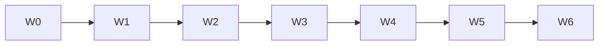

# PHASE 38: Admin/Mobile UI Design System Pass (Prod UX)

## Execution Spec Maturity

| Mục | Giá trị |
|---|---|
| **Mức hiện tại** | **95% Execution-Ready** (`/30-auto-project-planner` 2026-07-22) |
| **SoT UX** | `AUDIT_UI_UX_PROD_READINESS.md` + **Option B** (khuyến nghị JARVIS; FOUNDER đã gắn vào roadmap) |
| **Trạng thái** | ⬜ Chưa execute — **không block** P36; **nên sau hoặc song song muộn** P37 |
| **Dev-days** | **10–15** (chia wave; 1 Dev) |
| **Critical Path** | **Không** (bán đẹp); **Có** nếu FOUNDER chốt “đẹp trước bán” |

### Changelog plan

| Ngày | Thay đổi |
|---|---|
| 2026-07-22 | Khóa **Option B** Design System Pass (không A tối thiểu, không C full redesign) |
| 2026-07-22 | Auto-critique §19; maturity **95%** |

### Quyết định khóa (Option B)

| Câu hỏi | Quyết định |
|---|---|
| Option | **B** — token + page templates + migrate toàn admin/mobile theo pattern |
| Brand | Giữ Nexustock dark nội bộ gần Fluent; **không** purple-AI / cream-serif |
| shadcn Sidebar | Dùng semantic token; **không** bắt buộc rewrite toàn bộ sang `Sidebar` primitive nếu tốn effort — ưu tiên token + PageShell |
| i18n / routes / permission | **Không phá** |
| Motion | 2–3 motion có chủ đích (sidebar/page enter) — không noise |
| Wave migrate | 6 wave (§9) — mỗi wave có verify visual smoke |

---

## 1. Mục tiêu

Nâng UI từ **~6.0/10 “đủ”** → **≥8.0/10 chuẩn prod ops**: nhất quán, density operator, states chuẩn — toàn site Admin + Mobile RF.

---

## 2. Phạm vi

### In scope

| # | Deliverable |
|---|---|
| 1 | Semantic tokens dark trong `globals.css` (thay hardcode `#0a0a0a` / zinc rải page) |
| 2 | Primitives: `PageShell`, `PageHeader`, `FilterBar`, `DataTableFrame`, `EmptyState`, `LoadingState`, `ErrorState`, `PermissionDenied` |
| 3 | Migrate **toàn bộ** `app/admin/**`, `app/master-data/**`, shell, `app/mobile/**` theo wave |
| 4 | Sidebar visual polish (giữ P35 Ops lens behavior) |
| 5 | A11y tối thiểu: focus ring, contrast, keyboard table/toolbar |
| 6 | `tests/verify_ui_shell_classes.ps1` (grep chống hardcode cũ / bắt buộc import shell) |
| 7 | Evidence screenshots `planning/evidence/phase_38/` |
| 8 | Cập nhật `AUDIT_UI_UX_PROD_READINESS.md` điểm sau |

### Non-negotiable

- Không đổi business API.  
- UI labels English catalogs; VI/EN keys không mất.  
- Ops↔Modules toggle vẫn hoạt động.

### Out of scope

- Option C brand mới / marketing landing  
- WinForms clone  
- Chart library mới  
- P36 logic  

---

## 3. Readiness

- [x] shadcn ~60 components  
- [x] P35 nav ✅  
- [ ] P36 không bắt buộc nhưng nên xong trước demo khách  
- [ ] FOUNDER Proceed P38 (có thể song song sau wave 1)

---

## 4. Setup

```text
frontend/src/
  app/globals.css                    # REFACTOR tokens
  components/layout/
    page-shell.tsx                   # NEW
    page-header.tsx                  # NEW
    filter-bar.tsx                   # NEW
    data-table-frame.tsx             # NEW
  components/states/
    empty-state.tsx                  # NEW (wrap shadcn empty)
    loading-state.tsx                # NEW
    error-state.tsx                  # NEW
    permission-denied.tsx            # NEW
  components/app-sidebar.tsx         # POLISH visual only
  app/admin/**/page.tsx              # MIGRATE waves
  app/mobile/**/page.tsx             # MIGRATE waves
```

---

## 5. Permissions

Không đổi. `PermissionDenied` đọc auth context hiện có.

---

## 6. Database

Không.

---

## 7. API

Không.

---

## 8. Frontend Design Spec

### 8.1 Tokens (CSS variables)

```css
/* globals.css — dark (html.dark) */
--background: oklch(0.14 0.01 260);
--foreground: oklch(0.95 0.01 260);
--card: oklch(0.17 0.01 260);
--border: oklch(0.28 0.01 260);
--primary: oklch(0.72 0.14 155); /* accent ops — xanh công nghiệp, không purple */
--muted-foreground: oklch(0.65 0.02 260);
--radius: 0.5rem;
```

Cấm trong page mới: `bg-[#0a0a0a]`, `bg-zinc-950` hardcode (verify script).

### 8.2 PageShell API

```tsx
<PageShell
  title={t("title")}
  description={t("subtitle")}
  actions={<Button>...</Button>}
  filters={<FilterBar>...</FilterBar>}
>
  <DataTableFrame loading={loading} empty={!rows.length} error={error}>
    <Table>...</Table>
  </DataTableFrame>
</PageShell>
```

### 8.3 States

| State | UI |
|---|---|
| loading | Skeleton rows / Spinner centered |
| empty | Empty + 1 CTA |
| error | Alert + Retry |
| forbidden | PermissionDenied |

### 8.4 Mobile RF

- Giữ large tap targets; token chung; `PageShell` variant=`mobile`.  
- Không card dư; một job/màn.

---

## 9. Execution Flow — Waves

| Wave | Phạm vi | Ngày ước |
|---|---|---|
| W0 | Tokens + layout primitives + 1 page mẫu (`admin/qc`) | 2d |
| W1 | Shell + sidebar polish + login + home | 1d |
| W2 | Master-data (8 pages) | 2d |
| W3 | Inbound + QC + Lots + Putaway | 2d |
| W4 | Outbound + Allocation + Wave + RMA | 2d |
| W5 | Ops còn lại (audit, users, integrations, observability…) | 2d |
| W6 | Mobile `app/mobile/**` + verify script + AUDIT update | 2d |



### Pseudo migrate 1 page

```tsx
// Trước: Card + hardcode zinc
// Sau:
export default function ExamplePage() {
  const t = useTranslations("Admin.example");
  return (
    <PageShell title={t("title")} filters={<FilterBar>...</FilterBar>}>
      <DataTableFrame loading={loading} empty={!items.length}>
        <Table>...</Table>
      </DataTableFrame>
    </PageShell>
  );
}
```

---

## 10. Business Rules (UX)

- Density: toolbar 1 hàng; filter collapse mobile.  
- Không emoji decorative.  
- Table: sticky header optional W4+.  

---

## 11. Exceptions (UI)

| Case | Behavior |
|---|---|
| API 403 | PermissionDenied |
| API 5xx | ErrorState + toast |
| Empty filter | Empty “No results” khác Empty “No data” |

---

## 12. Observability

- Không KPI backend.  
- Evidence: trước/sau screenshot top 8 màn.  

---

## 13. Test Plan

| Test | Nội dung |
|---|---|
| `verify_ui_shell_classes.ps1` | Fail nếu `bg-\[#0a0a0a\]` còn trong `app/**` (trừ allowlist) |
| Visual smoke | Manual/dbm 8 routes |
| i18n | `verify_i18n` regression |
| Nav | `verify_nav_lens` PASS |
| A11y spot | Tab order page mẫu QC + inbound |

---

## 14. Acceptance Criteria

- [ ] Token semantic dùng ở layout gốc  
- [ ] ≥95% pages admin/mobile dùng PageShell (allowlist ≤5 legacy tạm)  
- [ ] Hardcode màu cũ = 0 (hoặc allowlist documented)  
- [ ] AUDIT UI tổng ≥ **8.0/10**  
- [ ] Nav lens + i18n PASS  
- [ ] Evidence phase_38  

---

## 15. Out of Scope

Option C · P36/P37 logic · New modules.

---

## 16. Downstream

Demo bán hàng / website nội bộ đẹp hơn. Không đổi L2 điểm logic.

---

## 17. Rollback

Revert FE commit theo wave; feature flag CSS optional `FF_UI_SHELL` (P1) — P0 không bắt buộc FF nếu migrate atomic theo wave.

---

## 18. Auto-Critique

| # | Hỏi | Trả lời |
|---|---|---|
| 1 | Concurrency? | N/A UI |
| 2 | Hardware? | Mobile RF: giữ offline UX; chỉ skin |
| 3 | Network? | ErrorState chuẩn hóa retry |
| 4 | Third-party? | N/A |

**Rủi ro:** scope phình → **khóa wave**; không redesign brand giữa chừng.

**Maturity:** **95%**.

---

## 19. Sign-off

| Vai trò | Quyết định | Ngày |
|---|---|---|
| JARVIS | Spec 95% · Option B | 2026-07-22 |
| FOUNDER | ☐ Proceed P38 · ☐ Sau P37 · ☐ Hủy | ____ |
