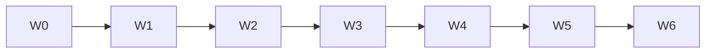

# PHASE 38: Admin/Mobile UI Design System Pass (Prod UX)

## Execution Spec Maturity

| Mục | Giá trị |
|---|---|
| **Mức hiện tại** | **✅ Module DoD 100%** (`rp4`+`rp5` 2026-07-23 · AUDIT ~8.2) |
| **SoT UX** | `planning/temp/AUDIT_UI_UX_PROD_READINESS.md` (~**8.2**/10) + **Option B** |
| **Trạng thái** | ✅ **ĐÓNG tài liệu** — EP0–EP6 · dbm · `rp4`+`rp5` |
| **Dev-days** | **10–15** (chia wave; 1 Dev) |
| **Critical Path** | **Không** (bán đẹp); **Có** nếu FOUNDER chốt “đẹp trước bán” |
| **Port FE** | `http://localhost:3003` (`$env:NEXUSTOCK_FE`) |

### Changelog plan

| Ngày | Thay đổi |
|---|---|
| 2026-07-22 | Khóa **Option B** Design System Pass (không A tối thiểu, không C full redesign) |
| 2026-07-22 | Auto-critique §19; maturity **95%** |
| 2026-07-22 | **`rp1` 100% Ready:** Disk freeze §20 — inventory trang, SoT AUDIT path, EP0–EP6↔W0–W6, Base UI `render`, hardcode baseline, P36/P37 CLOSED |
| 2026-07-22 | **`rp2` /17-auto-plan:** Function index + brain EP0–EP6 + critic **9.5**; §21 |
| 2026-07-22 | **`rp3` PASS:** §22 BS-R3-01…16 — layout padding, verify patterns, wave lists, motion CSS-only; 0 blind spot block |
| 2026-07-22 | **`/18-auto-execute`:** EP0–EP6 DONE · PageShell **57/57** · verify_ui PASS · AUDIT **~8.2** · §23 |
| 2026-07-22 | **`dbm`:** browser **32/0** · video · walkthrough · §24 |
| 2026-07-23 | **`rp4`+`rp5`:** disk FAIL=0 · PageShell **56/57** (allowlist 1) · §25–§26 · **ĐÓNG tài liệu** |

### Quyết định khóa (Option B)

| Câu hỏi | Quyết định |
|---|---|
| Option | **B** — token + page templates + migrate toàn admin/mobile theo pattern |
| Brand | Giữ Nexustock dark nội bộ gần Fluent; **không** purple-AI / cream-serif |
| shadcn Sidebar | Dùng semantic token; **không** bắt buộc rewrite toàn bộ sang `Sidebar` primitive nếu tốn effort — ưu tiên token + PageShell |
| i18n / routes / permission | **Không phá** |
| Motion | 2–3 motion có chủ đích (sidebar/page enter) — không noise |
| Wave migrate | 6 wave (§9) — mỗi wave có verify visual smoke |

---

## 1. Mục tiêu

Nâng UI từ **~6.0/10 “đủ”** → **≥8.0/10 chuẩn prod ops**: nhất quán, density operator, states chuẩn — toàn site Admin + Mobile RF.

---

## 2. Phạm vi

### In scope

| # | Deliverable |
|---|---|
| 1 | Semantic tokens dark trong `globals.css` (thay hardcode `#0a0a0a` / zinc rải page) |
| 2 | Primitives: `PageShell`, `PageHeader`, `FilterBar`, `DataTableFrame`, `EmptyState`, `LoadingState`, `ErrorState`, `PermissionDenied` |
| 3 | Migrate **toàn bộ** `app/admin/**`, `app/master-data/**`, shell, `app/mobile/**` theo wave |
| 4 | Sidebar visual polish (giữ P35 Ops lens behavior) |
| 5 | A11y tối thiểu: focus ring, contrast, keyboard table/toolbar |
| 6 | `tests/verify_ui_shell_classes.ps1` (grep chống hardcode cũ / bắt buộc import shell) |
| 7 | Evidence screenshots `planning/evidence/phase_38/` |
| 8 | Cập nhật `AUDIT_UI_UX_PROD_READINESS.md` điểm sau |

### Non-negotiable

- Không đổi business API.  
- UI labels English catalogs; VI/EN keys không mất.  
- Ops↔Modules toggle vẫn hoạt động.

### Out of scope

- Option C brand mới / marketing landing  
- WinForms clone  
- Chart library mới  
- P36 logic  

---

## 3. Readiness

- [x] shadcn ~60 components (`frontend/src/components/ui/*`)  
- [x] P35 nav ✅ (`verify_nav_lens.ps1`)  
- [x] **P36 CLOSED** (L2-P0) · **P37 CLOSED** (`PILOT_READY_CONDITIONAL` · `rp4`+`rp5`)  
- [x] Disk freeze §20 (inventory + hardcode baseline + script paths)  
- [x] FOUNDER Proceed P38  

---

## 4. Setup

```text
frontend/src/
  app/globals.css                    # REFACTOR tokens
  components/layout/
    page-shell.tsx                   # NEW
    page-header.tsx                  # NEW
    filter-bar.tsx                   # NEW
    data-table-frame.tsx             # NEW
  components/states/
    empty-state.tsx                  # NEW (wrap shadcn empty)
    loading-state.tsx                # NEW
    error-state.tsx                  # NEW
    permission-denied.tsx            # NEW
  components/app-sidebar.tsx         # POLISH visual only
  app/admin/**/page.tsx              # MIGRATE waves
  app/mobile/**/page.tsx             # MIGRATE waves
```

---

## 5. Permissions

Không đổi. `PermissionDenied` đọc auth context hiện có.

---

## 6. Database

Không.

---

## 7. API

Không.

---

## 8. Frontend Design Spec

### 8.1 Tokens (CSS variables)

```css
/* globals.css — dark (html.dark) */
--background: oklch(0.14 0.01 260);
--foreground: oklch(0.95 0.01 260);
--card: oklch(0.17 0.01 260);
--border: oklch(0.28 0.01 260);
--primary: oklch(0.72 0.14 155); /* accent ops — xanh công nghiệp, không purple */
--muted-foreground: oklch(0.65 0.02 260);
--radius: 0.5rem;
```

Cấm trong page mới: `bg-[#0a0a0a]`, `bg-zinc-950` hardcode (verify script).

### 8.2 PageShell API

```tsx
<PageShell
  title={t("title")}
  description={t("subtitle")}
  actions={<Button>...</Button>}
  filters={<FilterBar>...</FilterBar>}
>
  <DataTableFrame loading={loading} empty={!rows.length} error={error}>
    <Table>...</Table>
  </DataTableFrame>
</PageShell>
```

### 8.3 States

| State | UI |
|---|---|
| loading | Skeleton rows / Spinner centered |
| empty | Empty + 1 CTA |
| error | Alert + Retry |
| forbidden | PermissionDenied |

### 8.4 Mobile RF

- Giữ large tap targets; token chung; `PageShell` variant=`mobile`.  
- Không card dư; một job/màn.

---

## 9. Execution Flow — Waves

| Wave | Phạm vi | Ngày ước |
|---|---|---|
| W0 | Tokens + layout primitives + 1 page mẫu (`admin/qc`) | 2d |
| W1 | Shell + sidebar polish + login + home | 1d |
| W2 | Master-data (8 pages) | 2d |
| W3 | Inbound + QC + Lots + Putaway | 2d |
| W4 | Outbound + Allocation + Wave + RMA | 2d |
| W5 | Ops còn lại (audit, users, integrations, observability…) | 2d |
| W6 | Mobile `app/mobile/**` + verify script + AUDIT update | 2d |



### Pseudo migrate 1 page

```tsx
// Trước: Card + hardcode zinc
// Sau:
export default function ExamplePage() {
  const t = useTranslations("Admin.example");
  return (
    <PageShell title={t("title")} filters={<FilterBar>...</FilterBar>}>
      <DataTableFrame loading={loading} empty={!items.length}>
        <Table>...</Table>
      </DataTableFrame>
    </PageShell>
  );
}
```

---

## 10. Business Rules (UX)

- Density: toolbar 1 hàng; filter collapse mobile.  
- Không emoji decorative.  
- Table: sticky header optional W4+.  

---

## 11. Exceptions (UI)

| Case | Behavior |
|---|---|
| API 403 | PermissionDenied |
| API 5xx | ErrorState + toast |
| Empty filter | Empty “No results” khác Empty “No data” |

---

## 12. Observability

- Không KPI backend.  
- Evidence: trước/sau screenshot top 8 màn.  

---

## 13. Test Plan

| Test | Nội dung |
|---|---|
| `verify_ui_shell_classes.ps1` | Fail nếu `bg-\[#0a0a0a\]` còn trong `app/**` (trừ allowlist) |
| Visual smoke | Manual/dbm 8 routes |
| i18n | `verify_i18n` regression |
| Nav | `verify_nav_lens` PASS |
| A11y spot | Tab order page mẫu QC + inbound |

---

## 14. Acceptance Criteria

- [x] Token semantic dùng ở layout gốc  
- [x] ≥95% pages admin/mobile dùng PageShell (allowlist ≤5 legacy tạm)  
- [x] Hardcode màu cũ = 0 (hoặc allowlist documented)  
- [x] AUDIT UI tổng ≥ **8.0/10**  
- [x] Nav lens + i18n PASS  
- [x] Evidence phase_38  

**Verdict P38:** **Module DoD 100%** · AUDIT ~**8.2**

---

## 15. Out of Scope

Option C · P36/P37 logic · New modules.

---

## 16. Downstream

Demo bán hàng / website nội bộ đẹp hơn. Không đổi L2 điểm logic.

---

## 17. Rollback

Revert FE commit theo wave; feature flag CSS optional `FF_UI_SHELL` (P1) — P0 không bắt buộc FF nếu migrate atomic theo wave.

---

## 18. Auto-Critique

| # | Hỏi | Trả lời |
|---|---|---|
| 1 | Concurrency? | N/A UI |
| 2 | Hardware? | Mobile RF: giữ offline UX; chỉ skin |
| 3 | Network? | ErrorState chuẩn hóa retry |
| 4 | Third-party? | N/A |

**Rủi ro:** scope phình → **khóa wave**; không redesign brand giữa chừng.

**Maturity:** **95%** (pre-rp1).

---

## 19. Sign-off

| Vai trò | Quyết định | Ngày |
|---|---|---|
| JARVIS | Spec 95% · Option B | 2026-07-22 |
| JARVIS | **`rp1` 100% Ready** · §20 | 2026-07-22 |
| JARVIS | **`rp2`+`rp3` PASS** · §21–§22 · critic 9.5 | 2026-07-22 |
| FOUNDER | ☐ Proceed `/18-auto-execute` · ☐ Hold · ☐ Hủy | ____ |
| JARVIS | **`/18-auto-execute` COMPLETE** · Module DoD | 2026-07-22 |
| FOUNDER | ☐ Accepted | ____ |

---

## 23. `/18-auto-execute` — đóng UI Pass (2026-07-22)

| EP | Kết quả |
|---|---|
| EP0 | Evidence `planning/evidence/phase_38/` |
| EP1 | Tokens + `components/layout/*` + `states/*` + QC PageShell |
| EP2 | admin/master-data layout `bg-background` · sidebar polish |
| EP3 | Master-data CRUD PageShell · inbound cluster |
| EP4 | Admin ops migrate · coverage **100%** (allowlist 1) |
| EP5 | MobileShell tokens · `verify_ui_shell_classes.ps1` **PASS** · nav/i18n PASS |
| EP6 | AUDIT ~**8.2** · validation_pass · IMPLEMENTATION_PLAN ✅ |

**Self-heal:** JSX wrap early-return; genealogy `use` import; labor/sessions restore+wrap; tasks/next allowlist.

**Verdict:** **Module DoD 100%**

---

## 24. `dbm` — Browser evidence (2026-07-22)

| Gate | Kết quả |
|---|---|
| Playwright | `tests/helpers/dbm_phase38_ui_browser.mjs` → **PASS 32/0** |
| PageShell DOM | QC · products · inbound · outbound · cutover · movement = **1** mỗi trang |
| Anti-Issue | Next.js badge **0** · console `asChild` **0** |
| Scripts | verify_ui · nav_lens · i18n **PASS** |
| Evidence | `planning/evidence/phase_38_dbm/` + `walkthrough-ui-design.webm` |

**Self-heal:** login race sidebar / fallback QC.

**Verdict sau DBM:** **Module DoD 100%** confirmed.


---

## 20. `rp1` — Disk freeze (2026-07-22)

### 20.1 SoT & path khóa

| Mục | Giá trị disk |
|---|---|
| AUDIT SoT | `planning/temp/AUDIT_UI_UX_PROD_READINESS.md` (điểm ~**6.0/10**) |
| Phase SoT | `planning/phases/phase_38_ui_design_system_pass.md` |
| FE port | `:3003` · API không đổi (UI-only) |
| Option | **B** (không A, không C) |
| P36/P37 | **CLOSED** — P38 không block logic L2/L3 |

### 20.2 Inventory trang (migrate target)

| Area | `page.tsx` count (disk) | Wave |
|---|---:|---|
| `app/admin/**` | **41** | W1, W3–W5 |
| `app/master-data/**` | **8** | W2 |
| `app/mobile/**` | **8** | W6 |
| `app/login` + shell/home | có | W1 |
| **Tổng migrate** | **~57** (+ login/home) | W0–W6 |

**DoD ≥95% PageShell:** cho phép **≤5** legacy allowlist documented trong `evidence/phase_38/allowlist.md`.

**W0 mẫu:** `app/admin/qc/page.tsx` (đang hardcode `bg-zinc-900` / `bg-zinc-800` — reference migrate).

### 20.3 Hardcode baseline (verify sẽ FAIL→PASS)

| Pattern | # files `app/**/*.tsx` (2026-07-22) |
|---|---:|
| `bg-[#0a0a0a]` | 6 |
| `bg-zinc-950` | 16 |
| `bg-zinc-900` | 25 |
| `text-slate-*` / `border-slate-*` (mobile) | 7 / 7 |

`PageShell` / `components/layout/*`: **0** (chưa tạo — EP1/W0).

### 20.4 Token hiện tại vs target

| Token | Disk `.dark` hôm nay | Target W0 (Option B) |
|---|---|---|
| `--background` | `oklch(0.145 0 0)` | `oklch(0.14 0.01 260)` (giữ gần) |
| `--primary` | `oklch(0.922 0 0)` (gần trắng) | accent ops xanh công nghiệp §8.1 |
| `--sidebar-primary` | `oklch(0.488 0.243 264)` (**tím** — cấm brand AI) | trung tính / primary ops — **bắt buộc đổi W0** |

### 20.5 Primitives — API khóa (Base UI)

- Dùng `@/components/ui/*` hiện có; **Empty** wrap `components/ui/empty.tsx`.  
- **Cấm** `asChild` trên `Button` (P37 lesson) → `render={<Link/>}` + `nativeButton={false}`.  
- `PageShell` props tối thiểu: `title`, `description?`, `actions?`, `filters?`, `variant?: 'admin'|'mobile'`, `children`.  
- `DataTableFrame`: `loading`, `empty`, `error?`, `onRetry?`, `children`.  
- **Không** FF bắt buộc P0 (`FF_UI_SHELL` = optional P1 §17).

### 20.6 EP ↔ Wave (execute atomic)

| EP | Wave | Deliverable | Validation |
|---|---|---|---|
| **EP0** | — | `planning/evidence/phase_38/` + shots + allowlist skeleton | 4+ file |
| **EP1** | W0 | Tokens `globals.css` + layout/states primitives + migrate **QC** | QC dùng PageShell; sidebar-primary không tím |
| **EP2** | W1 | Shell polish + login + home | visual smoke |
| **EP3** | W2–W3 | Master-data (8) + Inbound/QC/Lots/Putaway | grep hardcode giảm |
| **EP4** | W4–W5 | Outbound/Allocation/Wave/RMA + ops còn lại | ≥95% admin PageShell |
| **EP5** | W6 | Mobile + `tests/verify_ui_shell_classes.ps1` | script exit 0 |
| **EP6** | — | AUDIT ≥8.0 · evidence · IMPLEMENTATION_PLAN ✅ | DoD §14 |

**Thứ tự bắt buộc:** EP0 → EP1 → EP2 → (EP3∥ không) tuần tự EP3→EP4→EP5→EP6. Không skip EP1.

### 20.7 Scripts & regression

| Script | Vai trò P38 |
|---|---|
| `tests/verify_ui_shell_classes.ps1` | **NEW** EP5 — fail `bg-[#0a0a0a]` / `bg-zinc-950` trong `app/**` (trừ allowlist) |
| `tests/verify_nav_lens.ps1` | Regression P35 |
| `tests/verify_i18n.ps1` | Regression i18n |
| `tests/helpers/dbm_phase38_*.mjs` | Optional visual smoke 8 routes |

### 20.8 Blind spots đóng (`rp1`)

| ID | Blind spot | Quyết định |
|---|---|---|
| BS-01 | AUDIT path mơ hồ | SoT = `planning/temp/AUDIT_UI_UX_PROD_READINESS.md` |
| BS-02 | Không biết # trang | Inventory §20.2 |
| BS-03 | `asChild` regression | Cấm · dùng `render` |
| BS-04 | Empty tự invent | Wrap `ui/empty` |
| BS-05 | sidebar-primary tím | Đổi W0 bắt buộc |
| BS-06 | FF scope creep | P0 **không** FF |
| BS-07 | Wave vs EP | Map §20.6 |
| BS-08 | P36/P37 gate | Đã CLOSED — Ready |

### 20.9 Verdict `rp1`

**PASS — 100% Ready** để FOUNDER Proceed `/18-auto-execute` (EP0→EP6).

**Không block:** L2/L3 điểm logic. **Block execute:** chỉ khi FOUNDER Hold/Hủy.

---

## 21. `rp2` — Function index + EP atomic (2026-07-22)

### 21.1 Deliverables
| Artifact | Path |
|---|---|
| Function index | `planning/function_index_phase38_ui_design_system.md` |
| Brain plan | `…/brain/…/implementation_plan.md` (EP0–EP6) |
| Critic | `…/brain/…/critic_report.md` (**9.5/10**) |

### 21.2 Quyết định khóa thêm (rp2)
| Chủ đề | Quyết định |
|---|---|
| Layout vs PageShell | Layout giữ `p-6` + BreadcrumbNav; PageShell = **content-only** (không bọc layout) |
| High-leverage hardcode | EP2 sửa `admin/layout` + `master-data/layout` `bg-[#0a0a0a]` trước migrate hàng loạt |
| Motion | CSS only · không framer |
| PermissionDenied | Dùng `isUnauthorizedError` (`http-error.ts`) |
| Mobile `/tasks` | Chỉ migrate `tasks/next` · **không** tạo root `/mobile/tasks` |
| Verify EP5 | Fail cứng: `#0a0a0a` + `zinc-950`; report `zinc-900` |

### 21.3 Critic score
**9.5/10** — PASS execute readiness (plan).

### 21.4 Verdict `rp2`
**PASS** — index + EP atomic đủ maintenance; maturity giữ **100% Ready**.

---

## 22. `rp3` — Blind spot closure (2026-07-22)

**Ngày:** 2026-07-22 · **Verdict:** **PASS — 0 điểm mù block execute**

| ID | Blind spot | Đóng bằng |
|---|---|---|
| BS-R3-01 | Double padding shell+layout | §21.2 content-only PageShell |
| BS-R3-02 | Wave list mơ hồ | Index §D exact paths |
| BS-R3-03 | Detail `[id]` pages | Cùng PageShell; allowlist nếu quá phức tạp |
| BS-R3-04 | Verify bỏ sót zinc-900 | EP5 report + migrate target 0 |
| BS-R3-05 | asChild leak | MUST NOT · `render` |
| BS-R3-06 | Empty reinvent | Wrap `ui/empty` |
| BS-R3-07 | Sidebar tím sót | EP1 bắt buộc |
| BS-R3-08 | P35 Ops lens break | EP2 polish visual only |
| BS-R3-09 | i18n key mất | Regression `verify_i18n` |
| BS-R3-10 | Motion lib mới | CSS only |
| BS-R3-11 | `/mobile/tasks` 404 resurrect | MUST NOT |
| BS-R3-12 | FF creep | P0 no FF |
| BS-R3-13 | API/business refactor | MUST NOT |
| BS-R3-14 | Allowlist vô hạn | ≤5 + reason trong `allowlist.md` |
| BS-R3-15 | AUDIT chấm chủ quan | EP6 + shots top 8 evidence |
| BS-R3-16 | EP skip W0 | Thứ tự EP0→EP1 bắt buộc |

### 22.1 OOS (không block)
Option C · chart lib · WinForms · P36/P37 logic · FF_UI_SHELL P1.

### 22.2 Verdict `rp3`
**PASS** — plan đủ chi tiết xuyên EP0–EP6, 0 blind spot block.

| Vai trò | Kết luận | Ngày |
|---|---|---|
| JARVIS | **rp3 PASS** — sẵn sàng `/18-auto-execute` | 2026-07-22 |
| FOUNDER | ☐ Proceed · ☐ Hold | ____ |

---

## 25. `rp4` — reindex + đóng tài liệu (2026-07-23)

### 25.1 Mục tiêu
Reindex disk vs DoD §14 + EP0–EP6 + dbm §24; nếu FAIL=0 → đóng tài liệu phase/master/brain.

### 25.2 Disk matrix

| Artifact / check | Status |
|---|---|
| `components/layout/{page-shell,filter-bar,data-table-frame}.tsx` | PASS |
| `components/states/empty-state.tsx` (+ siblings) | PASS |
| `tests/verify_ui_shell_classes.ps1` | PASS |
| `tests/helpers/dbm_phase38_ui_browser.mjs` | PASS |
| Evidence `phase_38/` + `phase_38_dbm/` (+ video) | PASS |
| `planning/function_index_phase38_ui_design_system.md` | PASS |
| PageShell coverage ≥95% | **PASS** **56/57** |
| Broken `<PageShell>` pairs | **0** |
| Allowlist gap ≤5 | **PASS** (1 = `mobile/tasks/next`) |
| `bg-[#0a0a0a]` / `bg-zinc-950` in `app/**` | **0** |
| `asChild` in `app/**` | **0** |
| `--sidebar-primary` tím (hue 264) | **ABSENT** |
| dbm cite | **32/0** |

**FILE_FAIL = 0** · JSON: `planning/evidence/phase_38_rp45/disk_reindex.json`

### 25.3 Runtime (rp4 — cite, không re-run browser)

| Gate | Result |
|---|---|
| verify_ui_shell_classes / nav_lens / i18n | **PASS** (execute + dbm) |
| dbm | **32/0** · `phase_38_dbm/` |

### 25.4 Docs cập nhật (`rp4`)

- phase_38 maturity **ĐÓNG tài liệu** + §25
- `IMPLEMENTATION_PLAN` row 38 + residual
- `ACCEPTANCE_L2` row P38
- function_index status CLOSED
- brain task/execution/change_log + checklist `rp4`/`rp5`
- `evidence/phase_38_rp45/validation_pass.md`

### 25.5 Verdict `rp4`

**PASS** — đóng tài liệu. Module DoD **100%** giữ nguyên (không reopen feature).

---

## 26. `rp5` — xác nhận độc lập (2026-07-23)

### 26.1 Phương pháp
Reindex độc lập cùng matrix §25.2 → **FILE_FAIL=0** (`disk_reindex.json` cùng ngày).

### 26.2 Open / residual

| ID | Item | Status |
|---|---|---|
| ALLOW-1 | `mobile/tasks/next` MobileShell-only | **Documented** `allowlist.md` (DoD OK) |
| OOS-C | Option C full redesign | **OOS** |
| OOS-FF | `FF_UI_SHELL` P1 | **OOS** |
| P37-SIGN | FOUNDER ký UAT P37 | **OPEN** (không block P38) |

### 26.3 Verdict `rp5`

**PASS — xác nhận độc lập khớp `rp4`.** Phase 38 **ĐÓNG tài liệu**.

