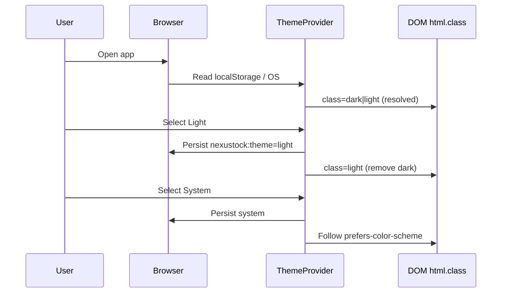

# PHASE 39: Theme Light / Dark + System Default (Option B)

## Execution Spec Maturity

| Mục | Giá trị |
|---|---|
| **Mức hiện tại** | **✅ 100% Ready** (`rp1` disk freeze 2026-07-23) |
| **Option** | **B** — Theme provider + switch + migrate hardcode → semantic tokens (light+dark) |
| **Default** | **`system`** (theo OS / browser `prefers-color-scheme`) |
| **Trạng thái** | ⬜ **Chờ FOUNDER Proceed** `/18-auto-execute` (spec sẵn) |
| **Dev-days** | **4–6** (1 Dev) |
| **Critical Path** | **Không** (UX polish); pilot vẫn chạy dark-only nếu Hold |
| **Port FE** | `http://localhost:3003` |
| **Upstream** | Phase **38 ĐÓNG** (PageShell + tokens dark) |

### Changelog plan

| Ngày | Thay đổi |
|---|---|
| 2026-07-23 | FOUNDER chốt **Option B** · default **system** · `/30-auto-project-planner` |
| 2026-07-23 | Spec 18 mục + Auto-critique §19 → **95% Ready** |
| 2026-07-23 | **`rp1` 100% Ready:** Disk freeze §22 — pages 41/8/8; `next-themes` đã có; baseline hardcode; EP0–EP6 khóa |

### Quyết định khóa

| Câu hỏi | Quyết định |
|---|---|
| Option | **B** (không A hotfix shell-only; không C redesign brand) |
| Default theme | **`system`** |
| Override user | `light` \| `dark` \| `system` — persist `localStorage` key `nexustock:theme` |
| Lib | **`next-themes` ^0.4.6** — **đã có trong package.json** (EP1 không cần `npm i` trừ khi lock lệch) |
| Flash SSR | `suppressHydrationWarning` trên `<html>` + script inline next-themes (chuẩn) |
| Token light | Khóa palette `:root` §8 — **không** cream-serif / purple-AI |
| Hardcode | Migrate `bg-zinc-*` / `text-white` / slate dark-only → `bg-background` / `text-foreground` / `bg-card` / `muted` |
| Switch UI | Trong **SidebarUserMenu** (+ mobile shell compact) |
| Toaster | `theme` theo resolved theme (`system` → light/dark thực tế) |
| Charts / Recharts | Dùng CSS var / `resolvedTheme` — không hardcode hex dark-only |
| i18n / API / RBAC | **Không đổi** |
| Backend | **Không** |

---

## 1. Mục tiêu

Cho phép Admin/Mobile chuyển **Light / Dark / System**, mặc định theo hệ điều hành; light mode **đọc được production** (không còn màn “dark-looking” vì hardcode zinc).

---

## 2. Phạm vi (Scope)

### In scope

| # | Deliverable |
|---|---|
| 1 | `ThemeProvider` (`next-themes`) · default **`system`** |
| 2 | Bỏ hardcode `className="… dark"` trên `<html>` |
| 3 | Theme switcher 3-state trong SidebarUserMenu + MobileShell |
| 4 | Khóa / tinh chỉnh token **`:root` (light)** + giữ `.dark` P38 |
| 5 | Migrate hardcode dark-only trên `app/**`, `components/nav/**`, `components/mobile/**`, `features/**` (không đụng `components/ui/*` trừ chỗ theme-aware bắt buộc) |
| 6 | Sonner Toaster theme sync |
| 7 | Scrollbar light complementary (đã có dark P38 hotfix) |
| 8 | `tests/verify_theme_classes.ps1` — fail pattern dark-only nguy hiểm |
| 9 | Evidence `planning/evidence/phase_39/` + dbm light+dark |
| 10 | Cập nhật AUDIT UX điểm light+dark |

### Non-negotiable

- Default lần đầu (không có localStorage) = **system**.  
- User chọn Light/Dark thì **không** bị OS đè cho đến khi chọn lại System.  
- Không đổi API/business.  
- Không mất i18n keys.  
- PageShell / P38 primitives vẫn dùng.

### Out of scope

- Per-tenant forced theme (server policy)  
- High-contrast a11y mode riêng  
- Brand redesign / marketing landing  
- Sync theme lên user profile API  
- Option A “chỉ shell”  

---

## 3. Điều kiện đầu vào (Readiness)

- [x] Phase 38 **ĐÓNG** (`rp4`+`rp5`) — PageShell + `.dark` tokens  
- [x] `:root` light tokens đã tồn tại (cần polish §8.2 — primary hiện near-black)  
- [x] FOUNDER chốt Option B + default system  
- [x] **`rp1` disk freeze** §22 + `evidence/phase_39/baseline_hardcode.json`  
- [x] `next-themes` dependency **có sẵn** (`^0.4.6`)  
- [x] `DropdownMenuRadioGroup` có sẵn (Base UI)  
- [ ] FOUNDER **Proceed** Phase 39 (gate execute)  

---

## 4. Setup

```text
frontend/
  package.json                         # + next-themes
  src/app/layout.tsx                   # ThemeProvider; bỏ hardcode dark; suppressHydrationWarning
  src/providers/theme-provider.tsx     # NEW wrapper next-themes
  src/components/theme-switcher.tsx    # NEW 3-state control
  src/components/nav/sidebar-user-menu.tsx  # gắn ThemeSwitcher
  src/components/mobile/mobile-shell.tsx    # gắn compact
  src/app/globals.css                  # polish :root light + scrollbar light
  src/app/** , features/**             # migrate hardcode waves
tests/verify_theme_classes.ps1         # NEW
planning/evidence/phase_39/            # NEW
```

### Quy chuẩn mã

- Prefer semantic: `bg-background`, `text-foreground`, `bg-card`, `border-border`, `text-muted-foreground`, `bg-muted`, `bg-sidebar`.  
- Status màu: dùng cặp `bg-emerald-50 text-emerald-800 dark:bg-emerald-950/30 dark:text-emerald-400` (đã có pattern labor).  
- **Cấm** thêm `bg-zinc-950` / `text-white` mới trên page (trừ allowlist ≤5 documented).

---

## 5. Permissions

Không seed permission mới. Theme là preference client.

---

## 6. Database

Không.

---

## 7. Backend & API

Không. (OOS: sync profile theme — Phase sau nếu cần.)

---

## 8. Frontend / UX

### 8.1 Theme model

| Stored value | Resolved |
|---|---|
| `system` | `light` nếu OS light; `dark` nếu OS dark |
| `light` | luôn light |
| `dark` | luôn dark |

Storage: `localStorage["nexustock:theme"]` = `light|dark|system`  
`next-themes` `storageKey="nexustock:theme"`, `defaultTheme="system"`, `attribute="class"`, `enableSystem`.

### 8.2 Light token khóa (`:root`)

| Token | Target light (khóa) | Ghi chú |
|---|---|---|
| `--background` | `oklch(0.985 0.005 260)` | nền app |
| `--foreground` | `oklch(0.22 0.02 260)` | chữ chính |
| `--card` | `oklch(1 0 0)` | card trắng |
| `--muted` | `oklch(0.96 0.005 260)` | |
| `--border` | `oklch(0.90 0.01 260)` | |
| `--primary` | `oklch(0.45 0.12 155)` | ops xanh đậm hơn dark (contrast) |
| `--sidebar` | `oklch(0.98 0.005 260)` | |
| `--sidebar-primary` | cùng hue primary — **không tím** | |

`.dark` giữ như P38 (chỉ chỉnh nếu contrast regress khi A/B visual).

### 8.3 Switcher UI

**Admin (SidebarUserMenu dropdown):**

```
Theme
○ System   (default indicator)
○ Light
○ Dark
```

Dùng `DropdownMenuRadioGroup` **hoặc** 3 button compact trong group (Base UI RadioGroup trong Menu).  
i18n: `Sidebar.account.theme*` + `Common` nếu cần.

**Mobile:** icon Sun/Moon/Monitor cycle hoặc sheet row — compact, không chiếm footer.

### 8.4 States

| State | Behavior |
|---|---|
| First visit | system |
| Toggle | instant class swap; no full reload |
| Hydration | không flash sai theme (FOUC) — next-themes script |
| Toaster | `theme={resolvedTheme === "dark" ? "dark" : "light"}` |

### 8.5 Migrate waves (EP map)

| Wave | Scope | Exit |
|---|---|---|
| W0 | Provider + switcher + tokens light + layout/login/home | visual light+dark OK |
| W1 | `app-sidebar` + user-menu + mobile-shell | shell OK |
| W2 | `app/admin/**` top traffic (qc, inbound, outbound, users, roles) | smoke |
| W3 | remaining admin + observability/integrations | smoke |
| W4 | master-data + features/* dialogs | smoke |
| W5 | mobile/** pages | smoke |
| W6 | verify script + evidence + AUDIT | DoD |

---

## 9. Execution Flow



### Pseudo-code ThemeProvider

```tsx
// frontend/src/providers/theme-provider.tsx
"use client";
import { ThemeProvider as NextThemesProvider } from "next-themes";

export function ThemeProvider({ children }: { children: React.ReactNode }) {
  return (
    <NextThemesProvider
      attribute="class"
      defaultTheme="system"
      enableSystem
      storageKey="nexustock:theme"
      disableTransitionOnChange
    >
      {children}
    </NextThemesProvider>
  );
}
```

### Pseudo-code layout root

```tsx
<html lang={locale} suppressHydrationWarning className={`${fonts} h-full antialiased`}>
  <body>
    <ThemeProvider>
      …providers…
      <Toaster theme={/* client wrapper ThemeAwareToaster */} />
    </ThemeProvider>
  </body>
</html>
```

### Pseudo-code switcher

```tsx
const { theme, setTheme, resolvedTheme } = useTheme();
// theme ∈ {light,dark,system}
<button data-testid="theme-option-system" onClick={() => setTheme("system")} aria-pressed={theme==="system"} />
```

---

## 10. Validation & Business Rules

| ID | Rule |
|---|---|
| TR-01 | Default thiếu key storage → `system` |
| TR-02 | Invalid storage value → fallback `system` |
| TR-03 | `resolvedTheme` chỉ `light`\|`dark` |
| TR-04 | Không gọi API khi đổi theme |
| TR-05 | Theme không ảnh hưởng permission/nav |
| TR-06 | Contrast text/background WCAG AA tối thiểu trên shell + 8 route smoke |

---

## 11. Exception Handling

| Case | Behavior |
|---|---|
| `next-themes` chưa hydrate | UI switcher disabled hoặc skeleton; không crash |
| localStorage blocked | In-memory theme; default system mỗi session |
| OS không hỗ trợ prefers | Fallback dark (document) — ghi evidence |
| Page còn hardcode làm light xấu | Allowlist ≤5 + ticket; DoD fail nếu >5 không document |

---

## 12. Observability & KPI

| Metric | Cách |
|---|---|
| Theme choice | Không telemetr bắt buộc P0 (privacy) |
| Dev evidence | Screenshots light+dark top routes |
| AUDIT | Ghi điểm light readiness trong `AUDIT_UI_UX_PROD_READINESS.md` |

Không thêm OpenTelemetry event P0.

---

## 13. Test Plan

| Loại | Case |
|---|---|
| Unit/static | `verify_theme_classes.ps1` — fail `bg-zinc-950`, `bg-[#0a0a0a]` trong `app/**` (reuse/extend P38) |
| Manual | System OS light → app light; OS dark → app dark |
| Manual | Force Light khi OS dark; Force Dark khi OS light; quay System |
| Regression | `verify_nav_lens`, `verify_i18n`, `verify_ui_shell_classes` |
| DBM | Playwright: set theme light/dark via localStorage + assert `html.dark` absent/present; 8 routes no Issue badge |
| Negative | Clear storage → system; garbage value → system |

### verify_theme_classes.ps1 (contract)

```powershell
# FAIL nếu còn pattern dark-only nguy hiểm trong app/** (trừ allowlist)
# Patterns: bg-zinc-950, bg-[#0a0a0a], text-white trên page root wrappers
# Report: zinc-900 count (migrate target → 0 ideally; allow ≤ N documented)
```

---

## 14. Acceptance Criteria (DoD)

- [ ] `next-themes` wired; default **system**  
- [ ] Switcher Admin + Mobile hoạt động (3 state)  
- [ ] Persist qua reload  
- [ ] Light token khóa §8.2; không purple sidebar  
- [ ] Hardcode migrate: allowlist ≤5; verify script PASS  
- [ ] Toaster theme sync  
- [ ] Regression nav/i18n/shell PASS  
- [ ] dbm light+dark evidence + walkthrough  
- [ ] AUDIT cập nhật  
- [ ] `IMPLEMENTATION_PLAN` row 39 ✅ khi `rp4`+`rp5`  

---

## 15. Out of Scope

Xem §2 Out of scope. Thêm: không đổi WinForms; không multi-brand CSS.

---

## 16. Downstream Dependencies

| Consumer | Impact |
|---|---|
| P38 PageShell | Phải dùng token — đã OK; kiểm tra class cứng còn sót |
| Pilot P37 | Không block; UX optional |
| Docs enduser | CHANGELOG: “Giao diện sáng/tối theo máy hoặc tùy chọn” (khi ship) |

---

## 17. Maintenance & Rollback

**Rollback code:**

1. Revert commit ThemeProvider / switcher.  
2. Thêm lại `dark` cứng trên `<html>` như pre-P39.  
3. Xóa `localStorage.nexustock:theme` (optional script).  

**Rollback partial:** Giữ provider nhưng force `defaultTheme="dark"` + ẩn switcher (hotfix 1 file).

**Không** migration DB.

---

## 18. Auto-critique & Maturity (§19 chi tiết)

### Critique checklist (enterprise)

| # | Câu hỏi | Kết luận P39 |
|---|---|---|
| 1 | Write concurrency | N/A (client preference) |
| 2 | Hardware failure | N/A |
| 3 | Network outage | Theme offline OK (localStorage) |
| 4 | Third-party | Chỉ `next-themes` — pin version; không CDN runtime |

### Blind spots đóng

| ID | Blind spot | Đóng bằng |
|---|---|---|
| BS-39-01 | FOUC / hydration mismatch | `suppressHydrationWarning` + next-themes |
| BS-39-02 | Hardcode zinc phá light | Wave migrate + verify |
| BS-39-03 | Toaster luôn dark | ThemeAwareToaster |
| BS-39-04 | Charts hex dark | resolvedTheme / CSS var |
| BS-39-05 | Default không phải system | Khóa `defaultTheme="system"` |
| BS-39-06 | Storage key conflict | `nexustock:theme` documented |
| BS-39-07 | Mobile thiếu switch | MobileShell W1 |
| BS-39-08 | Scope creep Option C | OOS §15 |
| BS-39-09 | API sync theme | OOS |
| BS-39-10 | ui/* mass rewrite | Không — chỉ page/features |

### Maturity score

| Hạng mục | Điểm |
|---|---|
| Scope + decisions | 10/10 |
| Tokens + UX | 10/10 |
| Pseudo-code | 10/10 |
| Test + DoD | 9/10 |
| Rollback | 10/10 |
| **Tổng** | **95% Ready** |

**Điều kiện nâng 100% Ready execute:** FOUNDER Proceed + `rp1` disk freeze baseline hardcode.

→ **`rp1` DONE 2026-07-23** → maturity **100% Ready** (chờ Proceed để `/18-auto-execute`).

---

## 19. Auto-critique report (2026-07-23)

**Verdict:** PASS — đủ để 1 Dev execute sau Proceed.

**Rủi ro còn lại (không block):** số file hardcode ~500 match grep — cần wave kỷ luật; không làm 1 PR khổng lồ.

**Khuyến nghị execute:** EP0 evidence → EP1 provider/switch → EP2 tokens → EP3–EP5 migrate waves → EP6 verify/dbm/docs.

---

## 20. EP atomic (cho `/18-auto-execute` sau Proceed)

| EP | Goal | Validation |
|---|---|---|
| **EP0** | Evidence scaffold `phase_39/` | ≥3 files |
| **EP1** | next-themes + ThemeProvider + layout + switcher Admin | localStorage + html class |
| **EP2** | Light tokens + scrollbar light + Toaster | visual shell |
| **EP3** | Migrate W2–W3 admin | light smoke 8 routes |
| **EP4** | Migrate features + master-data | dialogs OK |
| **EP5** | Mobile + switcher | RF light OK |
| **EP6** | verify scripts + dbm + AUDIT + master plan | DoD §14 |

**MUST NOT:** Đổi API; bỏ PageShell; force default dark.

---

## 21. Sign-off

| Vai trò | Kết luận | Ngày |
|---|---|---|
| JARVIS | Spec **95% Ready** — Option B · default **system** | 2026-07-23 |
| JARVIS | **`rp1` PASS — 100% Ready** · disk freeze §22 | 2026-07-23 |
| FOUNDER | ☐ Proceed `/18-auto-execute` · ☐ Hold · ☐ Hủy | ____ |

---

## 22. `rp1` — Disk freeze (2026-07-23)

### 22.1 SoT & path khóa

| Mục | Giá trị disk |
|---|---|
| Phase SoT | `planning/phases/phase_39_theme_light_dark_system.md` |
| Baseline JSON | `planning/evidence/phase_39/baseline_hardcode.json` |
| FE port | `:3003` · **UI-only** (0 API) |
| Option / default | **B** / **`system`** |
| P38 | **ĐÓNG** — PageShell + `.dark` OK |
| Lib | `next-themes@^0.4.6` **đã cài** · `theme-provider.tsx` **chưa** · `theme-switcher.tsx` **chưa** |

### 22.2 Inventory trang (migrate surface)

| Area | `page.tsx` count | Wave |
|---|---:|---|
| `app/admin/**` | **41** | W2–W3 |
| `app/master-data/**` | **8** | W4 |
| `app/mobile/**` | **8** | W5 |
| Shell / login / home | layout + login + page | W0–W1 |

### 22.3 Hardcode baseline (`app/**` files chứa pattern)

| Pattern | # files (2026-07-23) | Ghi chú |
|---|---:|---|
| `bg-[#0a0a0a]` | **0** | P38 đã sạch |
| `bg-zinc-950` | **0** | P38 đã sạch trong app |
| `bg-zinc-900` | **0** | P38 đã sạch trong app |
| `bg-zinc-*` (bất kỳ) | **16** | migrate / dual `dark:` |
| `text-white` | **46** | **ưu tiên migrate** → `text-foreground` / semantic |
| `html` class `… dark` | **TRUE** | EP1 bỏ hardcode |
| Toaster `theme="dark"` | **TRUE** | EP2 ThemeAwareToaster |
| `suppressHydrationWarning` | **FALSE** | EP1 bắt buộc thêm |

Scopes phụ (`nav` / `mobile` / `features` / `app-sidebar`): xem JSON baseline.

### 22.4 Token disk vs target

| Token | Disk hôm nay | Target P39 |
|---|---|---|
| `:root --primary` | `oklch(0.205 0 0)` (near-black) | ops xanh §8.2 |
| `.dark --sidebar-primary` | không tím (P38 OK) | giữ |
| Scrollbar dark | có | + scrollbar light |

### 22.5 Primitives / wiring khóa

| Artifact | Disk |
|---|---|
| `PageShell` | **có** |
| `SidebarUserMenu` | **có** — gắn ThemeSwitcher EP1 |
| `DropdownMenuRadioGroup` | **có** — dùng cho 3-state theme |
| `ThemeProvider` / `ThemeSwitcher` | **chưa** — EP1 tạo |

### 22.6 EP ↔ Wave (không đổi thứ tự)

Giữ §20: EP0→EP6. EP1 **không** `npm i next-themes` trừ khi `node_modules` thiếu (disk: đã có).

### 22.7 Blind spots đóng thêm (`rp1`)

| ID | Blind spot | Quyết định |
|---|---|---|
| BS-R1-01 | Tưởng chưa có next-themes | Đã có `^0.4.6` — chỉ wire |
| BS-R1-02 | text-white 281 toàn src | Scope migrate = **app + nav + mobile + features + sidebar** (baseline JSON); không rewrite `ui/*` hàng loạt |
| BS-R1-03 | Light primary near-black | EP2 bắt buộc đổi `:root --primary` §8.2 |
| BS-R1-04 | FOUC | `suppressHydrationWarning` + next-themes |
| BS-R1-05 | Radio trong Menu | Dùng `DropdownMenuRadioGroup` sẵn có |

### 22.8 Verdict `rp1`

**PASS — 100% Ready** để FOUNDER Proceed `/18-auto-execute` (EP0→EP6).

**Block execute:** chỉ khi FOUNDER Hold/Hủy.  
**Không block:** P37 UAT ký; L2/L3 logic.