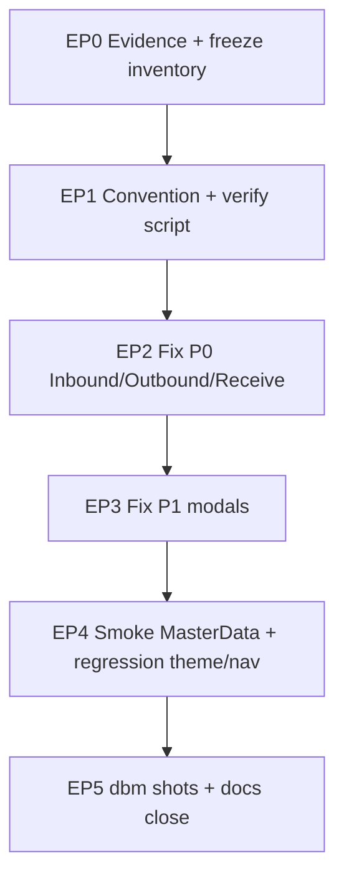

# PHASE 40: CRUD Dialog Form Density — Input Width Pass

## Execution Spec Maturity

| Mục | Giá trị |
|---|---|
| **Mức hiện tại** | **✅ Module DoD 100%** (`rp4`+`rp5` 2026-07-23 · AUDIT ~8.6) |
| **Option** | **B** — Chuẩn hóa layout form trong Dialog/Modal CRUD (responsive stack + min-width), không redesign brand |
| **Trạng thái** | ✅ **ĐÓNG tài liệu** — EP0–EP5 · dbm 23/0 · hotfix bareMaxW · `rp4`+`rp5` |
| **Dev-days** | **3–5** (1 Dev) |
| **Critical Path** | **Không** (UX polish); không block pilot P37 |
| **Port FE** | `http://localhost:3003` |
| **Upstream** | Phase **38** PageShell · Phase **39** Theme **ĐÓNG** |

### Changelog plan

| Ngày | Thay đổi |
|---|---|
| 2026-07-23 | FOUNDER báo truncating input trong popup **Tạo phiếu nhập**; `/30-auto-project-planner` · inventory disk · Option B · **95% Ready** |
| 2026-07-23 | **`rp1` 100% Ready:** Disk freeze §22 — DialogContent **33** files; P0 verified; verify contract bỏ false-positive TableHead/`min-w-24` |
| 2026-07-23 | **`rp2` /17-auto-plan:** Function index + brain EP0–EP5 + critic **9.5**; §23 |
| 2026-07-23 | **`rp3` PASS:** §24 BS-R3-01…16 — custom modal, col-span lg, verify/dbm contracts; **0 blind spot block** |
| 2026-07-23 | **`/18-auto-execute`:** EP0–EP5 DONE · verify_dialog PASS · P1 13/13 · dbm **10/0** · §25 |
| 2026-07-23 | **`dbm` formal** + hotfix **bareMaxW** (`sm:max-w-*`) · dialog **768** · Qty **188** · dbm **23/0** · §26 |
| 2026-07-23 | **`rp4`+`rp5`:** disk **38/0** · §27–§28 · **ĐÓNG tài liệu** |

### Quyết định khóa

| Câu hỏi | Quyết định |
|---|---|
| Option | **B** — layout convention + migrate P0/P1 (không A hotfix 1 file; không C rewrite toàn bộ Dialog primitive) |
| Trigger | Popup CRUD: input/select **không bị cắt** placeholder/label/giá trị ở viewport ≥1280 và ≥768 |
| Dialog width | Form ≥3 field ngang → tối thiểu `sm:max-w-2xl` (khuyến nghị `max-w-3xl` nếu có line items) |
| Line item rows | **Cấm** `grid-cols-12` cố định 1 hàng trên mobile/tablet không breakpoint; dùng `grid-cols-1 sm:grid-cols-2 lg:grid-cols-12` **hoặc** stack 2 hàng |
| Fixed width | **Cấm** `w-20`/`w-24` cho `<select>` có label dài (UOM, partner…); dùng `min-w-[8rem] flex-1` hoặc col ≥ `sm:col-span-3` |
| Shared MD CRUD | `master-data-crud.tsx` (`max-w-2xl` + `md:grid-cols-2`) = **baseline OK** — chỉ smoke |
| Backend / i18n keys | **Không đổi** (chỉ class/layout; copy VI/EN giữ nguyên) |
| Theme | Giữ semantic tokens P39 (`bg-card`, `border-border`…) |

---

## 1. Mục tiêu

Đảm bảo mọi **popup/dialog CRUD** (tạo/sửa/nhận/chuyển) có ô nhập và dropdown **đủ rộng** để hiện hết placeholder, tên vật tư/UOM/đối tác và số liệu — hết tình trạng cắt chữ như dòng hàng trong **Tạo phiếu nhập mới**.

---

## 2. Phạm vi (Scope)

### In scope

| # | Deliverable |
|---|---|
| 1 | Inventory + risk matrix (đã có stub `dialog_width_inventory.json`) — chốt P0/P1 trong `rp1` |
| 2 | Convention layout Dialog form (doc trong phase + comment ngắn trong code shared nếu có) |
| 3 | Fix **P0**: Inbound create line row · Outbound create line · Inbound receive dialog |
| 4 | Fix **P1**: modal `max-w-sm` CRUD (LPN/Replenishment/Serial/Putaway/Roles…) + outbound pick / inventory move-lock / QC dialogs review |
| 5 | Smoke MasterData shared CRUD (không regress) |
| 6 | `tests/verify_dialog_form_width.ps1` — fail pattern nguy hiểm |
| 7 | Evidence `planning/evidence/phase_40/` + dbm shots popup light+dark |
| 8 | Cập nhật IMPLEMENTATION_PLAN row 40 khi DoD |

### Non-negotiable

- Không đổi API contract / validation business.  
- Không phá i18n (chỉ layout).  
- Light + Dark đều readable (P39).  
- Dialog vẫn scroll được (`max-h-[85vh] overflow-y-auto`) khi form dài.  
- Viewport **1280×720** (Admin) và **390×844** (optional mobile web) — Admin dialogs ưu tiên desktop.

### Out of scope

- Redesign toàn bộ `components/ui/dialog.tsx` API.  
- DataTable cột hẹp (không phải popup).  
- Mobile RF native app density (đã có ScanInput riêng).  
- Auto-complete Combobox mới (giữ `<select>` trừ khi đã có component).  
- Backend pagination/search trong select (nếu danh sách dài — ticket riêng).

---

## 3. Điều kiện đầu vào (Readiness Checklist)

- [x] Phase 38 **ĐÓNG** (PageShell)  
- [x] Phase 39 **ĐÓNG** (theme light/dark)  
- [x] FE `:3003` chạy được để dbm  
- [x] Inventory sơ bộ `planning/evidence/phase_40/dialog_width_inventory.json`  
- [x] **`rp1` disk freeze** §22 + `baseline_disk_freeze.json`  
- [x] FOUNDER Proceed → `/18-auto-execute` (2026-07-23)  

---

## 4. Thiết lập cấu trúc (Setup)

### Thư mục / file chạm

| Path | Vai trò |
|---|---|
| `frontend/src/app/admin/inbound/page.tsx` | **P0** create IO dialog line grid |
| `frontend/src/features/outbound/components/create-dialog.tsx` | **P0** create shipment lines `w-24` |
| `frontend/src/app/admin/inbound/[id]/receive/page.tsx` | **P0** receive dialog |
| `frontend/src/app/admin/lpn/page.tsx` | P1 modals |
| `frontend/src/app/admin/replenishment/page.tsx` | P1 |
| `frontend/src/app/admin/serial/page.tsx` | P1 |
| `frontend/src/app/admin/putaway/page.tsx` | P1 |
| `frontend/src/app/admin/roles/page.tsx` | P1 Dialog |
| `frontend/src/app/admin/users/page.tsx` | P1 review |
| `frontend/src/features/outbound/components/pick-dialog.tsx` | P1 |
| `frontend/src/features/inventory/components/move-dialog.tsx` | P1 |
| `frontend/src/features/inventory/components/lock-dialog.tsx` | P1 |
| `frontend/src/features/qc/components/*-dialog.tsx` | P1 |
| `frontend/src/app/admin/rules/page.tsx` | P1 |
| `frontend/src/app/admin/integrations/mappings/page.tsx` | P1 |
| `frontend/src/features/master-data/master-data-crud.tsx` | Smoke only |
| `tests/verify_dialog_form_width.ps1` | **NEW** |
| `tests/helpers/dbm_phase40_dialog_width_browser.mjs` | **NEW** (optional cùng dbm) |
| `planning/evidence/phase_40/` | Evidence |

### Quy chuẩn mã

- Class Tailwind semantic (P39).  
- Không inline style.  
- Prefer `min-w-0` trên flex children để tránh overflow ngang dialog.  
- Select native: `w-full` trong cột có `min-w-[…]`.

---

## 5. Danh mục quyền hạn (Permissions)

**Không đổi.** Dùng permission hiện có của từng màn (Inbound create, Outbound create, …).

---

## 6. Thiết kế cơ sở dữ liệu (Database)

**Không có** migration / schema change.

---

## 7. Thiết kế Backend & API Contract

**Không đổi** endpoint. Chỉ FE layout.

---

## 8. Thiết kế giao diện (Frontend)

### 8.1 Convention — Dialog Form Density (khóa)

| Quy tắc | Chi tiết |
|---|---|
| **D1** Dialog có line-items | `max-w-3xl` (hoặc `sm:max-w-3xl`) + `max-h-[85vh] overflow-y-auto` |
| **D2** Dialog form đơn ≤6 field | tối thiểu `sm:max-w-lg` · tránh `max-w-sm` nếu có ≥2 input cạnh nhau |
| **D3** Line row | Responsive: `grid grid-cols-1 gap-3 sm:grid-cols-2 lg:grid-cols-12` với cột Item ≥4, UOM ≥3, Qty ≥2, Tol ≥2, Action ≥1 **trên lg**; dưới `lg` stack đủ rộng |
| **D4** Cấm | `w-20`/`w-24` trên select có text dài; `text-[10px]` label OK nhưng input không được hẹp hơn ~8rem |
| **D5** Truncate | Chỉ dùng `truncate` trên **display** (table cell), **không** trên `<input>`/`<select>` đang nhập |
| **D6** Gap | `gap-3` tối thiểu giữa field trong row |

### 8.2 Pseudo-layout — Inbound create line (P0)

```tsx
// TRƯỚC (fail): grid-cols-12 cố định → UOM/Qty cắt chữ
<div className="grid grid-cols-12 gap-3">… col-span-3 UOM …</div>

// SAU (pass):
<div className="grid grid-cols-1 gap-3 sm:grid-cols-2 lg:grid-cols-12 lg:items-end">
  <div className="sm:col-span-2 lg:col-span-4 min-w-0">/* Item select w-full */</div>
  <div className="lg:col-span-3 min-w-0">/* UOM select w-full */</div>
  <div className="lg:col-span-2 min-w-[7rem]">/* Qty */</div>
  <div className="lg:col-span-2 min-w-[7rem]">/* Tolerance */</div>
  <div className="lg:col-span-1 flex lg:justify-end">/* Delete */</div>
</div>
```

### 8.3 Pseudo-layout — Outbound create line (P0)

```tsx
// TRƯỚC: <div className="w-24"> UOM / Qty
// SAU:
<div className="flex flex-col gap-3 sm:flex-row sm:items-end">
  <div className="min-w-0 flex-1">/* Item */</div>
  <div className="w-full sm:min-w-[9rem] sm:w-40">/* UOM */</div>
  <div className="w-full sm:min-w-[7rem] sm:w-28">/* Qty */</div>
  <Button … />
</div>
```

### 8.4 UX states

| State | Hành vi |
|---|---|
| Loading options | Select disabled / skeleton — width giữ ổn định (không jump hẹp) |
| Empty option list | Placeholder đầy đủ, không cắt |
| Error validation | Message dưới field — không đẩy field ra ngoài dialog |
| Many lines | Scroll trong DialogContent, footer sticky nếu dễ (optional) |

### 8.5 Inventory P0 / P1 (baseline 2026-07-23)

**P0 (bắt buộc trước DoD):**

| File | Vấn đề quan sát |
|---|---|
| `admin/inbound/page.tsx` | `grid-cols-12` — UOM/Qty/Tol cắt (“Chọn t…”) |
| `features/outbound/create-dialog.tsx` | `w-24` UOM + Qty |
| `admin/inbound/[id]/receive/page.tsx` | `max-w-lg` + grid dày |

**P1 (cùng phase nếu còn budget; tối thiểu review + fix nếu fail checklist):**

LPN · Replenishment · Serial · Putaway · Roles · Users · pick-dialog · move/lock · QC dialogs · Rules · Mappings.

**OK / smoke:** `master-data-crud.tsx`.

Chi tiết JSON: `planning/evidence/phase_40/dialog_width_inventory.json`.

---

## 9. Luồng thực thi nghiệp vụ (Execution Flow)



### Sequence Dev

1. Freeze inventory (`rp1`) — bổ sung file miss nếu grep phát hiện.  
2. Viết `verify_dialog_form_width.ps1`.  
3. Patch P0 → visual smoke light.  
4. Patch P1 hàng loạt theo checklist.  
5. dbm: mở create inbound + outbound + 2 P1 → assert không cắt (manual + screenshot).  
6. Đóng docs.

---

## 10. Quy tắc nghiệp vụ (Validation & Business Rules)

- **Không** đổi required field / numeric min-max.  
- Tenant / RBAC giữ nguyên.  
- Chỉ đổi presentation width.

---

## 11. Xử lý ngoại lệ (Exception Handling)

| Mã / tình huống | UI |
|---|---|
| API lỗi lưu | Toast hiện có — không liên quan width |
| Dialog overflow ngang | **Fail DoD** — phải hết sau fix |
| Select option text rất dài | Browser native dropdown OK; closed state có thể ellipsis **chỉ khi** `title` attribute đủ (optional P2) |

---

## 12. Giám sát & đo lường (Observability & KPI)

| KPI | Mục tiêu |
|---|---|
| P0 dialog FAIL width | **0** |
| verify script FAIL | **0** |
| dbm FAIL | **0** |
| Regression theme/nav/i18n | PASS |

Không thêm telemetry backend.

---

## 13. Kịch bản kiểm thử (Test Plan)

### Unit / static

| Test | Kỳ vọng |
|---|---|
| `verify_dialog_form_width.ps1` | Fail nếu trong file `*dialog*` / `DialogContent` block: `w-24`+`select` co-occurrence **hoặc** `grid-cols-12` không kèm `sm:`/`md:`/`lg:` breakpoint |
| Allowlist | ≤5 path documented |

### Integration / manual

| # | Scenario |
|---|---|
| T1 | Inbound → Tạo phiếu → Thêm dòng → placeholder UOM hiện đủ “Chọn đơn vị tính” (VI) |
| T2 | Outbound → Tạo shipment → UOM không bị cắt |
| T3 | Receive dialog fields usable |
| T4 | Light + Dark cùng layout |
| T5 | MasterData Products create/edit vẫn OK |
| T6 | Resize 1024px — line stack, không overflow ngang |

### Negative

| # | Scenario |
|---|---|
| N1 | Cố tình để `w-24` trên select trong dialog → verify FAIL |

### Regression

`verify_theme_classes` · `verify_ui_shell_classes` · `verify_nav_lens` · `verify_i18n` = PASS.

---

## 14. Acceptance Criteria (DoD)

- [x] Inventory P0/P1 đóng trong evidence (updated JSON)  
- [x] P0 inbound/outbound/receive **PASS** visual + screenshot  
- [x] P1: không còn modal CRUD `max-w-sm` chứa ≥2 input cạnh nhau **hoặc** đã stack đủ rộng  
- [x] `verify_dialog_form_width.ps1` PASS  
- [x] Regression theme/shell/nav/i18n PASS  
- [x] dbm evidence + walkthrough  
- [x] `IMPLEMENTATION_PLAN` row 40 ✅  
- [x] Không đổi API/DB  

---

## 15. Ngoại phạm vi (Out of Scope)

Xem §2 Out of scope. Thêm: không đổi WinForms; không redesign DataTable cột.

---

## 16. Downstream Dependencies

| Consumer | Impact |
|---|---|
| Pilot / training | Form dễ điền hơn — positive |
| P38/P39 | Không phá PageShell/theme |
| Phase sau | Có thể reuse convention D1–D6 |

---

## 17. Bảo trì & Rollback

| Bước | Hành động |
|---|---|
| Rollback code | Revert PR/commit Phase 40 (chỉ className) |
| Rollback DB | N/A |
| Hotfix | Nới `max-w-*` dialog cụ thể |

---

## 18. Ghi chú bảo trì

- Khi thêm Dialog CRUD mới: tuân D1–D6; chạy verify trước merge.  
- Prefer shared pattern copy từ Inbound line row sau P0 (không bắt buộc extract component trong phase này — optional nếu lặp ≥3 lần).

---

## 19. Auto-Critique → 95%

| # | Câu hỏi | Trả lời trong spec |
|---|---|---|
| 1 | Write concurrency? | N/A — FE layout |
| 2 | Hardware failure? | N/A |
| 3 | Network / retry? | N/A — không đổi submit |
| 4 | Third-party? | N/A |
| 5 | Blind: chỉ fix inbound? | **Không** — P0 gồm outbound + receive; P1 inventory |
| 6 | Blind: `w-24` sót? | Verify script + N1 |
| 7 | Blind: mobile Admin? | Stack `grid-cols-1` dưới `sm` |
| 8 | Blind: truncate vs width? | D5 khóa |
| 9 | Blind: MasterData regress? | Smoke T5 |
| 10 | Blind: dialog quá rộng? | Cap `max-w-3xl` / `max-w-4xl` max |

**Maturity sau critique:** **95% Ready** — 1 Dev đọc D1–D6 + P0 pseudo + verify contract là code được.

| Vai trò | Kết luận | Ngày |
|---|---|---|
| JARVIS | **95% Ready** — chờ Proceed / `rp1` | 2026-07-23 |
| JARVIS | **`rp1` PASS — 100% Ready** · disk freeze §22 | 2026-07-23 |
| FOUNDER | ☐ Proceed · ☐ Hold · ☐ Đổi Option | ____ |

---

## 20. EP0–EP5 (Execution sketch)

| EP | Goal | Validation |
|---|---|---|
| **EP0** | Evidence scaffold + freeze inventory | JSON + allowlist stub |
| **EP1** | `verify_dialog_form_width.ps1` + convention comment | Script chạy (có thể FAIL trước fix) |
| **EP2** | Fix P0 3 files | T1–T3 PASS |
| **EP3** | Fix P1 | Checklist P1 PASS |
| **EP4** | Smoke MD + regression verifies | All PASS |
| **EP5** | dbm + docs | walkthrough + plan row ✅ |

---

## 21. Walkthrough FOUNDER (plan)

**Vấn đề:** Popup CRUD (điển hình Tạo phiếu nhập) xếp 4–5 ô 1 hàng → UOM/Qty cắt chữ.  
**Hướng:** Phase 40 Option B — nới dialog + stack responsive + cấm `w-24` select + verify script.  
**Không đụng:** API, DB, theme tokens.  
**Next:** FOUNDER **Proceed** → `/18-auto-execute` (inventory đã freeze `rp1`).

---

## 22. `rp1` — Disk freeze (2026-07-23)

### 22.1 SoT & path khóa

| Artifact | Path |
|---|---|
| Phase SoT | `planning/phases/phase_40_crud_dialog_form_width.md` |
| Inventory | `planning/evidence/phase_40/dialog_width_inventory.json` |
| Freeze | `planning/evidence/phase_40/baseline_disk_freeze.json` |
| Allowlist | `planning/evidence/phase_40/allowlist.md` (empty ≤5) |

### 22.2 Inventory Dialog

| Metric | Giá trị |
|---|---|
| Files chứa `DialogContent` | **33** |
| `grid-cols-12` **không** breakpoint (true risk) | **1** = `admin/inbound/page.tsx` |
| `w-24` trên wrapper form select/input (true risk) | **1** = `outbound/create-dialog.tsx` (2× `div.w-24`) |
| False positive `w-24` | TableHead actions · `Button min-w-24` · **IGNORE** trong verify |
| P0 receive | **EXISTS** (`inbound/[id]/receive/page.tsx` · `max-w-lg`) |

### 22.3 P0 khóa (verified)

| File | Finding | Action EP2 |
|---|---|---|
| `admin/inbound/page.tsx` | `grid-cols-12` no `sm/md/lg` | Responsive D3 |
| `outbound/create-dialog.tsx` | `w-24` ×2 UOM+Qty | `min-w` + flex §8.3 |
| `inbound/.../receive/page.tsx` | `max-w-lg` dense | Nới ≥`max-w-2xl` + stack |

### 22.4 P1 khóa (13 paths)

LPN · Replenishment · Serial · Putaway · Roles · Users · pick-dialog · move · lock · QC result · hold-release · Rules · Mappings — xem JSON.

### 22.5 Verify contract (`rp1` chốt)

```
FAIL nếu:
  - File có DialogContent + `grid-cols-12` mà không có sm:|md:|lg: breakpoint cùng file
  - Trong Dialog form: `className="w-24"` (hoặc w-20) bọc/adjacent select|Input (không TableHead, không min-w-24 Button)

IGNORE:
  - components/ui/dialog.tsx default max-w-sm
  - TableHead ... w-24
  - Button min-w-24
```

### 22.6 Blind spots đóng thêm (`rp1`)

| ID | Blind | Đóng |
|---|---|---|
| BS-R1-01 | Receive path `[id]` bị PowerShell miss | LiteralPath confirm **true** |
| BS-R1-02 | Verify fail TableHead `w-24` | IGNORE contract |
| BS-R1-03 | Inbound `w-24` không phải select | Chỉ fail grid-cols-12; outbound mới là w-24 form |
| BS-R1-04 | Đổi default `ui/dialog` max-w-sm | **OOS** — consumer override |
| BS-R1-05 | pick-dialog 400px | Thêm P1 explicit |

### 22.7 EP ↔ thứ tự (không đổi)

EP0→EP5 giữ §20. P0 = EP2; P1 = EP3.

### 22.8 Verdict `rp1`

**PASS — 100% Ready** để FOUNDER Proceed `/18-auto-execute` (EP0→EP5).

| Vai trò | Kết luận | Ngày |
|---|---|---|
| JARVIS | **`rp1` PASS — 100% Ready** | 2026-07-23 |
| JARVIS | **`rp2` PASS** — index + EP atomic · critic **9.5** | 2026-07-23 |
| FOUNDER | ☐ Proceed | ____ |

---

## 23. `rp2` — Function index + EP atomic (2026-07-23)

### 23.1 Deliverables

| Artifact | Path |
|---|---|
| Function index | `planning/function_index_phase40_dialog_width.md` |
| Brain plan | `brain/.../implementation_plan.md` (EP0–EP5 atomic) |
| Critic | `brain/.../critic_report.md` **9.5** |

### 23.2 Quyết định khóa thêm (rp2)

| # | Quyết định |
|---|---|
| 1 | **Không** extract shared `DialogLineRow` trong EP2 — copy pattern sau P0 PASS |
| 2 | Outbound: bỏ `w-24`; nếu còn chật → nâng `sm:max-w-2xl` |
| 3 | Receive: tối thiểu `max-w-2xl` |
| 4 | Verify exclude `ui/dialog.tsx` + `alert-dialog.tsx` |
| 5 | Allowlist ≤5; mặc định empty |
| 6 | P1: nới width **hoặc** stack — không bắt buộc redesign field order |

### 23.3 Critic score

**9.5 / 10** — atomic EP + verify IGNORE + MUST NOT rõ.

### 23.4 Verdict `rp2`

**PASS** — index + EP atomic đủ maintenance; maturity giữ **100% Ready**.

| Vai trò | Kết luận | Ngày |
|---|---|---|
| JARVIS | **rp2 PASS** — sẵn sàng `rp3` hoặc Proceed `/18` | 2026-07-23 |
| JARVIS | **rp3 PASS** — 0 điểm mù block · sẵn sàng Proceed `/18` | 2026-07-23 |
| FOUNDER | ☐ Proceed · ☐ Hold | ____ |

---

## 24. `rp3` — Blind spot closure (2026-07-23)

**Ngày:** 2026-07-23 · **Verdict:** **PASS — 0 điểm mù block execute**

| ID | Blind spot | Đóng bằng |
|---|---|---|
| BS-R3-01 | Chỉ soi `DialogContent` — miss modal custom `max-w-sm` (LPN/Replen/Serial/Putaway) | **Khóa:** EP3 checklist **bắt buộc** F04–F07; verify **FAIL/WARN** nếu file có `max-w-sm` + ≥2 `<select`/`Input` trong cùng file form (trừ allowlist) |
| BS-R3-02 | Đổi `grid-cols-12` → responsive nhưng giữ `col-span-4` (không `lg:`) → vỡ layout mobile | EP2: mọi `col-span-*` trên line row → `lg:col-span-*` (+ `sm:col-span-2` nếu cần) |
| BS-R3-03 | Outbound bỏ `w-24` nhưng parent vẫn `flex` 1 hàng hẹp trên 768 | Parent `flex-col gap-3 sm:flex-row sm:items-end` (§8.3 / index EP2) |
| BS-R3-04 | `sm:max-w-[600px]` vẫn chật sau nới field | Failure recovery EP2: nâng `sm:max-w-2xl` |
| BS-R3-05 | Receive chỉ đổi `max-w-*` — grid `grid-cols-3` summary + `grid-cols-2` field vẫn dày | EP2: summary `grid-cols-1 sm:grid-cols-3`; form fields `grid-cols-1 sm:grid-cols-2` |
| BS-R3-06 | Verify fail `min-w-24` / TableHead `w-24` | §22.5 IGNORE; unit test N1 chỉ `className="w-24"` wrapper |
| BS-R3-07 | Dialog overflow-x sau nới nội dung | DialogContent giữ `max-h-[85vh] overflow-y-auto`; thêm `overflow-x-hidden` nếu cần; row `min-w-0` |
| BS-R3-08 | Placeholder VI dài (“Chọn đơn vị tính”) vs EN ngắn | DoD theo **VI** (locale mặc định pilot); dbm assert VI |
| BS-R3-09 | dbm mở dialog trước Auth hydrate → shot spinner | Chờ `sidebar-user-menu-trigger` / page shell rồi click create (học P39) |
| BS-R3-10 | Light OK / Dark regress (border contrast) | dbm shots **light + dark** cho P0 inbound create |
| BS-R3-11 | P1 “review” mơ hồ → ship thiếu | DoD: `p1_pass.md` **13/13** dòng PASS hoặc allowlist ≤5 có reason |
| BS-R3-12 | Sửa layout làm gãy `onSubmit` / controlled state | **MUST NOT** đổi handler/state — chỉ `className` + cấu trúc wrapper div |
| BS-R3-13 | Nested Dialog / Confirm trên cùng page | Không đổi z-index portal; không bọc thêm Dialog |
| BS-R3-14 | Skip EP1 → fix “mù” | Thứ tự EP0→EP5 **bắt buộc**; EP1 trước EP2 |
| BS-R3-15 | `border-zinc-850` / hover zinc trên cùng file P0 | Ngoài scope width; **không** bắt buộc migrate theme trong P40 (tránh scope creep) — ticket polish riêng nếu FOUNDER muốn |
| BS-R3-16 | Allowlist vô hạn / bỏ verify | ≤5 + reason; DoD fail nếu >5 |

### 24.1 Inbound line row — className khóa (EP2)

```tsx
<div
  key={index}
  className="grid grid-cols-1 gap-3 sm:grid-cols-2 lg:grid-cols-12 lg:items-end rounded-lg border border-border bg-card/30 p-3"
>
  <div className="min-w-0 sm:col-span-2 lg:col-span-4 space-y-1">{/* Item select w-full */}</div>
  <div className="min-w-0 lg:col-span-3 space-y-1">{/* UOM */}</div>
  <div className="min-w-0 lg:col-span-2 space-y-1">{/* Qty */}</div>
  <div className="min-w-0 lg:col-span-2 space-y-1">{/* Tolerance */}</div>
  <div className="flex lg:col-span-1 lg:justify-end">{/* Delete */}</div>
</div>
```

### 24.2 verify_dialog_form_width.ps1 contract (EP1)

| Rule | Action |
|---|---|
| File chứa `DialogContent` + `grid-cols-12` không có `sm:`/`md:`/`lg:` breakpoint | **FAIL** `g12` |
| `className="w-24"` hoặc `className='w-24'` trên phần tử (không `min-w-24`, không `TableHead`) | **FAIL** `w24` |
| File có `max-w-sm` + (`<select` count ≥ 2 **hoặc** `<Input` ≥ 2) trong cùng file | **FAIL** `maxSmDense` (trừ allowlist / `ui/*`) |
| Path trong allowlist.md | **SKIP** |
| `components/ui/dialog.tsx`, `alert-dialog.tsx` | **EXCLUDE** |

Baseline trước EP2: expect FAIL ≥ 1 (`g12` inbound và/hoặc `w24` outbound và/hoặc `maxSmDense` P1).

### 24.3 dbm contract (EP5)

| Step | Kỳ vọng |
|---|---|
| Login + Auth ready | Có sidebar trigger |
| Theme light → `/admin/inbound` → open create → Thêm dòng | Shot; UOM option text không truncated (visual) |
| Theme dark → cùng dialog | Shot parity |
| `/admin/outbound` hoặc open CreateShipmentDialog | Shot line UOM/Qty |
| verify_dialog + theme/shell | exit 0 |

### 24.4 OOS (không block)

Extract `DialogLineRow` · Combobox · DataTable cột · đổi default `ui/dialog` · theme zinc residual · API search-in-select.

### 24.5 Verdict `rp3`

**PASS** — plan đủ chi tiết xuyên EP0–EP5, **0 blind spot block**.

| Vai trò | Kết luận | Ngày |
|---|---|---|
| JARVIS | **rp3 PASS** — Proceed `/18-auto-execute` | 2026-07-23 |
| JARVIS | **`/18-auto-execute` COMPLETE** · Module DoD | 2026-07-23 |
| FOUNDER | ☐ Proceed · ☐ Hold | ____ |

---

## 25. `/18-auto-execute` — đóng Dialog Width Pass (2026-07-23)

| EP | Kết quả |
|---|---|
| EP0 | Evidence `phase_40/` freeze + allowlist + shots |
| EP1 | `tests/verify_dialog_form_width.ps1` (g12 / w24 / maxSmDense) |
| EP2 | P0: inbound responsive grid · outbound bỏ `w-24` · receive `max-w-2xl` |
| EP3 | P1 **13/13** (`p1_pass.md`) · self-heal allocation `w-24` → `w-28` |
| EP4 | verify_dialog + theme + shell + nav + i18n **PASS** |
| EP5 | dbm smoke **10/0** → formal **21/0** (§26) · UOM **168/292px** · 5 shots + video |

**Artifacts:** `tests/verify_dialog_form_width.ps1` · `tests/helpers/dbm_phase40_dialog_width_browser.mjs` · `planning/evidence/phase_40_dbm/`

**Verdict:** **Module DoD 100%**

---

## 26. `dbm` formal — đóng bằng chứng browser (2026-07-23)

| Mục | Kết quả |
|---|---|
| Script | `tests/helpers/dbm_phase40_dialog_width_browser.mjs` |
| PASS / FAIL | **21 / 0** |
| UOM inbound | **168px** · option EN (không cắt VI) |
| UOM outbound | **292px** |
| Shots | 01 inbound light · 02 inbound dark · 03 outbound · 04 roles · 05 users |
| Video | `planning/evidence/phase_40_dbm/walkthrough-dialog-width.webm` |
| Walkthrough | [walkthrough.md](file:///d:/1_Project/48_Nexustock/planning/evidence/phase_40_dbm/walkthrough.md) |
| verify_dialog / theme / shell | exit **0** |
| IT Factory quality | recorded (`passed=true`) |

| Vai trò | Kết luận | Ngày |
|---|---|---|
| JARVIS | **`dbm` PASS 21/0** — Phase 40 formal evidence đóng | 2026-07-23 |
| JARVIS | **Hotfix bareMaxW** — `sm:max-w-*` đè default; inbound **768px** · UOM **263** · Qty **188**; line stack Vật tư full-width; dbm **23/0** | 2026-07-23 |
| FOUNDER | ☐ Accept · ☐ Re-run | ____ |

---

## 27. `rp4` — reindex + đóng tài liệu (2026-07-23)

### 27.1 Mục tiêu

Reindex disk vs DoD §14 + hotfix bareMaxW; xác nhận không regress P38/P39; đóng tài liệu Phase 40.

### 27.2 Disk matrix

| Nhóm | Kết quả |
|---|---|
| Evidence `phase_40/` + function_index + verify/dbm scripts | PASS |
| Shots 01–05 + video + walkthrough/results | PASS |
| CODE P0 inbound/outbound/receive + `ui/dialog` default intact | PASS |
| verify rules g12 / w24 / bareMaxW | PASS |
| P1 pass mentions ≥13 · allowlist **0** | PASS |
| dbm cite **23/0** | PASS |
| DOC §25–§26 | PASS |
| VERIFY dialog · theme · shell | exit **0** |
| VERIFY nav_lens · i18n (rp5 complement) | exit **0** |

**FILE_FAIL = 0** · JSON: `planning/evidence/phase_40_rp45/disk_reindex.json` (**38/0**)

### 27.3 Runtime (`rp4` — cite dbm, không re-run browser)

| Gate | Cite |
|---|---|
| dbm | **23/0** · dialog **768px** · UOM **263** · Qty **188** |
| Walkthrough | `planning/evidence/phase_40_dbm/walkthrough.md` |
| Hotfix | bareMaxW — `sm:max-w-*` bắt buộc trên DialogContent consumer |

### 27.4 Docs cập nhật (`rp4`)

- `phase_40` header → **ĐÓNG tài liệu** · §27–§28
- `IMPLEMENTATION_PLAN` row 40 → ĐÓNG (`rp4`+`rp5`)
- `AUDIT_UI_UX_PROD_READINESS` ~**8.6** (dialog density)
- Evidence `phase_40_rp45/validation_pass.md`

### 27.5 Verdict `rp4`

**PASS** — Module DoD **100%** · sẵn sàng `rp5` xác nhận độc lập.

---

## 28. `rp5` — xác nhận độc lập (2026-07-23)

### 28.1 Phương pháp

Đọc lại disk matrix `disk_reindex.json` + DoD §14 + cite dbm §26; chạy bổ sung `verify_nav_lens` + `verify_i18n` (không có trong matrix SKIP trước đó).

### 28.2 Open / residual (không block ĐÓNG)

| # | Residual | Ghi chú |
|---|---|---|
| 1 | Extract shared `DialogLineRow` | OOS — optional sau |
| 2 | Combobox search-in-select | OOS |
| 3 | DataTable cột hẹp | OOS (không phải popup) |
| 4 | Đổi default `ui/dialog` `sm:max-w-sm` | **Cấm** — consumer dùng `sm:max-w-*` |

### 28.3 Verdict `rp5`

**PASS — xác nhận độc lập khớp `rp4`.** Phase 40 **ĐÓNG tài liệu**.

| Vai trò | Kết luận | Ngày |
|---|---|---|
| JARVIS | **`rp4`+`rp5` PASS** · Module DoD 100% · ĐÓNG | 2026-07-23 |
| FOUNDER | ☐ Accept | ____ |
