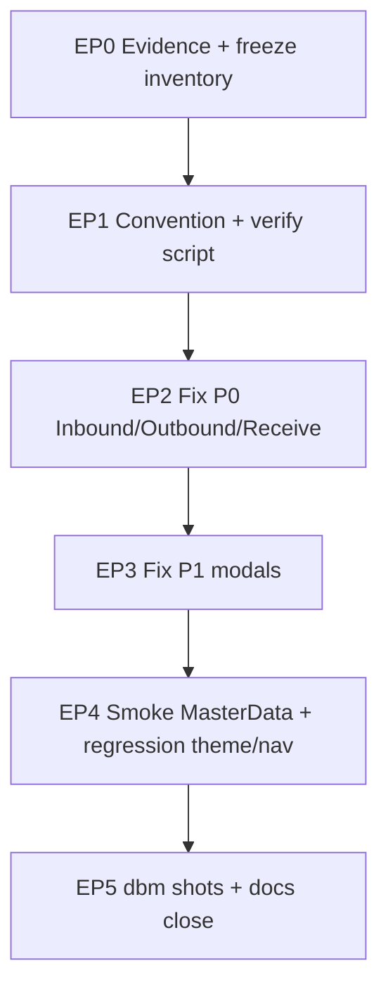

# PHASE 40: CRUD Dialog Form Density — Input Width Pass

## Execution Spec Maturity

| Mục | Giá trị |
|---|---|
| **Mức hiện tại** | **95% Ready** (`/30-auto-project-planner` 2026-07-23) |
| **Option** | **B** — Chuẩn hóa layout form trong Dialog/Modal CRUD (responsive stack + min-width), không redesign brand |
| **Trạng thái** | 🟡 Spec sẵn sàng — chờ FOUNDER Proceed → `rp1`/`rp2`/`rp3` hoặc `/18-auto-execute` |
| **Dev-days** | **3–5** (1 Dev) |
| **Critical Path** | **Không** (UX polish); không block pilot P37 |
| **Port FE** | `http://localhost:3003` |
| **Upstream** | Phase **38** PageShell · Phase **39** Theme **ĐÓNG** |

### Changelog plan

| Ngày | Thay đổi |
|---|---|
| 2026-07-23 | FOUNDER báo truncating input trong popup **Tạo phiếu nhập**; `/30-auto-project-planner` · inventory disk · Option B · **95% Ready** |

### Quyết định khóa

| Câu hỏi | Quyết định |
|---|---|
| Option | **B** — layout convention + migrate P0/P1 (không A hotfix 1 file; không C rewrite toàn bộ Dialog primitive) |
| Trigger | Popup CRUD: input/select **không bị cắt** placeholder/label/giá trị ở viewport ≥1280 và ≥768 |
| Dialog width | Form ≥3 field ngang → tối thiểu `sm:max-w-2xl` (khuyến nghị `max-w-3xl` nếu có line items) |
| Line item rows | **Cấm** `grid-cols-12` cố định 1 hàng trên mobile/tablet không breakpoint; dùng `grid-cols-1 sm:grid-cols-2 lg:grid-cols-12` **hoặc** stack 2 hàng |
| Fixed width | **Cấm** `w-20`/`w-24` cho `<select>` có label dài (UOM, partner…); dùng `min-w-[8rem] flex-1` hoặc col ≥ `sm:col-span-3` |
| Shared MD CRUD | `master-data-crud.tsx` (`max-w-2xl` + `md:grid-cols-2`) = **baseline OK** — chỉ smoke |
| Backend / i18n keys | **Không đổi** (chỉ class/layout; copy VI/EN giữ nguyên) |
| Theme | Giữ semantic tokens P39 (`bg-card`, `border-border`…) |

---

## 1. Mục tiêu

Đảm bảo mọi **popup/dialog CRUD** (tạo/sửa/nhận/chuyển) có ô nhập và dropdown **đủ rộng** để hiện hết placeholder, tên vật tư/UOM/đối tác và số liệu — hết tình trạng cắt chữ như dòng hàng trong **Tạo phiếu nhập mới**.

---

## 2. Phạm vi (Scope)

### In scope

| # | Deliverable |
|---|---|
| 1 | Inventory + risk matrix (đã có stub `dialog_width_inventory.json`) — chốt P0/P1 trong `rp1` |
| 2 | Convention layout Dialog form (doc trong phase + comment ngắn trong code shared nếu có) |
| 3 | Fix **P0**: Inbound create line row · Outbound create line · Inbound receive dialog |
| 4 | Fix **P1**: modal `max-w-sm` CRUD (LPN/Replenishment/Serial/Putaway/Roles…) + outbound pick / inventory move-lock / QC dialogs review |
| 5 | Smoke MasterData shared CRUD (không regress) |
| 6 | `tests/verify_dialog_form_width.ps1` — fail pattern nguy hiểm |
| 7 | Evidence `planning/evidence/phase_40/` + dbm shots popup light+dark |
| 8 | Cập nhật IMPLEMENTATION_PLAN row 40 khi DoD |

### Non-negotiable

- Không đổi API contract / validation business.  
- Không phá i18n (chỉ layout).  
- Light + Dark đều readable (P39).  
- Dialog vẫn scroll được (`max-h-[85vh] overflow-y-auto`) khi form dài.  
- Viewport **1280×720** (Admin) và **390×844** (optional mobile web) — Admin dialogs ưu tiên desktop.

### Out of scope

- Redesign toàn bộ `components/ui/dialog.tsx` API.  
- DataTable cột hẹp (không phải popup).  
- Mobile RF native app density (đã có ScanInput riêng).  
- Auto-complete Combobox mới (giữ `<select>` trừ khi đã có component).  
- Backend pagination/search trong select (nếu danh sách dài — ticket riêng).

---

## 3. Điều kiện đầu vào (Readiness Checklist)

- [x] Phase 38 **ĐÓNG** (PageShell)  
- [x] Phase 39 **ĐÓNG** (theme light/dark)  
- [x] FE `:3003` chạy được để dbm  
- [x] Inventory sơ bộ `planning/evidence/phase_40/dialog_width_inventory.json`  
- [ ] FOUNDER Proceed trước `/18-auto-execute`  

---

## 4. Thiết lập cấu trúc (Setup)

### Thư mục / file chạm

| Path | Vai trò |
|---|---|
| `frontend/src/app/admin/inbound/page.tsx` | **P0** create IO dialog line grid |
| `frontend/src/features/outbound/components/create-dialog.tsx` | **P0** create shipment lines `w-24` |
| `frontend/src/app/admin/inbound/[id]/receive/page.tsx` | **P0** receive dialog |
| `frontend/src/app/admin/lpn/page.tsx` | P1 modals |
| `frontend/src/app/admin/replenishment/page.tsx` | P1 |
| `frontend/src/app/admin/serial/page.tsx` | P1 |
| `frontend/src/app/admin/putaway/page.tsx` | P1 |
| `frontend/src/app/admin/roles/page.tsx` | P1 Dialog |
| `frontend/src/app/admin/users/page.tsx` | P1 review |
| `frontend/src/features/outbound/components/pick-dialog.tsx` | P1 |
| `frontend/src/features/inventory/components/move-dialog.tsx` | P1 |
| `frontend/src/features/inventory/components/lock-dialog.tsx` | P1 |
| `frontend/src/features/qc/components/*-dialog.tsx` | P1 |
| `frontend/src/app/admin/rules/page.tsx` | P1 |
| `frontend/src/app/admin/integrations/mappings/page.tsx` | P1 |
| `frontend/src/features/master-data/master-data-crud.tsx` | Smoke only |
| `tests/verify_dialog_form_width.ps1` | **NEW** |
| `tests/helpers/dbm_phase40_dialog_width_browser.mjs` | **NEW** (optional cùng dbm) |
| `planning/evidence/phase_40/` | Evidence |

### Quy chuẩn mã

- Class Tailwind semantic (P39).  
- Không inline style.  
- Prefer `min-w-0` trên flex children để tránh overflow ngang dialog.  
- Select native: `w-full` trong cột có `min-w-[…]`.

---

## 5. Danh mục quyền hạn (Permissions)

**Không đổi.** Dùng permission hiện có của từng màn (Inbound create, Outbound create, …).

---

## 6. Thiết kế cơ sở dữ liệu (Database)

**Không có** migration / schema change.

---

## 7. Thiết kế Backend & API Contract

**Không đổi** endpoint. Chỉ FE layout.

---

## 8. Thiết kế giao diện (Frontend)

### 8.1 Convention — Dialog Form Density (khóa)

| Quy tắc | Chi tiết |
|---|---|
| **D1** Dialog có line-items | `max-w-3xl` (hoặc `sm:max-w-3xl`) + `max-h-[85vh] overflow-y-auto` |
| **D2** Dialog form đơn ≤6 field | tối thiểu `sm:max-w-lg` · tránh `max-w-sm` nếu có ≥2 input cạnh nhau |
| **D3** Line row | Responsive: `grid grid-cols-1 gap-3 sm:grid-cols-2 lg:grid-cols-12` với cột Item ≥4, UOM ≥3, Qty ≥2, Tol ≥2, Action ≥1 **trên lg**; dưới `lg` stack đủ rộng |
| **D4** Cấm | `w-20`/`w-24` trên select có text dài; `text-[10px]` label OK nhưng input không được hẹp hơn ~8rem |
| **D5** Truncate | Chỉ dùng `truncate` trên **display** (table cell), **không** trên `<input>`/`<select>` đang nhập |
| **D6** Gap | `gap-3` tối thiểu giữa field trong row |

### 8.2 Pseudo-layout — Inbound create line (P0)

```tsx
// TRƯỚC (fail): grid-cols-12 cố định → UOM/Qty cắt chữ
<div className="grid grid-cols-12 gap-3">… col-span-3 UOM …</div>

// SAU (pass):
<div className="grid grid-cols-1 gap-3 sm:grid-cols-2 lg:grid-cols-12 lg:items-end">
  <div className="sm:col-span-2 lg:col-span-4 min-w-0">/* Item select w-full */</div>
  <div className="lg:col-span-3 min-w-0">/* UOM select w-full */</div>
  <div className="lg:col-span-2 min-w-[7rem]">/* Qty */</div>
  <div className="lg:col-span-2 min-w-[7rem]">/* Tolerance */</div>
  <div className="lg:col-span-1 flex lg:justify-end">/* Delete */</div>
</div>
```

### 8.3 Pseudo-layout — Outbound create line (P0)

```tsx
// TRƯỚC: <div className="w-24"> UOM / Qty
// SAU:
<div className="flex flex-col gap-3 sm:flex-row sm:items-end">
  <div className="min-w-0 flex-1">/* Item */</div>
  <div className="w-full sm:min-w-[9rem] sm:w-40">/* UOM */</div>
  <div className="w-full sm:min-w-[7rem] sm:w-28">/* Qty */</div>
  <Button … />
</div>
```

### 8.4 UX states

| State | Hành vi |
|---|---|
| Loading options | Select disabled / skeleton — width giữ ổn định (không jump hẹp) |
| Empty option list | Placeholder đầy đủ, không cắt |
| Error validation | Message dưới field — không đẩy field ra ngoài dialog |
| Many lines | Scroll trong DialogContent, footer sticky nếu dễ (optional) |

### 8.5 Inventory P0 / P1 (baseline 2026-07-23)

**P0 (bắt buộc trước DoD):**

| File | Vấn đề quan sát |
|---|---|
| `admin/inbound/page.tsx` | `grid-cols-12` — UOM/Qty/Tol cắt (“Chọn t…”) |
| `features/outbound/create-dialog.tsx` | `w-24` UOM + Qty |
| `admin/inbound/[id]/receive/page.tsx` | `max-w-lg` + grid dày |

**P1 (cùng phase nếu còn budget; tối thiểu review + fix nếu fail checklist):**

LPN · Replenishment · Serial · Putaway · Roles · Users · pick-dialog · move/lock · QC dialogs · Rules · Mappings.

**OK / smoke:** `master-data-crud.tsx`.

Chi tiết JSON: `planning/evidence/phase_40/dialog_width_inventory.json`.

---

## 9. Luồng thực thi nghiệp vụ (Execution Flow)



### Sequence Dev

1. Freeze inventory (`rp1`) — bổ sung file miss nếu grep phát hiện.  
2. Viết `verify_dialog_form_width.ps1`.  
3. Patch P0 → visual smoke light.  
4. Patch P1 hàng loạt theo checklist.  
5. dbm: mở create inbound + outbound + 2 P1 → assert không cắt (manual + screenshot).  
6. Đóng docs.

---

## 10. Quy tắc nghiệp vụ (Validation & Business Rules)

- **Không** đổi required field / numeric min-max.  
- Tenant / RBAC giữ nguyên.  
- Chỉ đổi presentation width.

---

## 11. Xử lý ngoại lệ (Exception Handling)

| Mã / tình huống | UI |
|---|---|
| API lỗi lưu | Toast hiện có — không liên quan width |
| Dialog overflow ngang | **Fail DoD** — phải hết sau fix |
| Select option text rất dài | Browser native dropdown OK; closed state có thể ellipsis **chỉ khi** `title` attribute đủ (optional P2) |

---

## 12. Giám sát & đo lường (Observability & KPI)

| KPI | Mục tiêu |
|---|---|
| P0 dialog FAIL width | **0** |
| verify script FAIL | **0** |
| dbm FAIL | **0** |
| Regression theme/nav/i18n | PASS |

Không thêm telemetry backend.

---

## 13. Kịch bản kiểm thử (Test Plan)

### Unit / static

| Test | Kỳ vọng |
|---|---|
| `verify_dialog_form_width.ps1` | Fail nếu trong file `*dialog*` / `DialogContent` block: `w-24`+`select` co-occurrence **hoặc** `grid-cols-12` không kèm `sm:`/`md:`/`lg:` breakpoint |
| Allowlist | ≤5 path documented |

### Integration / manual

| # | Scenario |
|---|---|
| T1 | Inbound → Tạo phiếu → Thêm dòng → placeholder UOM hiện đủ “Chọn đơn vị tính” (VI) |
| T2 | Outbound → Tạo shipment → UOM không bị cắt |
| T3 | Receive dialog fields usable |
| T4 | Light + Dark cùng layout |
| T5 | MasterData Products create/edit vẫn OK |
| T6 | Resize 1024px — line stack, không overflow ngang |

### Negative

| # | Scenario |
|---|---|
| N1 | Cố tình để `w-24` trên select trong dialog → verify FAIL |

### Regression

`verify_theme_classes` · `verify_ui_shell_classes` · `verify_nav_lens` · `verify_i18n` = PASS.

---

## 14. Acceptance Criteria (DoD)

- [ ] Inventory P0/P1 đóng trong evidence (updated JSON)  
- [ ] P0 inbound/outbound/receive **PASS** visual + screenshot  
- [ ] P1: không còn modal CRUD `max-w-sm` chứa ≥2 input cạnh nhau **hoặc** đã stack đủ rộng  
- [ ] `verify_dialog_form_width.ps1` PASS  
- [ ] Regression theme/shell/nav/i18n PASS  
- [ ] dbm evidence + walkthrough  
- [ ] `IMPLEMENTATION_PLAN` row 40 ✅  
- [ ] Không đổi API/DB  

---

## 15. Ngoại phạm vi (Out of Scope)

Xem §2 Out of scope. Thêm: không đổi WinForms; không redesign DataTable cột.

---

## 16. Downstream Dependencies

| Consumer | Impact |
|---|---|
| Pilot / training | Form dễ điền hơn — positive |
| P38/P39 | Không phá PageShell/theme |
| Phase sau | Có thể reuse convention D1–D6 |

---

## 17. Bảo trì & Rollback

| Bước | Hành động |
|---|---|
| Rollback code | Revert PR/commit Phase 40 (chỉ className) |
| Rollback DB | N/A |
| Hotfix | Nới `max-w-*` dialog cụ thể |

---

## 18. Ghi chú bảo trì

- Khi thêm Dialog CRUD mới: tuân D1–D6; chạy verify trước merge.  
- Prefer shared pattern copy từ Inbound line row sau P0 (không bắt buộc extract component trong phase này — optional nếu lặp ≥3 lần).

---

## 19. Auto-Critique → 95%

| # | Câu hỏi | Trả lời trong spec |
|---|---|---|
| 1 | Write concurrency? | N/A — FE layout |
| 2 | Hardware failure? | N/A |
| 3 | Network / retry? | N/A — không đổi submit |
| 4 | Third-party? | N/A |
| 5 | Blind: chỉ fix inbound? | **Không** — P0 gồm outbound + receive; P1 inventory |
| 6 | Blind: `w-24` sót? | Verify script + N1 |
| 7 | Blind: mobile Admin? | Stack `grid-cols-1` dưới `sm` |
| 8 | Blind: truncate vs width? | D5 khóa |
| 9 | Blind: MasterData regress? | Smoke T5 |
| 10 | Blind: dialog quá rộng? | Cap `max-w-3xl` / `max-w-4xl` max |

**Maturity sau critique:** **95% Ready** — 1 Dev đọc D1–D6 + P0 pseudo + verify contract là code được.

| Vai trò | Kết luận | Ngày |
|---|---|---|
| JARVIS | **95% Ready** — chờ Proceed / `rp1` | 2026-07-23 |
| FOUNDER | ☐ Proceed · ☐ Hold · ☐ Đổi Option | ____ |

---

## 20. EP0–EP5 (Execution sketch)

| EP | Goal | Validation |
|---|---|---|
| **EP0** | Evidence scaffold + freeze inventory | JSON + allowlist stub |
| **EP1** | `verify_dialog_form_width.ps1` + convention comment | Script chạy (có thể FAIL trước fix) |
| **EP2** | Fix P0 3 files | T1–T3 PASS |
| **EP3** | Fix P1 | Checklist P1 PASS |
| **EP4** | Smoke MD + regression verifies | All PASS |
| **EP5** | dbm + docs | walkthrough + plan row ✅ |

---

## 21. Walkthrough FOUNDER (plan)

**Vấn đề:** Popup CRUD (điển hình Tạo phiếu nhập) xếp 4–5 ô 1 hàng → UOM/Qty cắt chữ.  
**Hướng:** Phase 40 Option B — nới dialog + stack responsive + cấm `w-24` select + verify script.  
**Không đụng:** API, DB, theme tokens.  
**Next:** FOUNDER **Proceed** → `rp1` freeze hoặc thẳng `/18-auto-execute` nếu chấp nhận inventory hiện tại.
