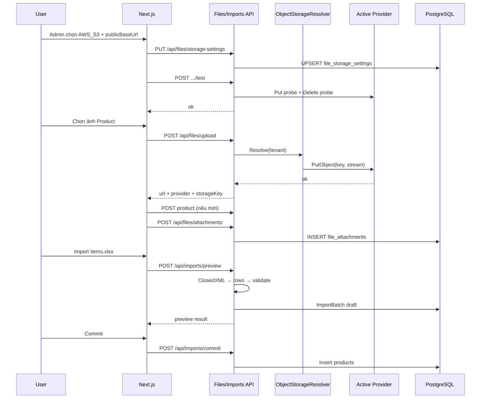

# PHASE 41: File Attachments + Spreadsheet Import/Export — Gap Close

## Execution Spec Maturity

| Mục | Giá trị |
|---|---|
| **Mức hiện tại** | **✅ Module DoD 100%** (`rp4`+`rp5` 2026-07-23 · AUDIT ~8.7) |
| **Option** | **B** — Shared File Service + **Storage Provider abstraction** (default Local + cloud lớn) + EntityAttachment + Product P0 + Excel/CSV Master |
| **Trạng thái** | ✅ **ĐÓNG tài liệu** — EP0–EP6 · dbm **19/0** · `rp4`+`rp5` |
| **Dev-days** | **7–9** (1 Dev) — Files+Spreadsheet **5–7** + Storage Admin/providers **+2** |
| **Critical Path** | **Không** — không block P37 pilot; nâng UX/ops data + multi-tenant storage |
| **Port FE** | `http://localhost:3003` |
| **Upstream** | Phase **02** Master Data · **05** QC storage · **16** Serial CSV · **23** ERP CSV · **38–40** UI ĐÓNG |

### Changelog plan

| Ngày | Thay đổi |
|---|---|
| 2026-07-23 | FOUNDER hỏi gap upload image/doc + Excel; inventory disk; `/30` Option B · **95% Ready** |
| 2026-07-23 | **`up`:** Multi-provider cloud (AWS S3 · Azure Blob · GCS · R2) · **default Local** · custom public base URL · Admin switch linh hoạt · secret không lộ FE |
| 2026-07-23 | **`rp1` 100% Ready:** Disk freeze §22 — baseline JSON; P0 wire paths khóa; verify contract; **0 blocker** execute |
| 2026-07-23 | Bulk migrate **khóa Phase 42** (`/30` · `phase_42_storage_provider_migrate.md`) |
| 2026-07-23 | **`rp2` /17-auto-plan:** Function index F01–F38 + brain EP0–EP6 atomic + critic **9.5**; §23 |
| 2026-07-23 | **`rp3` PASS:** §24 BS-R3-01…20 — OpenRead · tenant key · import cap · MIME · activate gate; **0 blind spot block** |
| 2026-07-23 | **`/18-auto-execute`:** EP0–EP6 DONE · Files module · Storage Admin · Product attach · xlsx/export · verify_files PASS · §25 |
| 2026-07-23 | **`dbm` formal:** Playwright **19/0** · Storage+Product+Import/Export shots+video · hotfix migrate schema `files` · §26 |
| 2026-07-23 | **`rp4`+`rp5`:** disk **50/0** · verify files/nav/i18n/shell · §27–§28 · **ĐÓNG tài liệu** |

### Gap inventory (disk — 2026-07-23)

| Hạng mục | Hiện có | Thiếu |
|---|---|---|
| Upload file | QC `POST /api/storage/upload` · local disk `UploadSettings` · accept image/PDF | Shared module; RBAC; bind entity; Product CRUD; **multi-provider cloud**; Admin switch |
| Storage backend | **Local only** `D:\NexustockUploads` | Pluggable providers · default Local · custom public base URL |
| Import bảng | Master `ImportsController` CSV preview/commit · template ITEMS/LOCATIONS/PARTNERS · Serial CSV · ERP import CSV | **`.xlsx`**; UOM/Reasons/Warehouses import; UX dual format |
| Export bảng | Export **CSV lỗi** batch import | Export danh mục ITEMS/LOCATIONS/PARTNERS · grid Admin → csv/xlsx |
| UI | `/master-data/import` CSV · Serial import · QC attachment | Product form ảnh/doc · Export button · **Admin Storage Settings** · File picker xlsx |

### Quyết định khóa

| Câu hỏi | Quyết định |
|---|---|
| Option | **B** — foundation dùng chung + P0 Product + Master spreadsheet + Storage Provider Hub |
| Storage default | **`LOCAL`** — path `UploadSettings:UploadPath` (như hiện tại); zero-config pilot |
| Cloud providers (P0) | **AWS S3** · **Azure Blob Storage** · **Google Cloud Storage** · **Cloudflare R2** (S3-compatible) |
| Extensibility | Interface `IObjectStorageProvider` + registry; thêm provider mới = 1 class + register DI (không đụng upload API) |
| Custom link | `publicBaseUrl` (CDN / custom domain / reverse-proxy) — override URL trả về FE; local mặc định `{origin}/uploads` |
| Admin switch | Trang **Admin → Settings → File Storage**: chọn provider active · test connection · lưu credential (encrypted at rest) · áp dụng **tenant-wide** |
| Credential | Không trả secret ra FE; API chỉ mask (`****`); lưu DPAPI/local key hoặc env override cho prod |
| Model attachment | Bảng `file_attachments` polymorphic (`entityType` + `entityId`) — **không** nhồi cột `image_url` vào `products` |
| Provider trên file | Cột `provider` + `storage_key` — file cũ vẫn đọc được khi đổi provider (**bulk migrate → Phase 42**) |
| QC migrate | QC gọi shared `/api/files/upload`; giữ tương thích `attachmentRefs` string (URL) |
| Spreadsheet | **ClosedXML** — đọc/ghi `.xlsx`; CSV giữ nguyên parser hiện có |
| Export | `GET /api/exports?type=&format=csv\|xlsx` · permission `master_data.export` |
| Limit | File ≤ **10 MB**; image: jpeg/png/webp; doc: pdf; spreadsheet: csv/xlsx |
| Tenant | Mọi attachment + storage settings filter `TenantId` |
| Phase 42 | **Storage bulk migrate** Local/old → target (SoT riêng) |
| Phase 43 (OOS) | Inbound ASN docs · Outbound packing photo · Stocktake evidence · thumbnail |

---

## 1. Mục tiêu

Đóng gap vận hành và **mở rộng đa khách hàng**:

1. **Đính kèm ảnh/tài liệu** tái sử dụng (P0: Product + nền shared; QC migrate).  
2. **Import/export bảng** Master Data **Excel `.xlsx` + CSV**.  
3. **Storage đa provider**: default **Local**; hỗ trợ cloud uy tín (AWS S3, Azure Blob, GCS, Cloudflare R2); **custom public base URL**; Admin **chuyển provider linh hoạt** không sửa code deploy mỗi khách.

---

## 2. Phạm vi (Scope)

### In scope

| # | Deliverable |
|---|---|
| 1 | Module/shared **FileStorage** + `IObjectStorageProvider` registry + `FilesController` (`upload`, `attachments` CRUD list/delete) |
| 2 | Migration `file_attachments` + `file_storage_settings` + EF + permissions seed |
| 3 | Providers P0: **Local** · **AwsS3** · **AzureBlob** · **Gcs** · **CloudflareR2** (implement + unit fake) |
| 4 | Admin UI **File Storage Settings** (provider · credentials masked · publicBaseUrl · Test connection · Save/Activate) |
| 5 | FE component `EntityAttachmentsPanel` (upload · preview image · open PDF · delete) |
| 6 | Product Admin: gắn panel vào create/edit (master-data products) |
| 7 | QC: chuyển upload sang `/api/files/upload` (compat URL) |
| 8 | Master Import: accept `.xlsx` → normalize rows → reuse `IImportService` preview/commit |
| 9 | Template download: csv **và** xlsx |
| 10 | Export danh mục ITEMS/LOCATIONS/PARTNERS → csv/xlsx |
| 11 | FE `/master-data/import` dual format + nút Export trên list pages liên quan |
| 12 | `tests/verify_files_spreadsheet.ps1` (+ storage settings gates) + evidence `phase_41/` + dbm smoke |

### Non-negotiable

- Không phá import CSV hiện có (regression preview/commit PASS).  
- Không lưu file bytea trong DB — chỉ metadata + object storage.  
- **Default provider = `LOCAL`** khi chưa cấu hình / fresh install.  
- Đổi provider trên Admin **không** yêu cầu rebuild FE; API resolve provider runtime.  
- Secret (access key/secret/connection string) **không** trả full ra FE; chỉ mask + “configured: true/false”.  
- Custom `publicBaseUrl` trim trailing `/`; URL public = `{publicBaseUrl}/{storageKey}` (cloud) hoặc map local static.  
- MIME + extension whitelist; reject executable.  
- camelCase JSON API.  
- Light/Dark UI đúng P39; Dialog width tuân P40 (`sm:max-w-*`).  
- i18n VI/EN keys mới trong `MasterData.json` / `Common.json` / `Admin.json` (Storage section).

### Out of scope

- Virus scan · OCR · thumbnail server · signed URL TTL nâng cao (P1 sau: optional presign).  
- Full DMS (folder tree, ACL per file, e-sign).  
- **Bulk migrate** toàn bộ blob Local → cloud khi đổi provider → **Phase 42** (SoT `phase_42_storage_provider_migrate.md`).  
- P41: file mới theo provider mới; file cũ vẫn đọc bằng `provider` trên row.  
- MinIO self-host như product default (có thể map sau qua S3-compatible endpoint custom — OOS UI riêng).  
- Import Excel cho Inbound/Outbound/Wave (Phase sau).  
- Export toàn bộ báo cáo Observability/IQC macro GCM.  
- Đổi schema `products` thêm cột ảnh.  
- Inbound/Outbound/Stocktake attachment UI → **Phase 43**.

---

## 3. Điều kiện đầu vào (Readiness Checklist)

- [x] Phase 02 Master Data + `ImportsController` CSV  
- [x] Phase 05 QC `StorageController`  
- [x] Phase 38–40 UI ĐÓNG  
- [x] FE `:3003` + API chạy được  
- [x] **`rp1` disk freeze** §22 + `baseline_disk_freeze.json`  
- [x] FOUNDER Proceed Phase 41 (`/18` 2026-07-23) 
---

## 4. Thiết lập cấu trúc (Setup)

### Thư mục / file chạm

| Path | Vai trò |
|---|---|
| `backend/modules/Nexustock.Modules.Files/` **NEW** | Entities · DbContext · Providers · Services · Controllers |
| `.../Files/Providers/IObjectStorageProvider.cs` | Contract Put/Delete/Exists/BuildPublicUrl |
| `.../Files/Providers/LocalObjectStorageProvider.cs` | Default local disk |
| `.../Files/Providers/AwsS3ObjectStorageProvider.cs` | AWS S3 |
| `.../Files/Providers/AzureBlobObjectStorageProvider.cs` | Azure Blob |
| `.../Files/Providers/GcsObjectStorageProvider.cs` | Google Cloud Storage |
| `.../Files/Providers/CloudflareR2ObjectStorageProvider.cs` | R2 (S3 API) |
| `.../Files/Services/ObjectStorageResolver.cs` | Resolve active provider theo tenant settings |
| `backend/.../MasterData/Services/ImportService.cs` | Extend preview từ rows (csv/xlsx) |
| `backend/.../MasterData/Controllers/ExportsController.cs` **NEW** | Export csv/xlsx |
| `backend/.../Qc/Controllers/StorageController.cs` | Deprecated wrapper → Files **hoặc** redirect |
| `frontend/src/features/files/` **NEW** | `api.ts` · `entity-attachments-panel.tsx` |
| `frontend/src/app/admin/settings/storage/page.tsx` **NEW** | Admin Storage Settings |
| `frontend/src/app/master-data/import/page.tsx` | Dual format |
| `frontend/src/app/master-data/products/` (hoặc CRUD shared) | Gắn panel |
| `tests/verify_files_spreadsheet.ps1` **NEW** | Gates |
| `planning/evidence/phase_41/` | Evidence |

### Quy chuẩn mã

- NuGet: `ClosedXML` (xlsx); AWS SDK / Azure.Storage.Blobs / Google.Cloud.Storage.V1 (hoặc HTTP S3-compatible tối thiểu cho R2).  
- Không base64 lớn trong JSON response list.  
- Local: giữ `UseStaticFiles` RequestPath `/uploads` như `Program.cs`.  
- Comments tiếng Việt; UI labels English (i18n).

### Pseudo cấu trúc module Files

```
Nexustock.Modules.Files/
  Entities/FileAttachment.cs
  Entities/FileStorageSettings.cs
  Contexts/FilesDbContext.cs
  Providers/IObjectStorageProvider.cs
  Providers/LocalObjectStorageProvider.cs
  Providers/AwsS3ObjectStorageProvider.cs
  Providers/AzureBlobObjectStorageProvider.cs
  Providers/GcsObjectStorageProvider.cs
  Providers/CloudflareR2ObjectStorageProvider.cs
  Services/ObjectStorageResolver.cs
  Services/IFileStorageService.cs
  Services/FileStorageService.cs
  Services/IAttachmentService.cs
  Controllers/FilesController.cs
  Controllers/FileStorageSettingsController.cs
  DependencyInjection.cs
  Migrations/...
```
---

## 5. Danh mục quyền (Permissions)

| Permission | Mô tả |
|---|---|
| `files.upload` | Upload file lên storage |
| `files.read` | Xem metadata + URL attachment theo entity |
| `files.delete` | Xóa attachment (soft hoặc hard + object) |
| `files.storage.manage` | Đọc/ghi cấu hình provider + Test connection (Admin only) |
| `master_data.import` | Giữ — preview/commit (đã có) |
| `master_data.export` | Export danh mục csv/xlsx (seed nếu thiếu) |

Seed: Admin đầy đủ; WarehouseManager: upload/read/delete + import/export; Viewer: `files.read` + `master_data.export`; **chỉ Admin** có `files.storage.manage`.

---

## 6. Thiết kế cơ sở dữ liệu

### 6.1 Bảng `file_attachments`

| Cột | Kiểu | Ràng buộc |
|---|---|---|
| `id` | uuid PK | |
| `tenant_id` | uuid NOT NULL | index |
| `entity_type` | varchar(64) NOT NULL | `PRODUCT` · `QC_RESULT` · … |
| `entity_id` | uuid NOT NULL | |
| `file_name` | varchar(255) NOT NULL | original |
| `content_type` | varchar(128) NOT NULL | |
| `size_bytes` | bigint NOT NULL | |
| `kind` | varchar(16) NOT NULL | `IMAGE` \| `DOCUMENT` |
| `provider` | varchar(32) NOT NULL | `LOCAL` \| `AWS_S3` \| `AZURE_BLOB` \| `GCS` \| `CLOUDFLARE_R2` — provider **lúc upload** |
| `storage_key` | varchar(512) NOT NULL | object key / filename |
| `public_url` | varchar(1024) NOT NULL | URL đã resolve (có thể absolute cloud hoặc `/uploads/...`) |
| `created_at` | timestamptz NOT NULL | |
| `created_by` | varchar(128) NULL | |
| `deleted_at` | timestamptz NULL | soft delete |

**Index:** `(tenant_id, entity_type, entity_id)` · unique optional không bắt buộc (nhiều file/entity).

### 6.2 Bảng `file_storage_settings` (1 row / tenant)

| Cột | Kiểu | Ràng buộc |
|---|---|---|
| `id` | uuid PK | |
| `tenant_id` | uuid NOT NULL UNIQUE | |
| `active_provider` | varchar(32) NOT NULL DEFAULT `'LOCAL'` | |
| `public_base_url` | varchar(1024) NULL | custom CDN/domain; null = default theo provider |
| `local_path_override` | varchar(1024) NULL | optional; null → `UploadSettings:UploadPath` |
| `config_json_encrypted` | text NULL | JSON credentials theo provider (encrypted) |
| `is_enabled` | bool NOT NULL DEFAULT true | |
| `updated_at` | timestamptz NOT NULL | |
| `updated_by` | varchar(128) NULL | |
| `last_test_at` | timestamptz NULL | |
| `last_test_ok` | bool NULL | |
| `last_test_message` | varchar(512) NULL | |

**config_json (logical, trước encrypt) — ví dụ AWS**
```json
{
  "region": "ap-southeast-1",
  "bucket": "nexustock-tenant-a",
  "accessKeyId": "***",
  "secretAccessKey": "***",
  "forcePathStyle": false
}
```

**Azure:** `connectionString` hoặc `accountName`+`accountKey`+`container`  
**GCS:** `projectId` + `bucket` + service account JSON (encrypted)  
**R2:** `accountId` + `accessKeyId` + `secretAccessKey` + `bucket` + `endpoint`

### 6.3 Migration UP/DOWN

```sql
-- UP
CREATE TABLE file_attachments (
  id uuid PRIMARY KEY,
  tenant_id uuid NOT NULL,
  entity_type varchar(64) NOT NULL,
  entity_id uuid NOT NULL,
  file_name varchar(255) NOT NULL,
  content_type varchar(128) NOT NULL,
  size_bytes bigint NOT NULL,
  kind varchar(16) NOT NULL,
  provider varchar(32) NOT NULL,
  storage_key varchar(512) NOT NULL,
  public_url varchar(1024) NOT NULL,
  created_at timestamptz NOT NULL,
  created_by varchar(128) NULL,
  deleted_at timestamptz NULL
);
CREATE INDEX ix_file_attachments_entity ON file_attachments (tenant_id, entity_type, entity_id)
  WHERE deleted_at IS NULL;

CREATE TABLE file_storage_settings (
  id uuid PRIMARY KEY,
  tenant_id uuid NOT NULL UNIQUE,
  active_provider varchar(32) NOT NULL DEFAULT 'LOCAL',
  public_base_url varchar(1024) NULL,
  local_path_override varchar(1024) NULL,
  config_json_encrypted text NULL,
  is_enabled boolean NOT NULL DEFAULT true,
  updated_at timestamptz NOT NULL,
  updated_by varchar(128) NULL,
  last_test_at timestamptz NULL,
  last_test_ok boolean NULL,
  last_test_message varchar(512) NULL
);

-- DOWN
DROP TABLE IF EXISTS file_storage_settings;
DROP TABLE IF EXISTS file_attachments;
```

### 6.4 Không đổi `products`

Ảnh/doc chỉ qua `file_attachments` với `entity_type='PRODUCT'`.

### 6.5 Seed settings

On first request / migration seed: insert `active_provider='LOCAL'` cho tenant mặc định nếu chưa có row.
---

## 7. Backend & API Contract

### 7.1 Upload

`POST /api/files/upload`  
Auth: Bearer · Permission: `files.upload`  
Content-Type: `multipart/form-data` · field `file`

**Response 200**
```json
{
  "fileName": "spec.pdf",
  "contentType": "application/pdf",
  "sizeBytes": 102400,
  "kind": "DOCUMENT",
  "provider": "LOCAL",
  "storageKey": "a1b2c3d4.pdf",
  "url": "/uploads/a1b2c3d4.pdf"
}
```

**Errors:** `400 FILE_EMPTY` · `400 FILE_TOO_LARGE` · `400 FILE_TYPE_NOT_ALLOWED` · `503 STORAGE_PROVIDER_ERROR` · `403`

### 7.1b Storage settings (Admin)

`GET /api/files/storage-settings` · Permission `files.storage.manage`  
```json
{
  "activeProvider": "LOCAL",
  "publicBaseUrl": null,
  "localPathConfigured": true,
  "providers": [
    { "id": "LOCAL", "label": "Local disk", "configured": true },
    { "id": "AWS_S3", "label": "Amazon S3", "configured": false },
    { "id": "AZURE_BLOB", "label": "Azure Blob", "configured": false },
    { "id": "GCS", "label": "Google Cloud Storage", "configured": false },
    { "id": "CLOUDFLARE_R2", "label": "Cloudflare R2", "configured": false }
  ],
  "lastTestAt": null,
  "lastTestOk": null,
  "lastTestMessage": null
}
```

`PUT /api/files/storage-settings`  
```json
{
  "activeProvider": "AWS_S3",
  "publicBaseUrl": "https://cdn.customer.com/files",
  "config": {
    "region": "ap-southeast-1",
    "bucket": "nexustock-prod",
    "accessKeyId": "...",
    "secretAccessKey": "..."
  }
}
```
- Field secret để trống / `"********"` → **không** ghi đè secret cũ.  
- Validate provider id ∈ enum.

`POST /api/files/storage-settings/test`  
Body: optional same as PUT (test draft) hoặc test config đã lưu.  
Response: `{ "ok": true, "message": "Put+Delete probe object succeeded" }`

### 7.2 Bind attachment

`POST /api/files/attachments`  
```json
{
  "entityType": "PRODUCT",
  "entityId": "11111111-1111-1111-1111-111111111111",
  "url": "/uploads/a1b2c3d4.pdf",
  "provider": "LOCAL",
  "storageKey": "a1b2c3d4.pdf",
  "fileName": "spec.pdf",
  "contentType": "application/pdf",
  "sizeBytes": 102400,
  "kind": "DOCUMENT"
}
```
Hoặc một bước: `POST /api/files/attachments/upload?entityType=&entityId=` multipart (khuyến nghị FE dùng 2 bước để tái dùng preview).

### 7.3 List / Delete

`GET /api/files/attachments?entityType=PRODUCT&entityId={guid}` → `{ items: AttachmentDto[] }`  
`DELETE /api/files/attachments/{id}` → soft delete + gọi `provider.Delete(storageKey)` theo **provider ghi trên row** (không theo active hiện tại).

### 7.4 Compat QC

`POST /api/storage/upload` → **delegate** cùng `FileStorageService` (giữ URL shape) — zero break QC FE nếu chưa đổi.

### 7.5 Import xlsx

`POST /api/imports/preview?type=ITEMS` — file `.csv` **hoặc** `.xlsx`  
Internal: nếu xlsx → `SpreadsheetReader.ToCsvLikeRows()` → existing preview pipeline.

`GET /api/imports/template?type=ITEMS&format=csv|xlsx`

### 7.6 Export

`GET /api/exports?type=ITEMS&format=xlsx`  
Headers: `Content-Disposition: attachment; filename="items.xlsx"`  
Body: file bytes.

**Mock export row**
```json
{ "code": "SP001", "name": "Sample Item", "baseUomCode": "PCS", "isActive": true }
```

---

## 8. Thiết kế giao diện

### 8.0 Admin — File Storage Settings (`/admin/settings/storage`)

- Select **Active provider** (LOCAL default selected).  
- Field **Public base URL** (optional) — helper text: CDN / custom domain.  
- Form động theo provider (bucket, region, keys…).  
- Buttons: **Test connection** · **Save** · **Activate** (Save có thể = Activate cùng lúc).  
- Banner khi cloud chưa test OK.  
- Nav: thêm mục Settings/Storage (sidebar Admin · permission gate).  
- Dialog confirm khi đổi provider: “New uploads use {X}; existing files stay on previous provider.”

### 8.1 `EntityAttachmentsPanel`

- Props: `entityType`, `entityId` (nullable khi create — queue local rồi bind sau khi save).  
- States: empty · uploading · list · error.  
- Image: thumbnail `img` + lightbox optional đơn giản.  
- PDF: link mở tab.  
- Delete: confirm Dialog (outline cancel / destructive).  
- Light/Dark: `border-border` `bg-card`; CTA `text-white` trên emerald (hotfix P40).  
- Hiển thị badge provider nhỏ trên item (LOCAL/S3/…) — optional P0.
### 8.2 Product page

- Tab hoặc section **Attachments** dưới form.  
- Create flow: upload tạm → sau `POST product` gọi bind hàng loạt.

### 8.3 Master Import page

- Accept `.csv,.xlsx`.  
- Radio/select format template download.  
- Giữ preview table + commit.

### 8.4 Export

- Nút **Export** trên products/locations/partners list: dropdown CSV | Excel.

### 8.5 Loading / Empty / Error

| State | UI |
|---|---|
| Empty | “No attachments yet” + Upload |
| Uploading | Button disabled + spinner |
| Error | Toast + `Errors.*` code |
| Exporting | Button loading |

---

## 9. Luồng thực thi nghiệp vụ



### Pseudo-code lõi — Provider contract

```csharp
public interface IObjectStorageProvider
{
    string ProviderId { get; } // LOCAL | AWS_S3 | ...
    Task PutAsync(string key, Stream content, string contentType, CancellationToken ct);
    Task DeleteAsync(string key, CancellationToken ct);
    Task<bool> ExistsAsync(string key, CancellationToken ct);
    Task<Stream> OpenReadAsync(string key, CancellationToken ct); // P42-ready — bắt buộc
    string BuildPublicUrl(string key, string? publicBaseUrl);
}
```

### Pseudo-code lõi — Upload + whitelist + resolver

```csharp
public async Task<UploadResult> UploadAsync(IFormFile file, Guid tenantId, string? user)
{
    if (file == null || file.Length == 0) throw new AppException("FILE_EMPTY");
    if (file.Length > 10 * 1024 * 1024) throw new AppException("FILE_TOO_LARGE");

    var ext = Path.GetExtension(file.FileName).ToLowerInvariant();
    var allowed = new HashSet<string> { ".jpg", ".jpeg", ".png", ".webp", ".pdf", ".csv", ".xlsx" };
    if (!allowed.Contains(ext)) throw new AppException("FILE_TYPE_NOT_ALLOWED");

    var kind = ext is ".pdf" or ".csv" or ".xlsx" ? "DOCUMENT" : "IMAGE";
    // Tenant prefix — tránh collision + isolation bucket shared (§24 BS-R3-02)
    var key = $"{tenantId:N}/{Guid.NewGuid():N}{ext}";

    var settings = await _settings.GetOrCreateLocalDefaultAsync(tenantId);
    var provider = _resolver.GetProvider(settings.ActiveProvider, settings);
    await using var stream = file.OpenReadStream();
    try {
        await provider.PutAsync(key, stream, file.ContentType, CancellationToken.None);
    } catch (Exception ex) {
        _logger.LogError(ex, "Storage put failed");
        throw new AppException("STORAGE_PROVIDER_ERROR");
    }

    var url = provider.BuildPublicUrl(key, settings.PublicBaseUrl);
    return new UploadResult {
        FileName = file.FileName,
        ContentType = file.ContentType,
        SizeBytes = file.Length,
        Kind = kind,
        Provider = provider.ProviderId,
        StorageKey = key,
        Url = url
    };
}
```
### Pseudo-code — Xlsx → rows

```csharp
public static List<string[]> ReadSheetRows(Stream stream)
{
    using var wb = new XLWorkbook(stream);
    var ws = wb.Worksheets.First();
    var rows = new List<string[]>();
    var range = ws.RangeUsed();
    if (range == null) return rows;
    foreach (var row in range.Rows())
    {
        var cells = row.Cells(1, range.ColumnCount())
            .Select(c => c.GetString()?.Trim() ?? "")
            .ToArray();
        rows.Add(cells);
    }
    return rows;
}
```

---

## 10. Quy tắc nghiệp vụ

| Rule | Chi tiết |
|---|---|
| Tenant isolation | Mọi query attachment + settings `TenantId == current` |
| Default provider | Fresh tenant / missing row → **LOCAL** |
| Entity ownership | Không bind attachment entity của tenant khác |
| Soft delete | List mặc định `deleted_at IS NULL` |
| Create-then-bind | Product chưa có Id: FE giữ `pendingUploads[]` |
| Delete uses row provider | Xóa object bằng `attachment.provider`, không dùng active hiện tại |
| Switch provider | Chỉ ảnh hưởng **upload mới**; không rewrite URL file cũ |
| Custom publicBaseUrl | Bắt buộc https ở cloud prod khuyến nghị; local cho phép relative `/uploads` |
| Secret update | Omit / mask → giữ secret cũ |
| Test before activate (khuyến nghị) | UI cảnh báo nếu `lastTestOk != true` khi active ≠ LOCAL |
| Import atomic | Commit giữ transaction như hiện tại |
| Export size | Cap **5 000** rows/request; nếu hơn → `400 EXPORT_TOO_LARGE` (paginate sau) |
| Concurrent upload | Mỗi request file độc lập; không lock product row |
| Idempotency import | Giữ batchId commit 1 lần |

---

## 11. Xử lý ngoại lệ

| Code | HTTP | Hành vi UI |
|---|---|---|
| `FILE_EMPTY` | 400 | Toast |
| `FILE_TOO_LARGE` | 400 | Toast max 10MB |
| `FILE_TYPE_NOT_ALLOWED` | 400 | Toast whitelist |
| `STORAGE_PROVIDER_ERROR` | 503 | Toast; Admin xem Test log |
| `STORAGE_CONFIG_INVALID` | 400 | Form field errors |
| `STORAGE_TEST_FAILED` | 400 | Banner đỏ + message |
| `ATTACHMENT_NOT_FOUND` | 404 | Refresh list |
| `EXPORT_TYPE_INVALID` | 400 | |
| `EXPORT_TOO_LARGE` | 400 | Gợi ý filter |
| `IMPORT_PARSE_FAILED` | 400 | Hiện dòng lỗi sheet |
| `IMPORT_TOO_LARGE` | 400 | >5 000 rows — gợi ý chia file |
| `STORAGE_TEST_REQUIRED` | 400 | Test cloud trước khi Activate |
| `ATTACHMENT_ENTITY_NOT_FOUND` | 404 | Refresh / chọn lại entity |
| `ENTITY_TYPE_NOT_ALLOWED` | 400 | entityType ngoài P0 |
| `403` | 403 | PermissionDenied |

---

## 12. Observability & KPI

| Signal | Cách |
|---|---|
| Audit | `files.upload` · `files.delete` · `files.storage.manage` · `master_data.export` |
| Trace | Activity log entityType/entityId · provider id |
| KPI | Count uploads/day by provider · import batch success rate |
| Metric optional | File size histogram · storage test fail count |

---

## 13. Test Plan

### Unit
- Whitelist extension/MIME  
- Xlsx reader header row  
- Kind IMAGE vs DOCUMENT  
- `BuildPublicUrl` với/không `publicBaseUrl`  
- Resolver default LOCAL khi settings null  

### Integration
- Upload → bind PRODUCT → list → delete (LOCAL)  
- PUT settings → AWS_S3 (mock/fake provider in test) → Test ok → upload ghi `provider=AWS_S3`  
- Preview xlsx ITEMS → commit  
- Export xlsx ITEMS downloadable  
- QC `/api/storage/upload` still 200  
- Secret mask: GET settings không chứa raw secret  

### Negative
- `.exe` reject  
- >10MB reject  
- Export type invalid  
- Bind wrong tenant (403/404)  
- Activate cloud thiếu bucket → `STORAGE_CONFIG_INVALID`  
- Test connection fail → `STORAGE_TEST_FAILED`  

### Regression
- `ImportsControllerTests` CSV  
- verify_theme / shell / dialog_width  
- Serial CSV import  

### FE dbm
- Admin Storage Settings: LOCAL selected · đổi publicBaseUrl · Save  
- Product attach image light/dark  
- Import page chọn xlsx template  
- Export button  
---

## 14. Acceptance Criteria (DoD)

- [x] `file_attachments` + `file_storage_settings` migrated · API files upload/list/delete PASS  
- [x] Default **LOCAL** fresh install / seed  
- [x] Admin Storage Settings: chọn provider · custom publicBaseUrl · Test · Save (secrets masked)  
- [x] Providers P0 đăng ký: LOCAL · AWS_S3 · AZURE_BLOB · GCS · CLOUDFLARE_R2 (fake OK trong CI nếu không có cloud credential)  
- [x] Product UI đính kèm panel (happy path LOCAL — dbm panel+upload control)  
- [x] QC upload path còn (compat)  
- [x] Import ITEMS `.xlsx` accept trên FE (dbm) · preview/commit code path EP5  
- [x] Template xlsx downloadable (API)  
- [x] Export ITEMS/LOCATIONS/PARTNERS csv **và** xlsx (FE buttons + API)  
- [x] `verify_files_spreadsheet.ps1` PASS  
- [x] Evidence `phase_41_dbm/` + dbm shots (Storage Admin + Product attach)  
- [x] `IMPLEMENTATION_PLAN` row 41 ✅ (`rp4`/`rp5`)  
- [x] Không auto bulk-migrate blob / không DMS creep (OOS giữ)

---

## 15. Ngoại phạm vi (Out of Scope)

Xem §2. Thêm: không multi-sheet mapping phức tạp; sheet đầu tiên only; không macro Excel.

---

## 16. Downstream Dependencies

| Downstream | Impact |
|---|---|
| Phase **42** | **Bulk migrate** provider (Local/old → target) — SoT `phase_42_*` |
| Phase **43** | Inbound/Outbound/Stocktake attachments reuse panel |
| Multi-customer onboard | Admin chọn S3/Azure/GCS/R2 + CDN URL — không fork code |
| Reporting | Có thể reuse export service |
| Mobile | Chưa bắt buộc upload RF trong P41 |
| Phase sau | Optional: signed URL · MinIO preset |

---

## 17. Bảo trì & Rollback

| Bước | Hành động |
|---|---|
| Rollback code | Revert PR; QC vẫn dùng StorageController wrapper; settings row có thể để LOCAL |
| Rollback DB | DOWN drop `file_attachments` + `file_storage_settings` (object cloud có thể orphan — cleanup manual) |
| Feature flag | Optional `FF_FILE_ATTACHMENTS` / `FF_XLSX_IMPORT` / `FF_CLOUD_STORAGE` default ON local; cloud providers có thể gate bằng env |
| Emergency provider | Force `active_provider=LOCAL` SQL nếu cloud outage |

```sql
-- emergency
DROP TABLE IF EXISTS file_attachments;
```

---

## 18. Ghi chú bảo trì

- Whitelist MIME cập nhật qua config `UploadSettings:AllowedExtensions`.  
- ClosedXML + cloud SDK version pin trong Directory.Packages hoặc csproj.  
- Khi thêm `entityType` mới: chỉ FE panel + permission — không migration.  
- Khi thêm provider mới: implement `IObjectStorageProvider` + register DI + thêm option Admin UI + i18n label.  
- `publicBaseUrl` document cho khách: trỏ CDN về bucket origin / local reverse-proxy `/uploads`.

---

## 19. Auto-Critique → 95%

| # | Câu hỏi | Trả lời trong spec |
|---|---|---|
| 1 | Write concurrency 2 upload cùng product? | Insert độc lập; không update balance — OK |
| 2 | Disk full / path missing? | CreateDirectory; 500 + log; FE toast |
| 3 | Network midway upload? | Multipart fail → không bind; orphan object OK cleanup job OOS |
| 4 | Third-party cloud down? | `STORAGE_PROVIDER_ERROR`; Admin Test; emergency SQL về LOCAL; file cũ vẫn đọc theo row.provider |
| 5 | XSS via fileName? | Sanitize display; content-disposition attachment |
| 6 | Path traversal storage_key? | Chỉ Guid filename server-side |
| 7 | CSV regression? | Tests bắt buộc |
| 8 | Large xlsx? | 10MB + 5k export cap |
| 9 | Product create without id? | pendingUploads pattern §10 |
| 10 | Blind: chỉ Product? | P0 Product; foundation cho P42 |
| 11 | Secret leak FE? | Mask + omit-empty update §7.1b |
| 12 | Đổi provider mất file cũ? | Không — row giữ provider; không bulk migrate P41 |
| 13 | Custom link sai? | Test connection + preview URL mẫu trên Admin |

**Maturity:** **95% Ready** (tại `/30`+`up`) → nâng **100% Ready** sau `rp1` §22.

| Vai trò | Kết luận | Ngày |
|---|---|---|
| JARVIS | `/30` PASS · Option B · 95% Ready | 2026-07-23 |
| JARVIS | **`up` multi-provider** — default LOCAL · S3/Azure/GCS/R2 · custom URL · Admin switch | 2026-07-23 |
| JARVIS | **`rp1` PASS — 100% Ready** · disk freeze §22 | 2026-07-23 |
| FOUNDER | ☐ Proceed · ☐ Hold · ☐ Split P42 sớm | ____ |

---

## 20. Execution Phases (cho `/18`)

| EP | Goal | Validation |
|---|---|---|
| EP0 | Evidence scaffold + ClosedXML + DI Files stub + provider interfaces | folder phase_41 |
| EP1 | Migration attachments + settings · Local provider · upload/list/delete | integration LOCAL |
| EP2 | Cloud providers P0 + settings API + encrypt secrets + Test endpoint | fake provider CI |
| EP3 | Admin Storage Settings UI + nav + i18n | dbm shot Admin |
| EP4 | FE EntityAttachmentsPanel + Product wire + QC compat | dbm Product |
| EP5 | Master xlsx import/template + Exports API/FE | Imports/Export tests |
| EP6 | verify script + dbm full + plan row | DoD §14 |

---

## 21. Phase 42 — Storage Provider Bulk Migrate (**đã khóa SoT**)

SoT: [`phase_42_storage_provider_migrate.md`](file:///d:/1_Project/48_Nexustock/planning/phases/phase_42_storage_provider_migrate.md) · **100% Ready** (`rp1` 2026-07-23).

- Dry-run · Start · Progress · Cancel/Resume · Purge source (opt-in).  
- Gate: **Test connection** target PASS (P41).  
- Inbound/Outbound attach → **Phase 43** (không nằm P42).

### Phase 43 (đề xuất — chưa mở)

**Inbound / Outbound / Stocktake Attachments Pass** — reuse `EntityAttachmentsPanel`.

---

## 22. `rp1` — Disk freeze (2026-07-23)

### 22.1 SoT & path khóa

| Artifact | Path |
|---|---|
| Phase SoT | `planning/phases/phase_41_attachments_spreadsheet_gap.md` |
| Disk freeze | `planning/evidence/phase_41/baseline_disk_freeze.json` |
| Gap inventory | `planning/evidence/phase_41/gap_inventory.json` |
| Master plan | `planning/IMPLEMENTATION_PLAN.md` row 41 |

### 22.2 Inventory disk (verified)

| Có sẵn (PASS) | Chưa có — **expected NEW** cho `/18` |
|---|---|
| QC `StorageController` + `UploadSettings` + `UseStaticFiles` | `Nexustock.Modules.Files` (+ providers) |
| `ImportsController` + `ImportService` (ITEMS/LOCATIONS/PARTNERS CSV) | ClosedXML NuGet |
| FE `/master-data/import` CSV | `ExportsController` |
| QC dialog `storage/upload` | `admin/settings/storage` + nav |
| Serial CSV multipart | `features/files` EntityAttachmentsPanel |
| shadcn `components/ui/attachment.tsx` (primitive) | `tests/verify_files_spreadsheet.ps1` |

**Master-data pages (8):** `products` · `partners` · `locations` · `uoms` · `warehouses` · `zones` · `reasons` · `import`  
**FE ref `storage/upload`:** 1 (QC) — đúng baseline trước migrate.

### 22.3 P0 wire paths (khóa execute)

| # | Path / hành động |
|---|---|
| 1 | `frontend/src/app/master-data/products/page.tsx` — gắn `EntityAttachmentsPanel` entityType=`PRODUCT` |
| 2 | `frontend/src/app/master-data/import/page.tsx` — accept `.xlsx` + template format |
| 3 | `frontend/src/app/master-data/{products,locations,partners}/page.tsx` — nút Export csv\|xlsx |
| 4 | `frontend/src/app/admin/settings/storage/page.tsx` **NEW** + sidebar nav (Settings/System) |
| 5 | `frontend/src/features/qc/components/qc-result-dialog.tsx` — upload → `/api/files/upload` (hoặc giữ `/api/storage/upload` delegate) |
| 6 | `ImportService` — overload `PreviewImportAsync(type, IReadOnlyList<string[]> rows)` từ xlsx reader |
| 7 | NuGet: ClosedXML; cloud SDK (AWS/Azure/GCS); R2 = S3-compatible client |

### 22.4 Secret encrypt (chốt `rp1`)

| Môi trường | Cơ chế |
|---|---|
| Local/Dev | ASP.NET Core **Data Protection** |
| Prod | Data Protection keys persist volume; không commit key |
| FE | Không nhận plaintext; PUT omit/`********` = giữ cũ |

### 22.5 CI / Test doubles

| Component | Contract |
|---|---|
| `FakeObjectStorageProvider` | In-memory Put/Delete/Exists; ProviderId=`FAKE` — chỉ test |
| Cloud P0 trong CI | Không bắt buộc credential thật |
| Local integration | Temp path dưới `TestResults/uploads` |

### 22.6 Verify contract (`rp1` chốt)

`tests/verify_files_spreadsheet.ps1` **FAIL** nếu thiếu (sau EP):

| Rule id | Điều kiện FAIL |
|---|---|
| `filesModule` | Không có `IObjectStorageProvider` / module Files |
| `settingsTable` | Không có `FileStorageSettings` / migration |
| `defaultLocal` | Default ≠ `LOCAL` |
| `closedXml` | Không reference ClosedXML |
| `exportsApi` | Không có ExportsController |
| `adminStoragePage` | Không có `admin/settings/storage/page.tsx` |
| `productPanel` | products page không gắn attachments panel |
| `xlsxImport` | Import page không accept `.xlsx` |
| `qcCompat` | Không còn upload path QC (storage hoặc files) |

### 22.7 Blind spots đóng thêm (`rp1`)

| # | Blind | Khóa |
|---|---|---|
| BS-R1-01 | Nav Settings chưa có | EP3: `/admin/settings/storage` + i18n + `files.storage.manage` |
| BS-R1-02 | Product create chưa có Id | pendingUploads §10 — EP4 |
| BS-R1-03 | ImportService chỉ CSV string | Overload rows §22.3 #6 |
| BS-R1-04 | Cloud SDK nặng CI | Fake provider §22.5 |
| BS-R1-05 | Đổi provider mất file | row.`provider` §10 |
| BS-R1-06 | Export UOM/Reasons | OOS — chỉ ITEMS/LOCATIONS/PARTNERS |
| BS-R1-07 | shadcn attachment ≠ domain | Logic trong `features/files` |

### 22.8 EP ↔ thứ tự

Giữ §20 EP0→EP6 — **không đổi thứ tự**.

### 22.9 Verdict `rp1`

**PASS — 100% Ready** để FOUNDER Proceed `/18-auto-execute` (EP0→EP6).

| Metric | Giá trị |
|---|---|
| Spec gates | **12/12** PASS |
| Execute blockers | **0** |
| Implementation TODO (NEW/EXTEND) | **10** (expected — không block Proceed) |

| Vai trò | Kết luận | Ngày |
|---|---|---|
| JARVIS | **`rp1` PASS — 100% Ready** | 2026-07-23 |
| FOUNDER | ☐ Proceed `/18` · ☐ Hold | ____ |

---

## 23. `rp2` — Function index + EP atomic (2026-07-23)

### 23.1 Deliverables

| Artifact | Path |
|---|---|
| Function index | `planning/function_index_phase41_attachments_spreadsheet.md` (F01–F38 · EP0–EP6) |
| Brain plan | `brain/.../implementation_plan.md` (EP0–EP6 atomic) |
| Critic | `brain/.../critic_report.md` **9.5** |
| Evidence | `planning/evidence/phase_41/rp2_pass.md` |

### 23.2 Quyết định khóa thêm (`rp2`)

| # | Quyết định |
|---|---|
| 1 | `IObjectStorageProvider` **bắt buộc** `OpenReadAsync` (P42-ready) — F05 |
| 2 | **MUST NOT** implement bulk migrate / Inbound attach trong P41 (F38 · Phase 42/43) |
| 3 | Seed default **LOCAL** only — không activate cloud khi thiếu Test connection |
| 4 | Secrets: Data Protection; FE GET mask; PUT omit/`********` = giữ cũ |
| 5 | EP5 giữ CSV path xanh — `ImportsControllerTests` regression bắt buộc |
| 6 | CI: `FakeObjectStorageProvider` — không bắt credential cloud thật |
| 7 | shadcn `attachment.tsx` = visual only — domain logic trong `features/files` |
| 8 | Thứ tự EP0→EP6 **bắt buộc**; không skip EP1 trước cloud UI |

### 23.3 Critic score

**9.5 / 10** — atomic EP + F-map + MUST NOT P42/P43 + OpenRead sớm; −0.5 proxy SDK (Fake fallback).

### 23.4 Trace EP ↔ F (rút gọn)

| EP | F-ids | Validation gate |
|---|---|---|
| EP0 | F01, F05, F36 | Module + interface load |
| EP1 | F02–F06, F12–F15, F18, F20 | LOCAL upload→bind→list→delete |
| EP2 | F07–F11, F16–F17 | Settings mask + Test Fake |
| EP3 | F28, F29, F33 | Admin Storage UI |
| EP4 | F19, F25–F27, F32 | Product panel + QC compat |
| EP5 | F21–F24, F30–F31 | xlsx + export + CSV green |
| EP6 | F34–F36 | verify + dbm + DoD |

### 23.5 Verdict `rp2`

**PASS** — index + EP atomic đủ maintenance; maturity giữ **100% Ready**.

| Vai trò | Kết luận | Ngày |
|---|---|---|
| JARVIS | **`rp2` PASS** — sẵn sàng `rp3` hoặc Proceed `/18` | 2026-07-23 |
| FOUNDER | ☐ Proceed `/18` · ☐ Hold · ☐ `rp3` trước | ____ |

---

## 24. `rp3` — Blind spot closure (2026-07-23)

**Ngày:** 2026-07-23 · **Verdict:** **PASS — 0 điểm mù block execute**

| ID | Blind spot | Đóng bằng |
|---|---|---|
| BS-R3-01 | §9 interface thiếu `OpenReadAsync` dù `rp2` khóa | Interface §9 + F05 **bắt buộc** `OpenReadAsync`; Local/Fake/Cloud implement stub-ready |
| BS-R3-02 | `storage_key` chỉ Guid → collision / thiếu tenant isolation trên shared bucket | Key = `{tenantId:N}/{guid:N}{ext}` (§9 pseudo đã cập nhật) |
| BS-R3-03 | Export có cap 5 000; **Import xlsx thiếu row cap** → OOM | Import data rows (sau header) ≤ **5 000** → `400 IMPORT_TOO_LARGE`; verify/unit assert |
| BS-R3-04 | Chỉ check extension → spoof MIME / `.jpg.exe` | Whitelist **extension ∩ content-type map**; reject nếu lệch; strip double-ext |
| BS-R3-05 | Activate cloud khi `lastTestOk != true` | **Hard gate:** `activeProvider ≠ LOCAL` ⇒ yêu cầu `lastTestOk==true` (cùng draft vừa Test) hoặc `400 STORAGE_TEST_REQUIRED`; LOCAL luôn được activate |
| BS-R3-06 | Save vs Activate mơ hồ | `PUT` body `activate: bool` (default true nếu gửi `activeProvider`); Save-only = `activate:false` chỉ ghi config/publicBaseUrl |
| BS-R3-07 | Soft delete DB nhưng object cloud fail → orphan / inconsistency | Soft-delete DB **trước**; `DeleteAsync` best-effort; fail → log `files.delete.object_failed` + vẫn 204; cleanup OOS |
| BS-R3-08 | Bind `entityId` không thuộc tenant / product không tồn tại | EP4: bind PRODUCT ⇒ tồn tại `products` cùng `TenantId`; else `404 ATTACHMENT_ENTITY_NOT_FOUND` |
| BS-R3-09 | Xlsx header / cột lệch CSV template | Row 0 = header; normalize trim + case-insensitive match template; lệch → `IMPORT_PARSE_FAILED` + cột thiếu |
| BS-R3-10 | Kestrel multipart default < 10MB → false `FILE_TOO_LARGE` sớm | EP1: `FormOptions.MultipartBodyLengthLimit` ≥ **12 MB**; `Kestrel.Limits.MaxRequestBodySize` ≥ 12 MB |
| BS-R3-11 | R2 SDK riêng nặng / trùng S3 | `CloudflareR2` = S3-compatible client + `endpoint`/`forcePathStyle` (reuse AWS SDK); không NuGet R2 riêng |
| BS-R3-12 | §16 ghi Phase 42 = Inbound attach (sai) | Đã sửa: P42 migrate · P43 entity attach |
| BS-R3-13 | `publicBaseUrl` + key → double slash / thiếu slash | `BuildPublicUrl`: trim trailing `/` base; key không leading `/`; join 1 `/` |
| BS-R3-14 | Data Protection key mất → decrypt fail → lock Admin | `STORAGE_CONFIG_INVALID` + UI “Re-enter secrets”; không crash host; emergency SQL `active_provider='LOCAL'` |
| BS-R3-15 | Concurrent PUT settings 2 Admin | Last-write-wins; `updated_at` ghi đè; optimistic concurrency **OOS** |
| BS-R3-16 | dbm mở Admin/Product trước Auth hydrate | Chờ `sidebar-user-menu-trigger` / shell rồi navigate (học P39/P40) |
| BS-R3-17 | QC path: files vs storage — verify fail nhầm | `qcCompat` PASS nếu còn **ít nhất một** `/api/storage/upload` **hoặc** `/api/files/upload` trong QC dialog |
| BS-R3-18 | Export CSV Excel mở lỗi Unicode | CSV export **UTF-8 BOM**; xlsx ClosedXML Unicode native |
| BS-R3-19 | `entityType` tự do → spam / abuse | P0 allowlist: `PRODUCT` · `QC_RESULT` only; khác → `400 ENTITY_TYPE_NOT_ALLOWED` |
| BS-R3-20 | ClosedXML formula cell / empty sheet | `GetFormattedString()` fallback; sheet trống → `IMPORT_PARSE_FAILED`; sheet **đầu tiên only** (§15) |

### 24.1 Error codes bổ sung (`rp3`)

| Code | HTTP | Khi nào |
|---|---|---|
| `IMPORT_TOO_LARGE` | 400 | >5 000 data rows |
| `STORAGE_TEST_REQUIRED` | 400 | Activate cloud khi chưa Test OK |
| `ATTACHMENT_ENTITY_NOT_FOUND` | 404 | Bind entity không tồn tại / sai tenant |
| `ENTITY_TYPE_NOT_ALLOWED` | 400 | entityType ngoài allowlist P0 |

### 24.2 Activate cloud — contract khóa

```text
IF activeProvider == LOCAL → allow activate (Test optional)
ELSE IF lastTestOk == true AND lastTestAt within same save session OR test draft ok
  → allow activate
ELSE → 400 STORAGE_TEST_REQUIRED
```

### 24.3 Import row budget (khóa)

| Loại | Cap |
|---|---|
| Export | 5 000 rows (§10) |
| Import CSV/xlsx data | **5 000** rows (sau header) |
| File size | 10 MB (§2) |

### 24.4 EP checklist bổ sung (không đổi thứ tự EP0→EP6)

| EP | Thêm gate từ `rp3` |
|---|---|
| EP0 | Interface có `OpenReadAsync` |
| EP1 | Multipart ≥12MB · key tenant prefix · MIME∩ext |
| EP2 | Activate hard gate · R2=S3-compatible · decrypt fail path |
| EP3 | Confirm dialog đổi provider · banner Test |
| EP4 | Bind entity exists · entityType allowlist · pendingUploads |
| EP5 | Import 5k cap · header match · UTF-8 BOM CSV export |
| EP6 | verify rules + qcCompat OR · dbm Auth wait |

### 24.5 Verdict `rp3`

**PASS — 0 điểm mù block.** Maturity giữ **100% Ready**. Sẵn sàng Proceed `/18`.

| Vai trò | Kết luận | Ngày |
|---|---|---|
| JARVIS | **`rp3` PASS** — 20/20 BS đóng · sẵn sàng Proceed `/18` | 2026-07-23 |
| FOUNDER | ☐ Proceed `/18` · ☐ Hold | ____ |

---

## 25. `/18-auto-execute` — Execution log (2026-07-23)

### 25.1 EP results

| EP | Status | Validation |
|---|---|---|
| EP0 | DONE | Files csproj + `IObjectStorageProvider` (+ OpenRead) + ClosedXML |
| EP1 | DONE | Entities · migration `AddFilesModule` · Local provider · Files API |
| EP2 | DONE | AWS_S3 · Azure · GCS · R2 · Fake · Settings GET/PUT/test · Data Protection |
| EP3 | DONE | `/admin/settings/storage` · nav `fileStorage` · i18n |
| EP4 | DONE | `EntityAttachmentsPanel` · Product wire · QC StorageController delegate |
| EP5 | DONE | xlsx preview/template · `ExportsController` · FE export buttons |
| EP6 | DONE | `verify_files_spreadsheet.ps1` PASS · `verify_nav_lens` 45 PASS |

### 25.2 Artifacts

| Artifact | Path |
|---|---|
| Module | `backend/modules/Nexustock.Modules.Files/` |
| Migration | `Migrations/20260723055848_AddFilesModule.cs` |
| Verify | `tests/verify_files_spreadsheet.ps1` |
| FE Storage | `frontend/src/app/admin/settings/storage/page.tsx` |
| FE Panel | `frontend/src/features/files/` |

### 25.3 Residual (không block execute)

| # | Residual | Next |
|---|---|---|
| 1 | ~~`dbm` formal~~ | **DONE** §26 · 19/0 |
| 2 | Real cloud credential e2e | Optional sau Local DoD |
| 3 | ImportsControllerTests regression run | CI / local test host |

### 25.4 Verdict `/18`

**PASS — code complete EP0–EP6.** `dbm`+`rp4`/`rp5` đã ĐÓNG (§26–§28).

| Vai trò | Kết luận | Ngày |
|---|---|---|
| JARVIS | **`/18` PASS** · verify static PASS | 2026-07-23 |
| FOUNDER | ☑ `dbm` · ☑ `rp4`/`rp5` | 2026-07-23 |

---

## 26. `dbm` — Browser formal (2026-07-23)

### 26.1 Method

- Script: `tests/helpers/dbm_phase41_files_browser.mjs`
- FE `http://localhost:3003` · Auth Admin
- Evidence: `planning/evidence/phase_41_dbm/`

### 26.2 Results

| Metric | Value |
|---|---|
| PASS / FAIL | **19 / 0** |
| Video | `walkthrough-files-spreadsheet.webm` |
| Walkthrough | `planning/evidence/phase_41_dbm/walkthrough.md` |

### 26.3 Self-heal trong `dbm`

1. Schema `files.file_storage_settings` thiếu lúc GET → `ef database update` FilesDbContext → API 200 LOCAL.  
2. Breadcrumb keys `settings`/`storage` EN+VI.

### 26.4 Verdict `dbm`

**PASS** — `rp4`/`rp5` ĐÓNG tài liệu (§27–§28).

| Vai trò | Kết luận | Ngày |
|---|---|---|
| JARVIS | **`dbm` PASS 19/0** | 2026-07-23 |
| FOUNDER | ☑ `rp4`/`rp5` | 2026-07-23 |

---

## 27. `rp4` — reindex + đóng tài liệu (2026-07-23)

### 27.1 Mục tiêu

Reindex disk vs DoD §14; xác nhận Files+Spreadsheet+Storage Hub không regress; đóng tài liệu Phase 41.

### 27.2 Disk matrix

| Nhóm | Kết quả |
|---|---|
| Evidence `phase_41_dbm/` + function_index + verify/dbm scripts | PASS |
| Shots 01–07 + video + walkthrough/results | PASS |
| CODE Files module · providers · settings · panel · xlsx | PASS |
| MUST NOT bulk migrate / inbound attach (P42/P43) | PASS |
| dbm cite **19/0** | PASS |
| DOC §25–§26 | PASS |
| VERIFY files · nav_lens(45) · shell | exit **0** |
| VERIFY i18n foundation **45/45** (rp5 complement · bump expect) | exit **0** |

**FILE_FAIL = 0** · JSON: `planning/evidence/phase_41_rp45/disk_reindex.json` (**50/0**)

### 27.3 Runtime (`rp4` — cite dbm, không re-run browser)

| Gate | Cite |
|---|---|
| dbm | **19/0** · Storage LOCAL · Product attach panel · Import/Export |
| Walkthrough | `planning/evidence/phase_41_dbm/walkthrough.md` |
| Self-heal | migrate `files` schema · breadcrumb `settings`/`storage` |

### 27.4 Docs cập nhật (`rp4`)

- `phase_41` header → **ĐÓNG tài liệu** · §27–§28
- `IMPLEMENTATION_PLAN` row 41 → ✅ Hoàn thành (`rp4`+`rp5`)
- `AUDIT_UI_UX_PROD_READINESS` ~**8.7** (file/storage)
- Evidence `phase_41_rp45/validation_pass.md`
- `verify_i18n.ps1` expect foundation **45** (+ Storage page)

### 27.5 Verdict `rp4`

**PASS** — Module DoD **100%** · sẵn sàng `rp5` xác nhận độc lập.

---

## 28. `rp5` — xác nhận độc lập (2026-07-23)

### 28.1 Phương pháp

Đọc lại disk matrix `disk_reindex.json` + DoD §14 + cite dbm §26; chạy bổ sung `verify_nav_lens` + `verify_i18n` + `verify_files_spreadsheet` + `verify_ui_shell_classes`.

### 28.2 Open / residual (không block ĐÓNG)

| # | Residual | Ghi chú |
|---|---|---|
| 1 | Real cloud credential e2e | Optional — Local DoD đủ |
| 2 | Upload thật ≥1 ảnh + 1 PDF end-to-end | dbm đã assert panel/upload control |
| 3 | ImportsControllerTests trên CI | Regression host |
| 4 | `verify_theme_classes` FAIL=33 site-wide | Debt P38+ · không phải regression P41 DoD |
| 5 | Phase **42** bulk migrate · Phase **43** entity attach | Downstream OOS P41 |

### 28.3 Verdict `rp5`

**PASS — xác nhận độc lập khớp `rp4`.** Phase 41 **ĐÓNG tài liệu**.

| Vai trò | Kết luận | Ngày |
|---|---|---|
| JARVIS | **`rp4`+`rp5` PASS** · Module DoD 100% · ĐÓNG | 2026-07-23 |
| FOUNDER | ☐ Accept | ____ |
