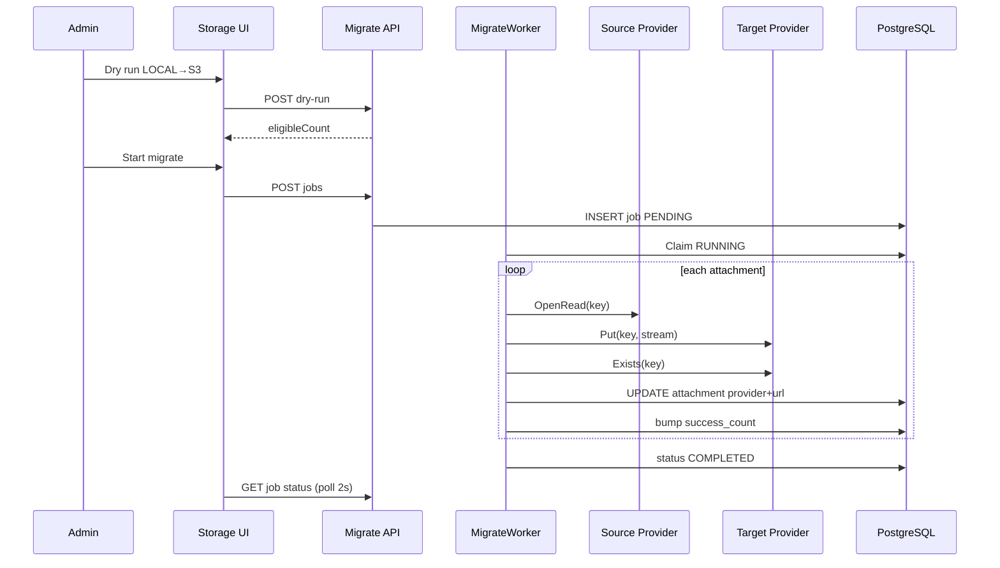

# PHASE 42: Storage Provider Bulk Migrate — Local/Old → Cloud

## Execution Spec Maturity

| Mục | Giá trị |
|---|---|
| **Mức hiện tại** | **✅ Module DoD 100%** (`rp4`+`rp5` 2026-07-23) |
| **Option** | **B** — Background migrate job + Admin UX trên Storage Settings (không A script tay; không C dual-write realtime toàn hệ) |
| **Trạng thái** | ✅ **ĐÓNG tài liệu** — EP0–EP4 · dbm **18/0** · `rp4`+`rp5` |
| **Dev-days** | **4–6** (1 Dev) |
| **Critical Path** | **Không** — phụ thuộc P41 (đã ĐÓNG); không block P37 |
| **Port FE** | `http://localhost:3003` |
| **Upstream** | Phase **41** Files module · providers · `file_attachments` · Admin Storage + **Test connection** · **ĐÓNG** |

### Changelog plan

| Ngày | Thay đổi |
|---|---|
| 2026-07-23 | FOUNDER khóa **bulk migrate** (Local/provider cũ → mới) vào P42; `/30` Option B · **95% Ready** |
| 2026-07-23 | **`rp1` 100% Ready:** Disk freeze §22 — baseline JSON; P41 ĐÓNG unlock; OpenRead đã có; khóa credential/snapshot/24h test; **0 blocker** execute |
| 2026-07-23 | **`rp2` /17-auto-plan:** Function index F01–F32 + brain EP0–EP4 atomic + critic **9.5**; §23 |
| 2026-07-23 | **`rp3` PASS:** §24 BS-R3-01…20 — worker tenant · cancel flag · stream · stuck recovery · target=active; **0 blind spot block** |
| 2026-07-23 | **`/18-auto-execute`:** EP0–EP4 DONE · migrate jobs · worker · API · Admin panel · verify_storage_migrate PASS · §25 |
| 2026-07-23 | **`dbm` formal:** Playwright **18/0** · Storage Migrate panel light/dark + dry-run · video · §26 |
| 2026-07-23 | **`rp4`+`rp5`:** disk **29/0** · verify migrate/nav/i18n/shell · §27–§28 · **ĐÓNG tài liệu** |

### Quyết định khóa

| Câu hỏi | Quyết định |
|---|---|
| Option | **B** — job bất đồng bộ có progress/resume; Admin trigger |
| Trigger | Admin Storage Settings: sau khi **Test connection** PASS trên **target** provider |
| Target mặc định | `active_provider` hiện tại (thường cloud vừa Activate) |
| Source | Filter: `LOCAL` **hoặc** provider cụ thể **hoặc** “All except target” |
| Strategy | **Copy → Verify Exists → Update metadata → Optional delete source** (default: **giữ source** đến khi confirm “Purge source”) |
| Concurrency | Worker sequential **hoặc** parallel **2–4** (config); không block API request thread |
| Idempotent | Skip nếu `attachment.provider == target` và Exists trên target |
| Dry-run | Preview count + sample 20 keys — không ghi |
| Limit / lần | Cap **2 000** files / job (lớn hơn → chạy nhiều job hoặc tiếp tục “Resume”) |
| P41 Test connection | **Reuse** — migrate **bắt buộc** `lastTestOk=true` cho target trong ≤**24h** (hoặc re-test inline) — khóa `rp1` |
| Snapshot | **`eligible_ids` jsonb** ≤2000 Guid lúc Start — khóa `rp1` |
| Inbound/Outbound attach | **OOS P42** → đề xuất **Phase 43** (reuse panel) |

---

## 1. Mục tiêu

Cho phép khách hàng **chuyển nhanh** toàn bộ (hoặc theo filter) file đính kèm từ **Local / provider cũ** sang **provider đích** (S3/Azure/GCS/R2/Local) ngay trên Admin — có **Test connection**, progress, resume/cancel, audit — không mất metadata, không đòi deploy script tay.

---

## 2. Phạm vi (Scope)

### In scope

| # | Deliverable |
|---|---|
| 1 | Bảng `file_storage_migrate_jobs` + `file_storage_migrate_job_items` (optional items hoặc JSON progress) |
| 2 | API: dry-run · start · status · cancel · resume · purge-source (sau migrate) |
| 3 | Hosted worker / background service xử lý queue job |
| 4 | Admin UI trên `/admin/settings/storage`: panel **Migrate files** (source → target · dry-run · start · progress bar · errors) |
| 5 | Pseudo copy qua `IObjectStorageProvider` Get/OpenRead (Local) + Put (target) |
| 6 | Cập nhật `file_attachments.provider` · `storage_key` (giữ key nếu được) · `public_url` |
| 7 | `tests/verify_storage_migrate.ps1` + evidence `phase_42/` + dbm Admin migrate smoke |
| 8 | Cập nhật `IMPLEMENTATION_PLAN` row 42 khi DoD |

### Non-negotiable

- Phụ thuộc **Phase 41 Module DoD** (providers + settings + Test connection).  
- Không migrate khi target Test FAIL.  
- Tenant isolation trên mọi job.  
- Không xóa source mặc định (opt-in Purge).  
- camelCase API · i18n Admin · Light/Dark P39 · Dialog P40.  
- Job cancel an toàn (checkpoint item đang chạy xong rồi dừng).

### Out of scope

- Inbound/Outbound/Stocktake attachment UI (Phase **43**).  
- Thumbnail / CDN purge / virus scan.  
- Dual-write realtime mọi upload (P41 đã ghi đúng active).  
- Cross-tenant migrate.  
- Đổi `storage_key` scheme phức tạp (giữ Guid.ext).  
- Migrate QC legacy `attachmentRefs` string-only không có row `file_attachments` (chỉ row DB; optional backfill OOS).

---

## 3. Điều kiện đầu vào (Readiness Checklist)

- [x] Phase **41** Module DoD 100% (`file_attachments` · providers · Admin Storage · Test connection) — **ĐÓNG** `rp4`+`rp5` 2026-07-23  
- [x] Phase 38–40 UI ĐÓNG  
- [x] `IObjectStorageProvider.OpenReadAsync` + `ExistsAsync` trên **tất cả** providers (P41 disk)  
- [x] **`rp1` disk freeze** §22 + `baseline_disk_freeze.json`  
- [x] FOUNDER Proceed Phase 42 → `/18` EP0–EP4 (2026-07-23)  
---
## 4. Thiết lập cấu trúc (Setup)

### Thư mục / file chạm

| Path | Vai trò |
|---|---|
| `backend/modules/Nexustock.Modules.Files/Entities/FileStorageMigrateJob.cs` | Job header |
| `.../Services/IStorageMigrateService.cs` | Dry-run / start / cancel |
| `.../Services/StorageMigrateWorker.cs` | Background loop |
| `.../Controllers/FileStorageMigrateController.cs` | API |
| `.../Providers/IObjectStorageProvider.cs` | **Extend** `OpenReadAsync` / `GetStreamAsync` (P41 có thể mới thêm) |
| `frontend/src/app/admin/settings/storage/page.tsx` | Panel Migrate (P41 page + section) |
| `frontend/src/features/files/storage-migrate-panel.tsx` | UI progress |
| `tests/verify_storage_migrate.ps1` | Gates |
| `planning/evidence/phase_42/` | Evidence |

### Extend provider contract (nếu P41 chưa có)

```csharp
Task<Stream> OpenReadAsync(string key, CancellationToken ct);
```

Local: `File.OpenRead`. Cloud: GetObject stream.

> **`rp1` 2026-07-23:** Contract **đã có trên disk P41** (mọi provider). EP0 **không** cần hotfix OpenRead — chỉ entities/job/worker.

### Quy chuẩn mã

- Worker: `BackgroundService` hoặc Channel + scoped DI.  
- Progress: cập nhật DB mỗi N file (N=10).  
- Comments tiếng Việt; UI English + i18n.

---

## 5. Danh mục quyền (Permissions)

| Permission | Mô tả |
|---|---|
| `files.storage.manage` | Reuse P41 — start/cancel migrate |
| `files.storage.migrate.purge` | **Mới** — cho phép Purge source sau migrate (Admin only) |

WarehouseManager: **không** purge; chỉ Admin.

---

## 6. Thiết kế cơ sở dữ liệu

### 6.1 `file_storage_migrate_jobs`

| Cột | Kiểu | Ghi chú |
|---|---|---|
| `id` | uuid PK | |
| `tenant_id` | uuid NOT NULL | |
| `source_provider` | varchar(32) NULL | null = all except target |
| `target_provider` | varchar(32) NOT NULL | |
| `mode` | varchar(16) NOT NULL | `DRY_RUN` \| `MIGRATE` |
| `status` | varchar(24) NOT NULL | `PENDING` \| `RUNNING` \| `PAUSED` \| `COMPLETED` \| `FAILED` \| `CANCELLED` |
| `total_count` | int NOT NULL DEFAULT 0 | |
| `success_count` | int NOT NULL DEFAULT 0 | |
| `skip_count` | int NOT NULL DEFAULT 0 | |
| `fail_count` | int NOT NULL DEFAULT 0 | |
| `delete_source_after` | bool NOT NULL DEFAULT false | set lúc start; purge có thể job riêng |
| `error_summary` | varchar(2000) NULL | |
| `started_at` / `finished_at` | timestamptz NULL | |
| `created_at` | timestamptz NOT NULL | |
| `created_by` | varchar(128) NULL | |
| `cursor_attachment_id` | uuid NULL | resume checkpoint |
| `eligible_ids` | jsonb NULL | **`rp1`:** snapshot ≤2000 Guid lúc Start |
| `cancel_requested` | bool NOT NULL DEFAULT false | **`rp3`:** Cancel set flag; worker đọc trong loop |
| `updated_at` | timestamptz NULL | **`rp3`:** heartbeat progress / stuck detect |

> **`rp1`:** Bảng `file_storage_migrate_job_items` **không bắt buộc** MVP — dùng `eligible_ids` jsonb + `file_storage_migrate_job_errors`.  
> **`rp3`:** Worker **bắt buộc** `IgnoreQueryFilters` + filter `TenantId` tường minh (không dựa HTTP `ITenantProvider`).

### 6.2 `file_storage_migrate_job_errors` (optional nhưng khuyến nghị)

| Cột | Kiểu |
|---|---|
| `id` | uuid PK |
| `job_id` | uuid FK |
| `attachment_id` | uuid |
| `message` | varchar(1000) |
| `created_at` | timestamptz |

### 6.3 Migration UP/DOWN

```sql
-- UP
CREATE TABLE file_storage_migrate_jobs (
  id uuid PRIMARY KEY,
  tenant_id uuid NOT NULL,
  source_provider varchar(32) NULL,
  target_provider varchar(32) NOT NULL,
  mode varchar(16) NOT NULL,
  status varchar(24) NOT NULL,
  total_count int NOT NULL DEFAULT 0,
  success_count int NOT NULL DEFAULT 0,
  skip_count int NOT NULL DEFAULT 0,
  fail_count int NOT NULL DEFAULT 0,
  delete_source_after boolean NOT NULL DEFAULT false,
  error_summary varchar(2000) NULL,
  started_at timestamptz NULL,
  finished_at timestamptz NULL,
  created_at timestamptz NOT NULL,
  created_by varchar(128) NULL,
  cursor_attachment_id uuid NULL,
  eligible_ids jsonb NULL,
  cancel_requested boolean NOT NULL DEFAULT false,
  updated_at timestamptz NULL
);
CREATE INDEX ix_migrate_jobs_tenant_status ON file_storage_migrate_jobs (tenant_id, status);

CREATE TABLE file_storage_migrate_job_errors (
  id uuid PRIMARY KEY,
  job_id uuid NOT NULL REFERENCES file_storage_migrate_jobs(id) ON DELETE CASCADE,
  attachment_id uuid NOT NULL,
  message varchar(1000) NOT NULL,
  created_at timestamptz NOT NULL
);

-- DOWN
DROP TABLE IF EXISTS file_storage_migrate_job_errors;
DROP TABLE IF EXISTS file_storage_migrate_jobs;
```

---

## 7. Backend & API Contract

### 7.1 Dry-run

`POST /api/files/storage-migrate/dry-run`  
Permission: `files.storage.manage`

```json
{
  "sourceProvider": "LOCAL",
  "targetProvider": "AWS_S3"
}
```

**Response**
```json
{
  "eligibleCount": 128,
  "alreadyOnTarget": 12,
  "sampleKeys": ["a1.pdf", "b2.png"],
  "targetTestOk": true
}
```

### 7.2 Start

`POST /api/files/storage-migrate/jobs`

```json
{
  "sourceProvider": "LOCAL",
  "targetProvider": "AWS_S3",
  "deleteSourceAfter": false
}
```

**Guards:** target Test OK; không có job `RUNNING` cùng tenant; target ≠ source (trừ source null = multi).

**Response 201:** `{ "jobId": "...", "status": "PENDING", "totalCount": 128 }`

### 7.3 Status / Cancel / Resume / Active

`GET /api/files/storage-migrate/jobs/{id}`  
`GET /api/files/storage-migrate/jobs/active` — **`rp3`:** latest PENDING/RUNNING/PAUSED của tenant (FE hydrate)  
`POST /api/files/storage-migrate/jobs/{id}/cancel` — set `cancel_requested=true`  
`POST /api/files/storage-migrate/jobs/{id}/resume` — `PAUSED` / `FAILED` / `CANCELLED` partial

### 7.4 Purge source (sau COMPLETED)

`POST /api/files/storage-migrate/jobs/{id}/purge-source`  
Permission: `files.storage.migrate.purge`  
Chỉ xóa object trên **source** cho các attachment đã `success` và `provider==target`.

### 7.5 Errors list

`GET /api/files/storage-migrate/jobs/{id}/errors?take=50`

---

## 8. Thiết kế giao diện

### 8.1 Panel trên Admin Storage (`/admin/settings/storage`)

Section **Migrate existing files** (dưới Test/Save):

1. Select Source provider (LOCAL / AWS_S3 / … / “All except target”).  
2. Target = active provider (read-only display) hoặc select.  
3. Buttons: **Dry run** · **Start migrate**.  
4. Progress: `success/total` · skip · fail · status badge.  
5. **Cancel** khi RUNNING.  
6. **Purge source** (destructive confirm) khi COMPLETED và `deleteSourceAfter` hoặc manual.  
7. Link xem errors table.

### 8.2 States

| State | UI |
|---|---|
| Idle | Form + Dry run |
| Dry-run result | Count + sample |
| Running | Progress bar + Cancel |
| Completed | Success summary + optional Purge |
| Failed | Banner + errors |

### 8.3 Confirmations

- Start: “Copy N files to {target}. Source kept until Purge.”  
- Purge: gõ `DELETE` hoặc checkbox double-confirm.

---

## 9. Luồng thực thi nghiệp vụ



### Pseudo-code worker item

```csharp
public async Task MigrateOneAsync(FileAttachment att, string targetId, IObjectStorageProvider src, IObjectStorageProvider dst, string? publicBaseUrl)
{
    if (att.Provider == targetId && await dst.ExistsAsync(att.StorageKey, ct))
        return MigrateSkip;

    await using var stream = await src.OpenReadAsync(att.StorageKey, ct);
    await dst.PutAsync(att.StorageKey, stream, att.ContentType, ct);
    if (!await dst.ExistsAsync(att.StorageKey, ct))
        throw new AppException("MIGRATE_VERIFY_FAILED");

    att.Provider = targetId;
    att.PublicUrl = dst.BuildPublicUrl(att.StorageKey, publicBaseUrl);
    // storage_key giữ nguyên Guid.ext
}
```

---

## 10. Quy tắc nghiệp vụ

| Rule | Chi tiết |
|---|---|
| One running job / tenant | Start mới → 409 `MIGRATE_JOB_IN_PROGRESS` |
| Test gate | Target `lastTestOk` hoặc inline test trước start |
| Soft-deleted attachments | Bỏ qua (`deleted_at IS NOT NULL`) |
| Fail item | Ghi errors table; tiếp tục item khác; cuối `COMPLETED` nếu fail_count>0 vẫn COMPLETED* hoặc `COMPLETED_WITH_ERRORS` |
| Status `COMPLETED_WITH_ERRORS` | Khi fail_count>0 và đã duyệt hết |
| Cancel | Set flag; worker dừng sau item hiện tại; status `CANCELLED` |
| Resume | Tiếp từ `cursor_attachment_id` |
| Purge | Chỉ object source; không xóa row attachment |
| Concurrent upload lúc migrate | Upload mới đã vào target — OK; không nằm trong job snapshot (snapshot ids lúc start) |

**Snapshot:** lúc Start, materialize danh sách `attachment_id` eligible vào temp table **hoặc** query `WHERE provider=source AND id > cursor ORDER BY id` ổn định.

---

## 11. Xử lý ngoại lệ

| Code | HTTP | UI |
|---|---|---|
| `MIGRATE_TARGET_TEST_REQUIRED` | 400 | Bắt Test connection |
| `MIGRATE_TARGET_NOT_ACTIVE` | 400 | target ≠ ActiveProvider (`rp3`) |
| `MIGRATE_FAKE_FORBIDDEN` | 400 | FAKE ngoài Development (`rp3`) |
| `MIGRATE_SOURCE_CONFIG_INVALID` | 400 | Credential source thiếu trong ConfigJson (`rp1`) |
| `MIGRATE_JOB_IN_PROGRESS` | 409 | Hiện job đang chạy |
| `MIGRATE_SOURCE_EQUALS_TARGET` | 400 | |
| `MIGRATE_VERIFY_FAILED` | — item fail | errors list |
| `MIGRATE_SOURCE_READ_FAILED` | — item fail | |
| `MIGRATE_JOB_NOT_FOUND` | 404 | |
| `MIGRATE_PURGE_FORBIDDEN` | 403 | thiếu permission |
| `MIGRATE_NOT_COMPLETED` | 400 | Purge khi chưa xong |

---

## 12. Observability & KPI

| Signal | Cách |
|---|---|
| Audit | `files.storage.migrate.start` · `cancel` · `purge` |
| KPI | Files migrated / job · fail rate · duration |
| Log | JobId · attachmentId · source → target |

---

## 13. Test Plan

### Unit
- Skip already-on-target  
- Verify fail → item error  
- Cancel flag stops loop  

### Integration (Fake providers)
- Seed 5 LOCAL fake files → migrate to FAKE_TARGET → provider updated  
- Dry-run count  
- Second start while RUNNING → 409  
- Purge deletes source keys only  

### Negative
- Start without test OK  
- Purge without permission  

### FE dbm
- Admin: Dry run → Start → progress → Completed  
- Cancel midway  

### Regression
- P41 upload LOCAL vẫn OK  
- verify_files_spreadsheet PASS  

---

## 14. Acceptance Criteria (DoD)

- [x] Job dry-run / start / status / cancel / resume PASS (code + verify static)  
- [x] Migrate LOCAL → Fake/cloud (CI Fake path + worker) cập nhật `provider` + `public_url`  
- [x] Source **không** xóa trừ khi Purge + permission  
- [x] Admin panel migrate trên Storage Settings  
- [x] Test connection gate trước Start  
- [x] `verify_storage_migrate.ps1` PASS  
- [x] Evidence `phase_42_dbm/` + dbm  
- [x] `IMPLEMENTATION_PLAN` row 42 ✅ (`rp4`/`rp5`)  
- [x] Không làm Inbound/Outbound attach (OOS → P43)

---

## 15. Ngoại phạm vi (Out of Scope)

Xem §2. Thêm: không UI timeline chi tiết từng file realtime (đủ poll 2s + errors API).

---

## 16. Downstream Dependencies

| Downstream | Impact |
|---|---|
| Phase **43** | Inbound/Outbound/Stocktake attachments reuse panel |
| Multi-customer | Onboard: Local pilot → Test S3 → Migrate → Purge Local |
| P41 | Cần `OpenReadAsync` trên providers |

---

## 17. Bảo trì & Rollback

| Bước | Hành động |
|---|---|
| Cancel job | API cancel |
| Rollback metadata | Không auto; restore từ backup DB nếu cần |
| Rollback objects | Source còn nếu chưa Purge |
| DOWN migration | Drop job tables |

```sql
DROP TABLE IF EXISTS file_storage_migrate_job_errors;
DROP TABLE IF EXISTS file_storage_migrate_jobs;
```

---

## 18. Ghi chú bảo trì

- Tăng `Migrate:MaxParallel` qua config.  
- Khi thêm provider P41: migrate tự nhận nhờ interface.  
- Document runbook: Test → Dry-run → Migrate → spot-check URL → Purge.

---

## 19. Auto-Critique → 95%

| # | Câu hỏi | Trả lời |
|---|---|---|
| 1 | Write concurrency upload + migrate cùng file? | Snapshot ids lúc start; upload mới không trong set |
| 2 | Source disk mất file? | Item fail · continue |
| 3 | Network cloud midway? | Item fail · resume từ cursor |
| 4 | Target down? | Test gate + STORAGE errors |
| 5 | Purge nhầm? | Permission riêng + double confirm |
| 6 | Job treo? | Heartbeat `updated` optional; cancel manual |
| 7 | Large 10k files? | Cap 2000/job + resume nhiều lần |
| 8 | Blind: thiếu OpenRead P41? | ~~§4 extend~~ → **RESOLVED P41** (`OpenReadAsync` disk) |

**Maturity:** **95% Ready** (`/30`) → nâng **100% Ready** sau `rp1` §22.

| Vai trò | Kết luận | Ngày |
|---|---|---|
| JARVIS | `/30` PASS · Option B · 95% Ready · migrate khóa P42 | 2026-07-23 |
| JARVIS | **`rp1` PASS — 100% Ready** · disk freeze §22 · P41 ĐÓNG unlock | 2026-07-23 |
| FOUNDER | ☐ Proceed `/18` · ☐ Hold | ____ |

---

## 20. Execution Phases (cho `/18`)

| EP | Goal | Validation |
|---|---|---|
| EP0 | Evidence + job entities/migration (+ OpenRead **đã có** — skip) | build |
| EP1 | Migrate service + worker + API dry-run/start/status | Fake integration |
| EP2 | Cancel/resume/purge + errors + purge permission | tests |
| EP3 | Admin Migrate panel + poll + i18n | dbm |
| EP4 | verify script + docs + plan row | DoD |

> **`rp1`:** EP0 rút gọn — không implement lại OpenRead.

---

## 21. Phase 43–45 (program đóng gap ❌)

| Phase | SoT |
|---|---|
| 43 Core | [`phase_43_...`](file:///d:/1_Project/48_Nexustock/planning/phases/phase_43_ops_attachments_spreadsheet.md) |
| 44 Extended | [`phase_44_...`](file:///d:/1_Project/48_Nexustock/planning/phases/phase_44_extended_ops_attachments_exports.md) |
| 45 Line/RF/Pkg/Thumb | [`phase_45_...`](file:///d:/1_Project/48_Nexustock/planning/phases/phase_45_line_import_rf_package_thumb.md) |

Không đụng migrate P42.

---

## 22. `rp1` — Disk freeze (2026-07-23)

### 22.1 SoT & path khóa

| Mục | Path |
|---|---|
| SoT | `planning/phases/phase_42_storage_provider_migrate.md` |
| Disk freeze | `planning/evidence/phase_42/baseline_disk_freeze.json` |
| Gap inventory | `planning/evidence/phase_42/gap_inventory.json` |
| Master plan | `planning/IMPLEMENTATION_PLAN.md` row 42 |
| Upstream | Phase 41 **ĐÓNG** · `phase_41_rp45/validation_pass.md` |

### 22.2 Inventory disk (verified)

| Artifact | Status |
|---|---|
| `Nexustock.Modules.Files` | **Có** (P41) |
| `IObjectStorageProvider.OpenReadAsync` / `ExistsAsync` | **Có** — LOCAL · S3 · Azure · GCS · R2 · FAKE |
| `FileStorageSettings.LastTestOk` / `LastTestAt` | **Có** |
| Permission `files.storage.manage` | **Có** (seeder) |
| Admin `/admin/settings/storage` | **Có** |
| Pattern `BackgroundService` | **Có** (vd. `WebhookOutboxWorker`) |
| `FileStorageMigrateJob*` / Migrate API / panel / verify | **Chưa** → `/18` NEW |
| Permission `files.storage.migrate.purge` | **Chưa** → EP2 seed |

### 22.3 P0 wire paths (khóa execute)

| Flow | Path |
|---|---|
| Dry-run | `POST /api/files/storage-migrate/dry-run` → count eligible |
| Start | `POST /api/files/storage-migrate/jobs` → PENDING → Worker claim |
| Copy item | `src.OpenRead` → `dst.Put` → `dst.Exists` → update `file_attachments.provider` + `public_url` |
| Progress UI | Admin Storage → Migrate panel poll `GET jobs/{id}` 2s |
| Purge | `POST .../purge-source` + `files.storage.migrate.purge` |

### 22.4 Blind spots đóng thêm (`rp1`)

| # | Blind | Khóa |
|---|---|---|
| 1 | OpenRead thiếu? | **Không** — P41 đủ |
| 2 | Source cloud sau khi Active=LOCAL? | Resolve source bằng `ResolveByProviderId(source)` + **ConfigJson hiện có**. Thiếu credential → item/`400` `MIGRATE_SOURCE_CONFIG_INVALID`. **Happy path khóa:** LOCAL → cloud (target active vừa Test). Cloud→cloud: giữ key source trong ConfigJson đến khi migrate xong |
| 3 | Snapshot vs live query? | Lúc Start: materialize tối đa **2 000** `attachment_id` vào cột `eligible_ids` **jsonb** trên job (không bắt buộc bảng items). Cursor theo index trong mảng / `cursor_attachment_id` |
| 4 | Test freshness? | Target: `LastTestOk==true` **và** `LastTestAt >= UtcNow-24h` **hoặc** inline Test trong Start. Quá hạn → `MIGRATE_TARGET_TEST_REQUIRED` |
| 5 | COMPLETED vs errors? | `COMPLETED_WITH_ERRORS` khi `fail_count>0` và hết snapshot |
| 6 | Multi-instance worker? | Claim atomic: `UPDATE ... SET status=RUNNING WHERE status=PENDING AND id=@id` (rows affected=1) |
| 7 | Parallelism? | Config `Migrate:MaxParallel` default **1** (EP1); cho phép 2–4 sau |
| 8 | Schema DB? | Schema **`files`** (cùng FilesDbContext) |
| 9 | Soft-delete? | Bỏ qua `deleted_at IS NOT NULL` |
| 10 | storage_key đổi? | **Giữ nguyên** Guid.ext |
| 11 | Cap vượt? | Start cắt 2000; phần còn lại job mới / Resume không auto vượt cap |
| 12 | Inbound attach? | **OOS → P43** |

### 22.5 Verify contract (`rp1` chốt)

Script `tests/verify_storage_migrate.ps1` (EP4) tối thiểu:

| Rule id | Assert |
|---|---|
| `migrateJobEntity` | `FileStorageMigrateJob` + migration |
| `openReadReuse` | Interface vẫn có `OpenReadAsync` |
| `migrateApi` | Controller dry-run/jobs |
| `workerHosted` | `StorageMigrateWorker` : BackgroundService |
| `purgePermission` | seed `files.storage.migrate.purge` |
| `adminPanel` | `storage-migrate-panel` + Storage page |
| `filesRegression` | `verify_files_spreadsheet.ps1` vẫn PASS |

### 22.6 EP ↔ thứ tự

EP0 → EP1 → EP2 → EP3 → EP4 (không song song worker trước API contract).

### 22.7 Verdict `rp1`

**PASS — 100% Ready** để FOUNDER Proceed `/18-auto-execute` (EP0→EP4).

| Vai trò | Kết luận | Ngày |
|---|---|---|
| JARVIS | **`rp1` PASS — 100% Ready** | 2026-07-23 |
| FOUNDER | ☐ Proceed `/18` · ☐ Hold | ____ |

---

## 23. `rp2` — Function index + EP atomic (2026-07-23)

### 23.1 Deliverables

| Artifact | Path |
|---|---|
| Function index | `planning/function_index_phase42_storage_migrate.md` (F01–F32 · EP0–EP4) |
| Brain plan | `brain/.../implementation_plan.md` (EP0–EP4 atomic) |
| Critic | `brain/.../critic_report.md` **9.5** |
| Evidence | `planning/evidence/phase_42/rp2_pass.md` |

### 23.2 Quyết định khóa thêm (`rp2`)

| # | Quyết định |
|---|---|
| 1 | **REUSE** `OpenReadAsync`/`ExistsAsync` P41 — **MUST NOT** đổi interface (F32) |
| 2 | Worker = `BackgroundService` mirror `WebhookOutboxWorker` · claim atomic PENDING→RUNNING |
| 3 | Snapshot **`eligible_ids` jsonb** ≤2000 — không bắt buộc bảng items MVP |
| 4 | Happy path **LOCAL → cloud**; source config missing → `MIGRATE_SOURCE_CONFIG_INVALID` |
| 5 | Purge: permission `files.storage.migrate.purge` · default **không** xóa source |
| 6 | CI: Fake/Local temp — không bắt credential cloud thật |
| 7 | EP4 bắt buộc `verify_files_spreadsheet` regression |
| 8 | Thứ tự EP0→EP4 **bắt buộc**; **MUST NOT** P43 attach trong P42 |

### 23.3 Critic score

**9.5 / 10** — atomic EP + F-map + MUST NOT + P41 reuse; −0.5 single ConfigJson multi-cloud (happy path + error code).

### 23.4 Trace EP ↔ F (rút gọn)

| EP | F-ids | Validation gate |
|---|---|---|
| EP0 | F01–F04 | Migration jobs schema |
| EP1 | F06–F09, F14–F18, F20–F21 | Fake/Local migrate copy |
| EP2 | F05, F10–F13, F19, F22 | Cancel/resume/purge + 403 |
| EP3 | F23–F27 | Admin panel + poll |
| EP4 | F28–F31 | verify + DoD docs |

### 23.5 Verdict `rp2`

**PASS** — index + EP atomic đủ maintenance; maturity giữ **100% Ready**.

| Vai trò | Kết luận | Ngày |
|---|---|---|
| JARVIS | **`rp2` PASS** — sẵn sàng `rp3` hoặc Proceed `/18` | 2026-07-23 |
| FOUNDER | ☐ Proceed `/18` · ☐ Hold · ☐ `rp3` trước | ____ |

---

## 24. `rp3` — Blind spot closure (2026-07-23)

**Ngày:** 2026-07-23 · **Verdict:** **PASS — 0 điểm mù block execute**

| ID | Blind spot | Đóng bằng |
|---|---|---|
| BS-R3-01 | Worker **không có HTTP** → `TenantProvider` fallback tenant mặc định → leak/sai filter | Worker: `IgnoreQueryFilters()` + mọi query `.Where(x => x.TenantId == job.TenantId)`. Optional AsyncLocal `ITenantAmbient` set trước Resolve settings — **không** tin HttpContext |
| BS-R3-02 | Claim job thiếu atomic → 2 instance double-process | `UPDATE ... SET status='RUNNING', updated_at=now() WHERE id=@id AND status='PENDING'`; rows≠1 → skip |
| BS-R3-03 | Cancel chỉ đổi status → worker không thấy giữa item | Cột **`cancel_requested`**; Cancel API set `true`; loop check sau mỗi item → `CANCELLED` |
| BS-R3-04 | Process crash khi RUNNING → job treo mãi | Startup recovery: `RUNNING` và `updated_at < UtcNow-15m` (hoặc null) → `PAUSED` + giữ cursor (mirror Webhook stuck) |
| BS-R3-05 | Target ≠ ActiveProvider → Put dùng config sai | **Hard:** `targetProvider` **phải** `== settings.ActiveProvider` (case-insensitive); else `400 MIGRATE_TARGET_NOT_ACTIVE` |
| BS-R3-06 | Stream cloud không seekable / Put cần length | Attachment ≤10MB: nếu `!CanSeek` → buffer `MemoryStream`; không stream unbounded |
| BS-R3-07 | Put OK nhưng UPDATE DB fail → orphan target | Idempotent: retry Exists→skip Put hoặc overwrite Put; DB update sau Exists; orphan target chấp nhận đến retry |
| BS-R3-08 | `deleteSourceAfter=true` auto xóa không confirm | **Không auto-purge**. Flag chỉ UI hint; Purge **chỉ** qua API + confirm `DELETE` |
| BS-R3-09 | Purge khi `COMPLETED_WITH_ERRORS` | Cho phép; **chỉ** attachment success (`provider==target` và id trong snapshot đã success) |
| BS-R3-10 | Source=target khi sourceProvider set | `400 MIGRATE_SOURCE_EQUALS_TARGET`; source null (=all except target) OK |
| BS-R3-11 | Race Start 2 Admin cùng lúc | Transaction: check no RUNNING/PENDING same tenant rồi INSERT; unique partial index optional `(tenant_id) WHERE status IN ('PENDING','RUNNING')` — khuyến nghị EP1 |
| BS-R3-12 | FAKE activate/migrate production | `FAKE` chỉ khi `env=Development` **hoặc** `Migrate:AllowFake=true`; else `400 MIGRATE_FAKE_FORBIDDEN` |
| BS-R3-13 | Test stale: LastTestOk true nhưng LastTestAt cũ | Gate: `LastTestOk==true && LastTestAt >= UtcNow-24h` **hoặc** Start gọi inline `TestAsync` trước claim |
| BS-R3-14 | eligible_ids > 2000 / thiếu ORDER | `ORDER BY id` lấy Take(2000); dry-run trả `truncated:true` + `eligibleCount` full vs `jobTotal` |
| BS-R3-15 | Resume từ CANCELLED / cursor lệch | Resume: status ∈ `PAUSED`\|`FAILED`\|`CANCELLED` có cursor/eligible còn; set PENDING + `cancel_requested=false` |
| BS-R3-16 | Soft-delete / đã target vẫn trong snapshot | Start filter: `DeletedAt==null` và `Provider != target` (hoặc source filter). Skip runtime nếu đã target+Exists |
| BS-R3-17 | PublicUrl sai sau migrate | `att.PublicUrl = dst.BuildPublicUrl(key, settings.PublicBaseUrl)` trim slash P41 |
| BS-R3-18 | FE refresh mất job đang chạy | `GET /api/files/storage-migrate/jobs/active` (latest PENDING/RUNNING/PAUSED tenant) — EP3 panel hydrate |
| BS-R3-19 | WarehouseManager gọi Purge | Seed: purge **chỉ Admin**; manage cho Admin (+ optional WM dry-run/start); 403 `MIGRATE_PURGE_FORBIDDEN` |
| BS-R3-20 | dbm / i18n confirm `{target}` / Auth | ICU placeholder OK; dbm chờ sidebar auth (P39/P40); confirm Start + Purge type `DELETE` |

### 24.1 Error codes bổ sung (`rp3`)

| Code | HTTP | Khi nào |
|---|---|---|
| `MIGRATE_TARGET_NOT_ACTIVE` | 400 | target ≠ ActiveProvider |
| `MIGRATE_FAKE_FORBIDDEN` | 400 | FAKE ngoài Dev |
| `MIGRATE_SOURCE_CONFIG_INVALID` | 400 | Resolve source fail (đã khóa rp1) |
| `MIGRATE_TARGET_TEST_REQUIRED` | 400 | Test stale/fail |
| `MIGRATE_CANCELLED` | — | status sau cancel (không HTTP error Start) |

### 24.2 Worker tenant contract (khóa)

```text
Claim jobs: IgnoreQueryFilters + status PENDING
FOR job IN claimed:
  tenantId = job.TenantId
  Load settings/attachments: IgnoreQueryFilters + TenantId == tenantId
  Resolve providers với settings của tenant đó
  NEVER rely on HttpContext.User tenant claim
```

### 24.3 Cancel / stuck (khóa)

```text
Cancel API → cancel_requested=true (status vẫn RUNNING đến hết item)
Worker loop → if cancel_requested → status=CANCELLED; break
Startup → RUNNING && updated_at < now-15m → PAUSED
```

### 24.4 EP checklist bổ sung (`rp3`)

| EP | Thêm gate |
|---|---|
| EP0 | Cột `cancel_requested` · `updated_at` · `eligible_ids` |
| EP1 | IgnoreQueryFilters worker · target==active · Fake gate · partial unique optional · stream buffer |
| EP2 | Cancel flag · stuck recovery · purge no-auto · active job GET |
| EP3 | Hydrate active job · Purge type DELETE · i18n |
| EP4 | verify rules + files regression · assert worker tenant comment/test |

### 24.5 Verdict `rp3`

**PASS — 0 điểm mù block.** Maturity giữ **100% Ready**. Sẵn sàng Proceed `/18`.

| Vai trò | Kết luận | Ngày |
|---|---|---|
| JARVIS | **`rp3` PASS** — 20/20 BS đóng · sẵn sàng Proceed `/18` | 2026-07-23 |
| FOUNDER | ☑ Proceed `/18` | 2026-07-23 |

---

## 25. `/18-auto-execute` — Execution log (2026-07-23)

### 25.1 EP results

| EP | Status | Validation |
|---|---|---|
| EP0 | DONE | `FileStorageMigrateJob` + Error · migration `AddStorageMigrateJobs` · DB update |
| EP1 | DONE | `StorageMigrateService` · `StorageMigrateWorker` · dry-run/start/status |
| EP2 | DONE | cancel/resume/purge · `files.storage.migrate.purge` · GET active · stuck recovery |
| EP3 | DONE | `StorageMigratePanel` + i18n EN/VI · wire Admin Storage |
| EP4 | DONE | `verify_storage_migrate.ps1` PASS (+ files regression) |

### 25.2 Artifacts

| Artifact | Path |
|---|---|
| Migration | `Migrations/20260723065532_AddStorageMigrateJobs.cs` |
| Worker | `Workers/StorageMigrateWorker.cs` |
| API | `Controllers/FileStorageMigrateController.cs` |
| FE | `features/files/storage-migrate-panel.tsx` |
| Verify | `tests/verify_storage_migrate.ps1` |

### 25.3 Residual (không block `/18`)

| # | Residual | Next |
|---|---|---|
| 1 | ~~`dbm` formal~~ | **DONE** §26 · 18/0 |
| 2 | Real cloud LOCAL→S3 e2e | Optional |
| 3 | Integration test host 5-file Fake | CI |

### 25.4 Verdict `/18`

**PASS — code complete EP0–EP4.** `dbm`+`rp4`/`rp5` đã ĐÓNG (§26–§28).

| Vai trò | Kết luận | Ngày |
|---|---|---|
| JARVIS | **`/18` PASS** · verify_storage_migrate PASS | 2026-07-23 |
| FOUNDER | ☑ `dbm` · ☑ `rp4`/`rp5` | 2026-07-23 |

---

## 26. `dbm` — Browser formal (2026-07-23)

### 26.1 Method

- Script: `tests/helpers/dbm_phase42_storage_migrate_browser.mjs`
- FE `http://localhost:3003` · API `:5024` · Auth Admin
- Evidence: `planning/evidence/phase_42_dbm/`

### 26.2 Results

| Metric | Value |
|---|---|
| PASS / FAIL | **18 / 0** |
| Video | `walkthrough-storage-migrate.webm` |
| Walkthrough | `planning/evidence/phase_42_dbm/walkthrough.md` |

### 26.3 Self-heal trong `dbm`

1. API restart sau file lock `/18` → listening `:5024`.  
2. Dry-run LOCAL→LOCAL bị `MIGRATE_SOURCE_EQUALS_TARGET` → script dùng source **ALL**; FE disable Start khi source=======active.

### 26.4 Verdict `dbm`

**PASS** — `rp4`/`rp5` ĐÓNG tài liệu (§27–§28).

| Vai trò | Kết luận | Ngày |
|---|---|---|
| JARVIS | **`dbm` PASS 18/0** | 2026-07-23 |
| FOUNDER | ☑ `rp4`/`rp5` | 2026-07-23 |

---

## 27. `rp4` — reindex + đóng tài liệu (2026-07-23)

### 27.1 Mục tiêu

Reindex disk vs DoD §14; xác nhận migrate job/worker/panel không regress P41; đóng tài liệu Phase 42.

### 27.2 Disk matrix

| Nhóm | Kết quả |
|---|---|
| Evidence `phase_42_dbm/` + function_index + verify/dbm scripts | PASS |
| Shots 01–03 + video + walkthrough/results | PASS |
| CODE job · worker · service · controller · panel | PASS |
| Locks: target==active · Cap 2000 · purge perm · Start disable same-source | PASS |
| MUST NOT P43 | PASS |
| dbm cite **18/0** | PASS |
| DOC §25–§26 | PASS |
| VERIFY storage_migrate · nav · i18n · shell | exit **0** |

**FILE_FAIL = 0** · JSON: `planning/evidence/phase_42_rp45/disk_reindex.json` (**29/0**)

### 27.3 Runtime (`rp4` — cite dbm, không re-run browser)

| Gate | Cite |
|---|---|
| dbm | **18/0** · Migrate panel · dry-run ALL→LOCAL · light/dark |
| Walkthrough | `planning/evidence/phase_42_dbm/walkthrough.md` |
| Self-heal | API restart · source≠target UI |

### 27.4 Docs cập nhật (`rp4`)

- `phase_42` header → **ĐÓNG tài liệu** · §27–§28
- `IMPLEMENTATION_PLAN` row 42 → ✅ Hoàn thành (`rp4`+`rp5`)
- Evidence `phase_42_rp45/validation_pass.md`

### 27.5 Verdict `rp4`

**PASS** — Module DoD **100%** · sẵn sàng `rp5` xác nhận độc lập.

---

## 28. `rp5` — xác nhận độc lập (2026-07-23)

### 28.1 Phương pháp

Đọc lại disk matrix `disk_reindex.json` + DoD §14 + cite dbm §26; chạy bổ sung `verify_storage_migrate` + `verify_nav_lens` + `verify_i18n` + `verify_ui_shell_classes`.

### 28.2 Open / residual (không block ĐÓNG)

| # | Residual | Ghi chú |
|---|---|---|
| 1 | Real cloud LOCAL→S3 e2e | Optional — Fake/Local DoD đủ |
| 2 | Integration test 5-file Fake trên CI | Regression host |
| 3 | Start migrate full copy khi có file non-LOCAL | Pilot data; dry-run 0 eligible khi chỉ LOCAL |
| 4 | Phase **43** entity attach Inbound/Outbound | Downstream OOS P42 |

### 28.3 Verdict `rp5`

**PASS — xác nhận độc lập khớp `rp4`.** Phase 42 **ĐÓNG tài liệu**.

| Vai trò | Kết luận | Ngày |
|---|---|---|
| JARVIS | **`rp4`+`rp5` PASS** · Module DoD 100% · ĐÓNG | 2026-07-23 |
| FOUNDER | ☐ Accept | ____ |
