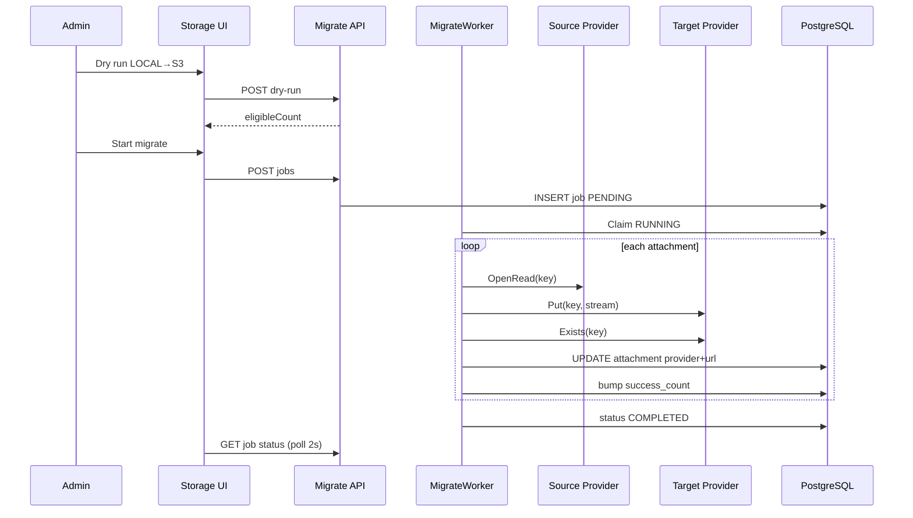

# PHASE 42: Storage Provider Bulk Migrate — Local/Old → Cloud

## Execution Spec Maturity

| Mục | Giá trị |
|---|---|
| **Mức hiện tại** | **95% Ready** (`/30-auto-project-planner` 2026-07-23) |
| **Option** | **B** — Background migrate job + Admin UX trên Storage Settings (không A script tay; không C dual-write realtime toàn hệ) |
| **Trạng thái** | ⏳ Chờ Phase **41 DoD** + FOUNDER **Proceed** |
| **Dev-days** | **4–6** (1 Dev) |
| **Critical Path** | **Không** — phụ thuộc P41; không block P37 |
| **Port FE** | `http://localhost:3003` |
| **Upstream** | Phase **41** Files module · providers · `file_attachments` · Admin Storage + **Test connection** |

### Changelog plan

| Ngày | Thay đổi |
|---|---|
| 2026-07-23 | FOUNDER khóa **bulk migrate** (Local/provider cũ → mới) vào P42; `/30` Option B · **95% Ready** |

### Quyết định khóa

| Câu hỏi | Quyết định |
|---|---|
| Option | **B** — job bất đồng bộ có progress/resume; Admin trigger |
| Trigger | Admin Storage Settings: sau khi **Test connection** PASS trên **target** provider |
| Target mặc định | `active_provider` hiện tại (thường cloud vừa Activate) |
| Source | Filter: `LOCAL` **hoặc** provider cụ thể **hoặc** “All except target” |
| Strategy | **Copy → Verify Exists → Update metadata → Optional delete source** (default: **giữ source** đến khi confirm “Purge source”) |
| Concurrency | Worker sequential **hoặc** parallel **2–4** (config); không block API request thread |
| Idempotent | Skip nếu `attachment.provider == target` và Exists trên target |
| Dry-run | Preview count + sample 20 keys — không ghi |
| Limit / lần | Cap **2 000** files / job (lớn hơn → chạy nhiều job hoặc tiếp tục “Resume”) |
| P41 Test connection | **Reuse** — migrate **bắt buộc** `lastTestOk=true` cho target trong ≤24h (hoặc re-test inline) |
| Inbound/Outbound attach | **OOS P42** → đề xuất **Phase 43** (reuse panel) |

---

## 1. Mục tiêu

Cho phép khách hàng **chuyển nhanh** toàn bộ (hoặc theo filter) file đính kèm từ **Local / provider cũ** sang **provider đích** (S3/Azure/GCS/R2/Local) ngay trên Admin — có **Test connection**, progress, resume/cancel, audit — không mất metadata, không đòi deploy script tay.

---

## 2. Phạm vi (Scope)

### In scope

| # | Deliverable |
|---|---|
| 1 | Bảng `file_storage_migrate_jobs` + `file_storage_migrate_job_items` (optional items hoặc JSON progress) |
| 2 | API: dry-run · start · status · cancel · resume · purge-source (sau migrate) |
| 3 | Hosted worker / background service xử lý queue job |
| 4 | Admin UI trên `/admin/settings/storage`: panel **Migrate files** (source → target · dry-run · start · progress bar · errors) |
| 5 | Pseudo copy qua `IObjectStorageProvider` Get/OpenRead (Local) + Put (target) |
| 6 | Cập nhật `file_attachments.provider` · `storage_key` (giữ key nếu được) · `public_url` |
| 7 | `tests/verify_storage_migrate.ps1` + evidence `phase_42/` + dbm Admin migrate smoke |
| 8 | Cập nhật `IMPLEMENTATION_PLAN` row 42 khi DoD |

### Non-negotiable

- Phụ thuộc **Phase 41 Module DoD** (providers + settings + Test connection).  
- Không migrate khi target Test FAIL.  
- Tenant isolation trên mọi job.  
- Không xóa source mặc định (opt-in Purge).  
- camelCase API · i18n Admin · Light/Dark P39 · Dialog P40.  
- Job cancel an toàn (checkpoint item đang chạy xong rồi dừng).

### Out of scope

- Inbound/Outbound/Stocktake attachment UI (Phase **43**).  
- Thumbnail / CDN purge / virus scan.  
- Dual-write realtime mọi upload (P41 đã ghi đúng active).  
- Cross-tenant migrate.  
- Đổi `storage_key` scheme phức tạp (giữ Guid.ext).  
- Migrate QC legacy `attachmentRefs` string-only không có row `file_attachments` (chỉ row DB; optional backfill OOS).

---

## 3. Điều kiện đầu vào (Readiness Checklist)

- [ ] Phase **41** Module DoD 100% (`file_attachments` · providers · Admin Storage · Test connection)  
- [x] Phase 38–40 UI ĐÓNG  
- [ ] FOUNDER Proceed Phase 42  
- [ ] `rp1` disk freeze P42 (sau Proceed khuyến nghị)

---

## 4. Thiết lập cấu trúc (Setup)

### Thư mục / file chạm

| Path | Vai trò |
|---|---|
| `backend/modules/Nexustock.Modules.Files/Entities/FileStorageMigrateJob.cs` | Job header |
| `.../Services/IStorageMigrateService.cs` | Dry-run / start / cancel |
| `.../Services/StorageMigrateWorker.cs` | Background loop |
| `.../Controllers/FileStorageMigrateController.cs` | API |
| `.../Providers/IObjectStorageProvider.cs` | **Extend** `OpenReadAsync` / `GetStreamAsync` (P41 có thể mới thêm) |
| `frontend/src/app/admin/settings/storage/page.tsx` | Panel Migrate (P41 page + section) |
| `frontend/src/features/files/storage-migrate-panel.tsx` | UI progress |
| `tests/verify_storage_migrate.ps1` | Gates |
| `planning/evidence/phase_42/` | Evidence |

### Extend provider contract (nếu P41 chưa có)

```csharp
Task<Stream> OpenReadAsync(string key, CancellationToken ct);
```

Local: `File.OpenRead`. Cloud: GetObject stream.

### Quy chuẩn mã

- Worker: `BackgroundService` hoặc Channel + scoped DI.  
- Progress: cập nhật DB mỗi N file (N=10).  
- Comments tiếng Việt; UI English + i18n.

---

## 5. Danh mục quyền (Permissions)

| Permission | Mô tả |
|---|---|
| `files.storage.manage` | Reuse P41 — start/cancel migrate |
| `files.storage.migrate.purge` | **Mới** — cho phép Purge source sau migrate (Admin only) |

WarehouseManager: **không** purge; chỉ Admin.

---

## 6. Thiết kế cơ sở dữ liệu

### 6.1 `file_storage_migrate_jobs`

| Cột | Kiểu | Ghi chú |
|---|---|---|
| `id` | uuid PK | |
| `tenant_id` | uuid NOT NULL | |
| `source_provider` | varchar(32) NULL | null = all except target |
| `target_provider` | varchar(32) NOT NULL | |
| `mode` | varchar(16) NOT NULL | `DRY_RUN` \| `MIGRATE` |
| `status` | varchar(24) NOT NULL | `PENDING` \| `RUNNING` \| `PAUSED` \| `COMPLETED` \| `FAILED` \| `CANCELLED` |
| `total_count` | int NOT NULL DEFAULT 0 | |
| `success_count` | int NOT NULL DEFAULT 0 | |
| `skip_count` | int NOT NULL DEFAULT 0 | |
| `fail_count` | int NOT NULL DEFAULT 0 | |
| `delete_source_after` | bool NOT NULL DEFAULT false | set lúc start; purge có thể job riêng |
| `error_summary` | varchar(2000) NULL | |
| `started_at` / `finished_at` | timestamptz NULL | |
| `created_at` | timestamptz NOT NULL | |
| `created_by` | varchar(128) NULL | |
| `cursor_attachment_id` | uuid NULL | resume checkpoint |

### 6.2 `file_storage_migrate_job_errors` (optional nhưng khuyến nghị)

| Cột | Kiểu |
|---|---|
| `id` | uuid PK |
| `job_id` | uuid FK |
| `attachment_id` | uuid |
| `message` | varchar(1000) |
| `created_at` | timestamptz |

### 6.3 Migration UP/DOWN

```sql
-- UP
CREATE TABLE file_storage_migrate_jobs (
  id uuid PRIMARY KEY,
  tenant_id uuid NOT NULL,
  source_provider varchar(32) NULL,
  target_provider varchar(32) NOT NULL,
  mode varchar(16) NOT NULL,
  status varchar(24) NOT NULL,
  total_count int NOT NULL DEFAULT 0,
  success_count int NOT NULL DEFAULT 0,
  skip_count int NOT NULL DEFAULT 0,
  fail_count int NOT NULL DEFAULT 0,
  delete_source_after boolean NOT NULL DEFAULT false,
  error_summary varchar(2000) NULL,
  started_at timestamptz NULL,
  finished_at timestamptz NULL,
  created_at timestamptz NOT NULL,
  created_by varchar(128) NULL,
  cursor_attachment_id uuid NULL
);
CREATE INDEX ix_migrate_jobs_tenant_status ON file_storage_migrate_jobs (tenant_id, status);

CREATE TABLE file_storage_migrate_job_errors (
  id uuid PRIMARY KEY,
  job_id uuid NOT NULL REFERENCES file_storage_migrate_jobs(id) ON DELETE CASCADE,
  attachment_id uuid NOT NULL,
  message varchar(1000) NOT NULL,
  created_at timestamptz NOT NULL
);

-- DOWN
DROP TABLE IF EXISTS file_storage_migrate_job_errors;
DROP TABLE IF EXISTS file_storage_migrate_jobs;
```

---

## 7. Backend & API Contract

### 7.1 Dry-run

`POST /api/files/storage-migrate/dry-run`  
Permission: `files.storage.manage`

```json
{
  "sourceProvider": "LOCAL",
  "targetProvider": "AWS_S3"
}
```

**Response**
```json
{
  "eligibleCount": 128,
  "alreadyOnTarget": 12,
  "sampleKeys": ["a1.pdf", "b2.png"],
  "targetTestOk": true
}
```

### 7.2 Start

`POST /api/files/storage-migrate/jobs`

```json
{
  "sourceProvider": "LOCAL",
  "targetProvider": "AWS_S3",
  "deleteSourceAfter": false
}
```

**Guards:** target Test OK; không có job `RUNNING` cùng tenant; target ≠ source (trừ source null = multi).

**Response 201:** `{ "jobId": "...", "status": "PENDING", "totalCount": 128 }`

### 7.3 Status / Cancel / Resume

`GET /api/files/storage-migrate/jobs/{id}`  
`POST /api/files/storage-migrate/jobs/{id}/cancel`  
`POST /api/files/storage-migrate/jobs/{id}/resume` — chỉ `PAUSED`/`FAILED` partial

### 7.4 Purge source (sau COMPLETED)

`POST /api/files/storage-migrate/jobs/{id}/purge-source`  
Permission: `files.storage.migrate.purge`  
Chỉ xóa object trên **source** cho các attachment đã `success` và `provider==target`.

### 7.5 Errors list

`GET /api/files/storage-migrate/jobs/{id}/errors?take=50`

---

## 8. Thiết kế giao diện

### 8.1 Panel trên Admin Storage (`/admin/settings/storage`)

Section **Migrate existing files** (dưới Test/Save):

1. Select Source provider (LOCAL / AWS_S3 / … / “All except target”).  
2. Target = active provider (read-only display) hoặc select.  
3. Buttons: **Dry run** · **Start migrate**.  
4. Progress: `success/total` · skip · fail · status badge.  
5. **Cancel** khi RUNNING.  
6. **Purge source** (destructive confirm) khi COMPLETED và `deleteSourceAfter` hoặc manual.  
7. Link xem errors table.

### 8.2 States

| State | UI |
|---|---|
| Idle | Form + Dry run |
| Dry-run result | Count + sample |
| Running | Progress bar + Cancel |
| Completed | Success summary + optional Purge |
| Failed | Banner + errors |

### 8.3 Confirmations

- Start: “Copy N files to {target}. Source kept until Purge.”  
- Purge: gõ `DELETE` hoặc checkbox double-confirm.

---

## 9. Luồng thực thi nghiệp vụ



### Pseudo-code worker item

```csharp
public async Task MigrateOneAsync(FileAttachment att, string targetId, IObjectStorageProvider src, IObjectStorageProvider dst, string? publicBaseUrl)
{
    if (att.Provider == targetId && await dst.ExistsAsync(att.StorageKey, ct))
        return MigrateSkip;

    await using var stream = await src.OpenReadAsync(att.StorageKey, ct);
    await dst.PutAsync(att.StorageKey, stream, att.ContentType, ct);
    if (!await dst.ExistsAsync(att.StorageKey, ct))
        throw new AppException("MIGRATE_VERIFY_FAILED");

    att.Provider = targetId;
    att.PublicUrl = dst.BuildPublicUrl(att.StorageKey, publicBaseUrl);
    // storage_key giữ nguyên Guid.ext
}
```

---

## 10. Quy tắc nghiệp vụ

| Rule | Chi tiết |
|---|---|
| One running job / tenant | Start mới → 409 `MIGRATE_JOB_IN_PROGRESS` |
| Test gate | Target `lastTestOk` hoặc inline test trước start |
| Soft-deleted attachments | Bỏ qua (`deleted_at IS NOT NULL`) |
| Fail item | Ghi errors table; tiếp tục item khác; cuối `COMPLETED` nếu fail_count>0 vẫn COMPLETED* hoặc `COMPLETED_WITH_ERRORS` |
| Status `COMPLETED_WITH_ERRORS` | Khi fail_count>0 và đã duyệt hết |
| Cancel | Set flag; worker dừng sau item hiện tại; status `CANCELLED` |
| Resume | Tiếp từ `cursor_attachment_id` |
| Purge | Chỉ object source; không xóa row attachment |
| Concurrent upload lúc migrate | Upload mới đã vào target — OK; không nằm trong job snapshot (snapshot ids lúc start) |

**Snapshot:** lúc Start, materialize danh sách `attachment_id` eligible vào temp table **hoặc** query `WHERE provider=source AND id > cursor ORDER BY id` ổn định.

---

## 11. Xử lý ngoại lệ

| Code | HTTP | UI |
|---|---|---|
| `MIGRATE_TARGET_TEST_REQUIRED` | 400 | Bắt Test connection |
| `MIGRATE_JOB_IN_PROGRESS` | 409 | Hiện job đang chạy |
| `MIGRATE_SOURCE_EQUALS_TARGET` | 400 | |
| `MIGRATE_VERIFY_FAILED` | — item fail | errors list |
| `MIGRATE_SOURCE_READ_FAILED` | — item fail | |
| `MIGRATE_JOB_NOT_FOUND` | 404 | |
| `MIGRATE_PURGE_FORBIDDEN` | 403 | thiếu permission |
| `MIGRATE_NOT_COMPLETED` | 400 | Purge khi chưa xong |

---

## 12. Observability & KPI

| Signal | Cách |
|---|---|
| Audit | `files.storage.migrate.start` · `cancel` · `purge` |
| KPI | Files migrated / job · fail rate · duration |
| Log | JobId · attachmentId · source → target |

---

## 13. Test Plan

### Unit
- Skip already-on-target  
- Verify fail → item error  
- Cancel flag stops loop  

### Integration (Fake providers)
- Seed 5 LOCAL fake files → migrate to FAKE_TARGET → provider updated  
- Dry-run count  
- Second start while RUNNING → 409  
- Purge deletes source keys only  

### Negative
- Start without test OK  
- Purge without permission  

### FE dbm
- Admin: Dry run → Start → progress → Completed  
- Cancel midway  

### Regression
- P41 upload LOCAL vẫn OK  
- verify_files_spreadsheet PASS  

---

## 14. Acceptance Criteria (DoD)

- [ ] Job dry-run / start / status / cancel / resume PASS  
- [ ] Migrate LOCAL → Fake/cloud (CI Fake) cập nhật `provider` + `public_url`  
- [ ] Source **không** xóa trừ khi Purge + permission  
- [ ] Admin panel migrate trên Storage Settings  
- [ ] Test connection gate trước Start  
- [ ] `verify_storage_migrate.ps1` PASS  
- [ ] Evidence `phase_42/` + dbm  
- [ ] `IMPLEMENTATION_PLAN` row 42 ✅  
- [ ] Không làm Inbound/Outbound attach (OOS → P43)

---

## 15. Ngoại phạm vi (Out of Scope)

Xem §2. Thêm: không UI timeline chi tiết từng file realtime (đủ poll 2s + errors API).

---

## 16. Downstream Dependencies

| Downstream | Impact |
|---|---|
| Phase **43** | Inbound/Outbound/Stocktake attachments reuse panel |
| Multi-customer | Onboard: Local pilot → Test S3 → Migrate → Purge Local |
| P41 | Cần `OpenReadAsync` trên providers |

---

## 17. Bảo trì & Rollback

| Bước | Hành động |
|---|---|
| Cancel job | API cancel |
| Rollback metadata | Không auto; restore từ backup DB nếu cần |
| Rollback objects | Source còn nếu chưa Purge |
| DOWN migration | Drop job tables |

```sql
DROP TABLE IF EXISTS file_storage_migrate_job_errors;
DROP TABLE IF EXISTS file_storage_migrate_jobs;
```

---

## 18. Ghi chú bảo trì

- Tăng `Migrate:MaxParallel` qua config.  
- Khi thêm provider P41: migrate tự nhận nhờ interface.  
- Document runbook: Test → Dry-run → Migrate → spot-check URL → Purge.

---

## 19. Auto-Critique → 95%

| # | Câu hỏi | Trả lời |
|---|---|---|
| 1 | Write concurrency upload + migrate cùng file? | Snapshot ids lúc start; upload mới không trong set |
| 2 | Source disk mất file? | Item fail · continue |
| 3 | Network cloud midway? | Item fail · resume từ cursor |
| 4 | Target down? | Test gate + STORAGE errors |
| 5 | Purge nhầm? | Permission riêng + double confirm |
| 6 | Job treo? | Heartbeat `updated` optional; cancel manual |
| 7 | Large 10k files? | Cap 2000/job + resume nhiều lần |
| 8 | Blind: thiếu OpenRead P41? | §4 extend contract — P41 hotfix hoặc P42 EP0 |

**Maturity:** **95% Ready** — 1 Dev đọc §6–§9 + pseudo là code được (sau P41 DoD).

| Vai trò | Kết luận | Ngày |
|---|---|---|
| JARVIS | `/30` PASS · Option B · 95% Ready · migrate khóa P42 | 2026-07-23 |
| FOUNDER | ☐ Proceed (sau P41) · ☐ Hold · ☐ `rp1` P42 | ____ |

---

## 20. Execution Phases (cho `/18`)

| EP | Goal | Validation |
|---|---|---|
| EP0 | Evidence + OpenRead trên providers + job entities | build |
| EP1 | Migrate service + worker + API dry-run/start/status | Fake integration |
| EP2 | Cancel/resume/purge + errors | tests |
| EP3 | Admin Migrate panel + poll | dbm |
| EP4 | verify script + docs + plan row | DoD |

---

## 21. Phase 43 (đề xuất — chưa mở)

**Inbound / Outbound / Stocktake Attachments** — reuse `EntityAttachmentsPanel`; không đụng migrate.
