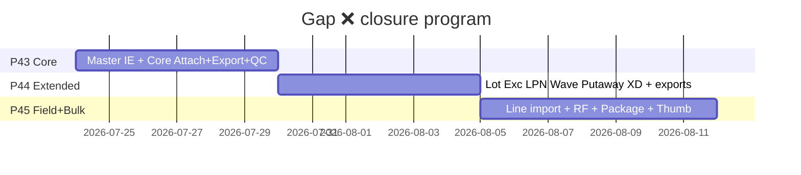

# PHASE 43: Core Ops Attach + Master Spreadsheet

## Execution Spec Maturity

| Mục | Giá trị |
|---|---|
| **Mức hiện tại** | **100% Ready** (`rp1` disk freeze 2026-07-23) |
| **Option** | **B** — reuse `EntityAttachmentsPanel` + allowlist + Master IE |
| **Trạng thái** | ⏳ **Execute-Ready** · Upstream P41+P42 **ĐÓNG** · chờ FOUNDER **Proceed** `/18` |
| **Dev-days** | **5–6** (1 Dev) |
| **Critical Path** | Không |
| **Port FE** | `http://localhost:3003` |
| **Upstream** | P41 Files Hub · P42 migrate ĐÓNG |
| **Downstream** | Phase **44** · **45** (cùng chương trình đóng gap ❌) |

### Changelog plan

| Ngày | Thay đổi |
|---|---|
| 2026-07-23 | `/30` khóa P43 monolit Option B |
| 2026-07-23 | `rp` coverage 100% gap inventory |
| 2026-07-23 | FOUNDER: **tách phase nhỏ** — P43 chỉ Core; P44 Extended; P45 Line/RF/Package/Thumbnail — **đủ hết ❌** |
| 2026-07-23 | **`rp1` 100% Ready:** §22 disk freeze · khóa DI handlers · template WH/Zone khớp entity · Outbound/RMA wire path · OpsExports @ Api · **0 blocker** |
| 2026-07-23 | **`rp2` /17-auto-plan:** Function index F01–F36 + brain EP0–EP5 atomic + critic **9.5**; §23 |

### Chương trình đóng gap (SoT inventory)

Inventory đầy đủ gốc: bảng 34 dòng bên dưới. Mỗi ❌ gán **owner phase** — không sót.

| # | Module | ❌ còn | Owner |
|---|---|---|---|
| 2–4,7 | UOM/WH/Zone/Reason Excel | IE | **P43** |
| 8 | Master Import hub +4 type | dropdown | **P43** |
| 9 | Inbound | A+E | **P43** |
| 10 | Lot | A+E | **P44** |
| 11 | QC Panel Files Hub | Panel+validate | **P43** |
| 12 | Putaway | A+E | **P44** |
| 13 | Shipment | A+E | **P43** |
| 14 | Allocation Excel | — | **N/A** (không cần) |
| 15 | Wave | A+E | **P44** |
| 16 | Cross-dock | A+E | **P44** |
| 17 | RMA | A+E | **P43** |
| 18 | Inventory balances | E | **P44** |
| 19 | Stocktake | A+E | **P43** |
| 20 | Exception | A+E | **P44** |
| 21 | Replenishment | E | **P44** |
| 22 | LPN | A+E | **P44** |
| 31 | Package IE | IE | **P45** |
| 32 | ASN/Pick line import | Import | **P45** |
| 33 | RF camera upload | Mobile A | **P45** |
| 34 | Thumbnail / signed URL / OCR | Polish | **P45** |



### Gap inventory đầy đủ (giữ nguyên để đối chiếu)

**Legend:** A=Attach · E=Excel · ✅ có · ❌ thiếu

| # | Module / function | A | E | P43 slice |
|---|---|---|---|---|
| 1 | Product | ✅ | ✅ | Done P41 |
| 2 | UOM | — | ❌ | **P43 IE** |
| 3 | Warehouse | — | ❌ | **P43 IE** |
| 4 | Zone | — | ❌ | **P43 IE** |
| 5 | Location | — | ✅ | Done |
| 6 | Partner | — | ✅ | Done |
| 7 | Reason | — | ❌ | **P43 IE** |
| 8 | Master Import hub | — | ✅ 3type | **P43 +4** |
| 9 | Inbound order | ❌ | ❌ | **P43 A+E** |
| 10 | Lot | ❌ | ❌ | → P44 |
| 11 | QC Result | ⚠️ | — | **P43 Panel** |
| 12 | Putaway | ❌ | ❌ | → P44 |
| 13 | Outbound shipment | ❌ | ❌ | **P43 A+E** |
| 14 | Allocation | — | ❌ | N/A |
| 15 | Wave | ❌ | ❌ | → P44 |
| 16 | Cross-dock | ❌ | ❌ | → P44 |
| 17 | RMA | ❌ | ❌ | **P43 A+E** |
| 18 | Inventory balances | — | ❌ | → P44 |
| 19 | Stocktake | ❌ | ❌ | **P43 A+E** |
| 20 | Exception | ❌ | ❌ | → P44 |
| 21 | Replenishment | — | ❌ | → P44 |
| 22 | LPN | ❌ | ❌ | → P44 |
| 23–30 | Serial/ERP/Admin… | ✅/— | ✅/— | Done/N/A |
| 31 | Package IE | — | ❌ | → P45 |
| 32 | ASN/Pick line import | — | ❌ | → P45 |
| 33 | RF camera | ❌ | — | → P45 |
| 34 | Thumbnail/OCR | ❌ | — | → P45 |

### Quyết định khóa P43

| Câu hỏi | Quyết định |
|---|---|
| Scope P43 | Master IE 4 + Attach core + Ops export 4 + foundation checker |
| EntityTypes P43 | `PRODUCT` · `QC_RESULT` · `INBOUND_ORDER` · `SHIPMENT` · `STOCKTAKE` · `RMA_REQUEST` |
| Ops export P43 | `INBOUND_ORDERS` · `SHIPMENTS` · `STOCKTAKES` · `RMA` |
| Extensibility | `IEntityExistenceHandler` registry — P44 chỉ thêm handler + panel |
| Cap | ≤10MB image/pdf · export ≤5000 rows |
| **DI (`rp1`)** | Files **không** ProjectReference Inbound/Rma/Qc (tránh vòng Qc→Files). Handlers Inbound/Rma/Qc đăng ký tại **Api DI**. PRODUCT + SHIPMENT + STOCKTAKE check trong Files (đã ref MasterData+Inventory). |
| **OpsExports (`rp1`)** | `Nexustock.Api/Controllers/OpsExportsController.cs` (Api aggregate DbContexts) |
| **CRUD attach** | C·R·D đã có P41 (upload/bind/list/delete + URL xem/tải); P43 chỉ mở allowlist + FE wire — **không U** metadata |
| **Outbound/RMA UI** | Wire panel vào **detail pane đã có** (`selectedShipment` / `selectedRma`) — không tạo drawer mới |
| **QC UI** | Thêm `EntityAttachmentsPanel` khi có `resultId`; giữ dual-write `attachmentRefs` string compat |

---

## 1. Mục tiêu

Đóng gap ❌ **core vận hành + master spreadsheet**: foundation Files allowlist mở rộng; attach Inbound/Shipment/Stocktake/RMA/QC; import/export UOM/WH/Zone/Reason; ops export 4 list — nền cho P44/P45.

---

## 2. Phạm vi (Scope)

### In scope

| # | Deliverable |
|---|---|
| 1 | `IEntityExistenceHandler` + allowlist 6 types |
| 2 | FE panels: Inbound receive · Outbound · Stocktake · RMA · QC dialog |
| 3 | Master IE: UOMS · WAREHOUSES · ZONES · REASONS |
| 4 | `OpsExportsController` + 4 types + FE Export buttons |
| 5 | Permission `ops.export` seed |
| 6 | `tests/verify_ops_attach_p43.ps1` + evidence + dbm |
| 7 | Plan row 43 ✅ khi DoD |

### Non-negotiable

- Reuse panel + `/api/files/*`. Tenant + i18n. Không phá P41/P42.  
- P43 **không** ship Lot/Exception/LPN/Wave attach (P44).

### Out of scope → P44/P45

Xem bảng owner phía trên (#10,12,15,16,18,20–22,31–34).

---

## 3. Điều kiện đầu vào

- [x] P41 · P42 ĐÓNG  
- [x] UI Inbound/Outbound/Stocktake/RMA/QC có sẵn  
- [x] **`rp1` disk freeze** §22 + `baseline_disk_freeze.json`  
- [ ] FOUNDER Proceed P43 → `/18`  

---

## 4. Setup

| Path | Vai trò |
|---|---|
| `Files/Services/IEntityExistenceHandler.cs` **NEW** | Interface `CanHandle` / `ExistsAsync` |
| `Files/Services/AttachmentService.cs` | Allowlist 6 + gọi handlers (+ inline PRODUCT/SHIPMENT/STOCKTAKE) |
| `Files` csproj | **Giữ** MasterData+Inventory+Identity — **không** thêm Inbound/Rma/Qc |
| `Api/ExistenceHandlers/*.cs` **NEW** | InboundOrder · RmaRequest · QcResult handlers |
| `Api/Controllers/OpsExportsController.cs` **NEW** | 4 types export |
| `Api/.../DatabaseSeeder.cs` | + `ops.export` |
| `MasterData/.../ImportService.cs` | +4 types (template khớp entity §7.2) |
| `MasterData/.../ExportsController.cs` | +4 types |
| `frontend/.../inbound/[id]/receive/page.tsx` | Panel `INBOUND_ORDER` |
| `frontend/.../outbound/page.tsx` | Panel trong detail `selectedShipment` |
| `frontend/.../inventory/stocktakes/[id]/page.tsx` | Panel `STOCKTAKE` |
| `frontend/.../rma/page.tsx` | Panel trong detail `selectedRma` |
| `frontend/.../qc-result-dialog.tsx` | Panel `QC_RESULT` + giữ compat upload string |
| `frontend/.../export-buttons.tsx` + master pages + import | Types mới |
| `frontend` inbound/outbound/stocktakes/rma list | Export CSV/Excel |
| `tests/verify_ops_attach_p43.ps1` **NEW** | Gates |

---

## 5. Permissions

| Permission | Ghi chú |
|---|---|
| `files.*` | Reuse |
| `master_data.import` / `master_data.export` | Reuse |
| `ops.export` **NEW** | Admin + WarehouseManager |

---

## 6. Database

Không migration Files. Allowlist code:

```text
PRODUCT | QC_RESULT | INBOUND_ORDER | SHIPMENT | STOCKTAKE | RMA_REQUEST
```

| entityType | DbContext |
|---|---|
| PRODUCT | MasterData |
| QC_RESULT | Qc (`qc_results` — validate thật) |
| INBOUND_ORDER | Inbound |
| SHIPMENT / STOCKTAKE | Inventory |
| RMA_REQUEST | Rma |

---

## 7. API Contract

### Attachments
Giữ `/api/files/upload|attachments` — entityType mở rộng.  
Errors: `ENTITY_TYPE_NOT_ALLOWED` · `ATTACHMENT_ENTITY_NOT_FOUND`

### Master IE
| type | Columns (**khớp entity disk — `rp1`**) |
|---|---|
| UOMS | `code,name,isActive,errorMessage` → `Uom` |
| WAREHOUSES | `code,name,description,isActive,errorMessage` → `Warehouse` (**không** cột `address` — entity không có) |
| ZONES | `warehouseCode,code,name,zoneType,errorMessage` → `StorageZone` |
| REASONS | `code,reasonType,description,isActive,errorMessage` → `ReasonCode` |

### Ops export
`GET /api/ops-exports?type=&format=csv|xlsx` · `ops.export`

| type | Cột chính (**khớp disk**) |
|---|---|
| INBOUND_ORDERS | orderNo, status, partnerId, createdAt, itemCount |
| SHIPMENTS | shipmentNo, status, partnerId, createdAt, lineCount |
| STOCKTAKES | stocktakeNo, status, zoneId, totalVarianceAmount, createdAt |
| RMA | rmaNo, status, createdAt, itemCount |

> Partner **code/name** join MasterData nếu có sẵn trong query Api; nếu join phức tạp MVP dùng `partnerId` Guid string — khóa EP4.

---

## 8. UI

| Màn | entityType |
|---|---|
| Inbound receive | `INBOUND_ORDER` |
| Outbound detail | `SHIPMENT` |
| Stocktake `[id]` | `STOCKTAKE` |
| RMA detail | `RMA_REQUEST` |
| QC result dialog | `QC_RESULT` (pending upload nếu chưa có id) |

Master: ExportButtons + import dropdown +4.  
Ops lists: Export CSV/Excel.

---

## 9. Execution Flow

```csharp
public async Task EnsureExistsAsync(string entityType, Guid entityId, CancellationToken ct)
{
    var handler = _handlers.FirstOrDefault(h => h.CanHandle(entityType))
        ?? throw new FileDomainException("ENTITY_TYPE_NOT_ALLOWED", "...", 400);
    if (!await handler.ExistsAsync(entityId, ct))
        throw new FileDomainException("ATTACHMENT_ENTITY_NOT_FOUND", "...", 404);
}
```

---

## 10. Business Rules

Allowlist cứng · soft-delete attachment · export cap 5000 · panel chỉ khi có entityId · QC dual-write string refs OK.

---

## 11. Exception Handling

| Code | HTTP |
|---|---|
| `ENTITY_TYPE_NOT_ALLOWED` | 400 |
| `ATTACHMENT_ENTITY_NOT_FOUND` | 404 |
| `OPS_EXPORT_TYPE_INVALID` | 400 |
| `IMPORT_TOO_LARGE` | 400 |

---

## 12. Observability

Audit `files.attach.bind` + entityType · log ops-export rowCount.

---

## 13. Test Plan

Unit: allowlist reject · bind missing inbound 404.  
Integration: upload+bind SHIPMENT · export UOMS xlsx · ops RMA csv.  
dbm: 5 panels + master export + inbound export.  
Regression: `verify_files_spreadsheet` · `verify_storage_migrate`.

---

## 14. Acceptance Criteria (DoD)

- [ ] Allowlist 6 + handlers PASS  
- [ ] Panels Inbound·Outbound·Stocktake·RMA·QC  
- [ ] Master IE 4 types csv\|xlsx  
- [ ] Ops export 4 types  
- [ ] verify_ops_attach_p43 PASS · dbm · plan row ✅  
- [ ] ❌ owner=P43 trong inventory = **0 còn thiếu**  

---

## 15. Out of Scope

P44/P45 toàn bộ. Allocation N/A.

---

## 16. Downstream

P44 phụ thuộc handler registry + `OpsExportsController` scaffold.  
P45 phụ thuộc Files upload mobile-ready (API đã có).

---

## 17. Rollback

Revert allowlist/FE; storage giữ file; không DROP bảng.

---

## 18. Bảo trì

Thêm entity = handler + allowlist + panel (P44 pattern).

---

## 19. Auto-Critique → 95%

| # | Rủi ro | Xử lý |
|---|---|---|
| 1 | Scope phình | Tách P44/P45 — P43 ≤6d |
| 2 | DI circular | Handler registry |
| 3 | QC validate | AnyAsync qc_results |
| 4 | Outbound UI | Drawer/dialog |
| 5 | ❌ sót | Bảng owner bắt buộc DoD |

**Maturity:** **95% Ready** (`/30`) → **100% Ready** sau `rp1` §22.

| Vai trò | Kết luận | Ngày |
|---|---|---|
| JARVIS | **`rp1` PASS — 100% Ready** · disk freeze · 0 blocker | 2026-07-23 |
| JARVIS | **`rp2` PASS** — F01–F36 · critic **9.5** · sẵn sàng `rp3` / Proceed `/18` | 2026-07-23 |
| FOUNDER | ☐ Proceed `/18` · ☐ `rp3` · ☐ Hold | ____ |

---

## 20. EP (`/18`)

| EP | Goal | Ghi chú `rp1` |
|---|---|---|
| EP0 | `IEntityExistenceHandler` + evidence | Không ref Inbound/Rma/Qc từ Files csproj |
| EP1 | Allowlist 6 + handlers Api + PRODUCT/SHIPMENT/STOCKTAKE | QC_RESULT validate thật |
| EP2 | FE 5 panels | Outbound/RMA = detail pane có sẵn |
| EP3 | Master IE 4 | Template §7.2 đã khóa entity |
| EP4 | OpsExports @ Api + FE | 4 types |
| EP5 | verify + docs + plan row | DoD |

---

## 21. Liên kết

- [Phase 44](file:///d:/1_Project/48_Nexustock/planning/phases/phase_44_extended_ops_attachments_exports.md)  
- [Phase 45](file:///d:/1_Project/48_Nexustock/planning/phases/phase_45_line_import_rf_package_thumb.md)  
- [gap_inventory.json](file:///d:/1_Project/48_Nexustock/planning/evidence/phase_43/gap_inventory.json)  
- [baseline_disk_freeze.json](file:///d:/1_Project/48_Nexustock/planning/evidence/phase_43/baseline_disk_freeze.json)  
- [coverage_audit_pass.md](file:///d:/1_Project/48_Nexustock/planning/evidence/phase_43/coverage_audit_pass.md)

---

## 22. `rp1` — Disk freeze (2026-07-23)

### 22.1 SoT & path khóa

| Mục | Path |
|---|---|
| SoT | `planning/phases/phase_43_ops_attachments_spreadsheet.md` |
| Disk freeze | `planning/evidence/phase_43/baseline_disk_freeze.json` |
| Gap inventory | `planning/evidence/phase_43/gap_inventory.json` |
| Coverage audit | `planning/evidence/phase_43/coverage_audit_pass.md` |
| Master plan | `planning/IMPLEMENTATION_PLAN.md` row 43 |
| Upstream | P41+P42 **ĐÓNG** |

### 22.2 Inventory disk (verified)

| Artifact | Status |
|---|---|
| `Nexustock.Modules.Files` + `AttachmentService` allowlist PRODUCT/QC_RESULT | **Có** — QC_RESULT **chưa** validate exists |
| `EntityAttachmentsPanel` C·R·D + URL open | **Có** (P41) |
| `ImportService` ITEMS/LOCATIONS/PARTNERS | **Có** — thiếu UOMS/WH/ZONES/REASONS |
| `ExportsController` 3 types | **Có** |
| `MasterDataExportButtons` type union 3 | **Có** |
| Import page dropdown 3 options | **Có** |
| `ops.export` permission | **Chưa** |
| `OpsExportsController` | **Chưa** |
| Panel trên Inbound/Outbound/Stocktake/RMA/QC | **Chưa** |
| `IEntityExistenceHandler` | **Chưa** |
| Files csproj → Inventory + MasterData | **Có** |
| Files → Inbound/Rma/Qc | **Không** (đúng — Qc đã ref Files) |
| Outbound `selectedShipment` detail pane | **Có** — wire panel đây |
| RMA `selectedRma` detail pane | **Có** — wire panel đây |
| Inbound receive page | **Có** |
| Stocktake `[id]` page | **Có** |
| Warehouse entity | `code,name,description,isActive` — **không** `address` |
| Zone entity | `StorageZone`: `warehouseId,code,name,zoneType` |
| Stocktake | `zoneId` + `totalVarianceAmount` — **không** warehouseCode |

### 22.3 P0 wire paths (khóa execute)

| # | Path |
|---|---|
| 1 | `IEntityExistenceHandler` + register Api handlers Inbound/Rma/Qc |
| 2 | `AttachmentService` allowlist 6 + existence (inline Inventory/MasterData + handlers) |
| 3 | Seed `ops.export` |
| 4 | `OpsExportsController` @ Api |
| 5 | ImportService/ExportsController +4 · FE export-buttons + import dropdown + 4 master pages |
| 6 | FE panels 5 màn |
| 7 | `tests/verify_ops_attach_p43.ps1` |

### 22.4 Blind spots đóng (`rp1`)

| Blind | Khóa |
|---|---|
| Circular DI Files↔Qc | Files **không** ProjectReference Qc; QcResult handler @ Api |
| WAREHOUSES `address` sai schema | Template = `description` |
| ZONES entity tên | `StorageZone` / bảng `storage_zones` |
| STOCKTAKES warehouseCode | Dùng `zoneId` / variance amount |
| Outbound không có trang `[id]` | Detail pane list page |
| QC chưa có resultId lúc upload | Pending uploads + bind sau create; dual-write string OK |
| partnerCode join phức tạp | MVP `partnerId` chấp nhận; enhance join EP4 nếu sẵn DTO |
| Permission seed role | Thêm ExtraPermissions + IdentitySeeder pattern hiện có (Admin nhận all / theo seeder) |

### 22.5 Verify contract (`rp1` chốt)

| Gate | Assert |
|---|---|
| Allowlist | Bind `WAVE` → 400 `ENTITY_TYPE_NOT_ALLOWED` |
| Exists | Bind fake inbound Guid → 404 |
| Happy | Upload+bind `SHIPMENT` real → 200 · list ≥1 · URL mở được |
| Master | Template UOMS/WAREHOUSES/ZONES/REASONS · preview xlsx |
| Ops | Export 4 types csv\|xlsx · 403 nếu thiếu `ops.export` |
| Regression | `verify_files_spreadsheet` · `verify_storage_migrate` |

### 22.6 EP ↔ thứ tự

EP0 → EP1 → EP2 ∥ EP3 → EP4 → EP5 (FE panels song song Master IE sau EP1).

### 22.7 Verdict `rp1`

| Mục | Giá trị |
|---|---|
| Blockers `/18` | **0** |
| Maturity | **100% Ready** |
| JARVIS | **`rp1` PASS** | 2026-07-23 |

---

## 23. `rp2` — Function index + EP atomic (2026-07-23)

### 23.1 Deliverables

| Artifact | Path |
|---|---|
| Function index | `planning/function_index_phase43_ops_attach.md` (F01–F36 · EP0–EP5) |
| Brain plan | `brain/.../implementation_plan.md` |
| Critic | `brain/.../critic_report.md` **9.5 / 10** |
| Evidence | `planning/evidence/phase_43/rp2_pass.md` |

### 23.2 Quyết định khóa thêm (`rp2`)

| Mục | Khóa |
|---|---|
| Spreadsheet helper | Reuse `MasterData.Services.SpreadsheetReader` từ Api OpsExports (ProjectReference đã có) |
| QC panel | Dual-write: Files bind **và** giữ `attachmentRefs` string khi submit result |
| Ops export FE | Component nhỏ `OpsExportButtons` (mirror MasterDataExportButtons) — tránh copy-paste 4 lần |
| i18n | MasterData.import.options.* + Admin common export labels |
| EP song song | EP2 ∥ EP3 sau EP1; EP4 sau EP1 (có thể song song EP3 nếu không conflict) |

### 23.3 Critic score

**9.5 / 10** — trừ 0.5 partner display name MVP.

### 23.4 Trace EP ↔ F (rút gọn)

| EP | F-ids | Goal |
|---|---|---|
| EP0 | F01, F11 | Interface + seed |
| EP1 | F02–F10 | Allowlist + handlers |
| EP2 | F28–F32, F34 | FE panels |
| EP3 | F19–F27 | Master IE 4 |
| EP4 | F12–F18, F33 | Ops exports |
| EP5 | F35–F36 | verify + MUST NOT |

### 23.5 Verdict `rp2`

| Mục | Giá trị |
|---|---|
| Blockers `/18` | **0** |
| Maturity | **100% Ready** (giữ) |
| JARVIS | **`rp2` PASS** — sẵn sàng `rp3` hoặc Proceed `/18` | 2026-07-23 |
