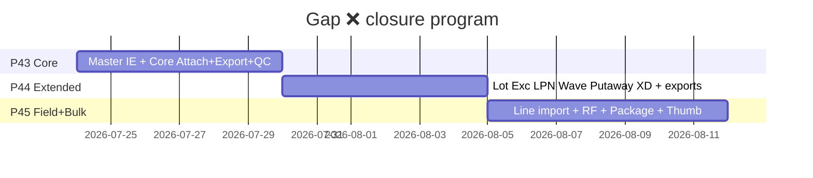

# PHASE 43: Core Ops Attach + Master Spreadsheet

## Execution Spec Maturity

| Mục | Giá trị |
|---|---|
| **Mức hiện tại** | **95% Ready** |
| **Option** | **B** — reuse `EntityAttachmentsPanel` + allowlist + Master IE |
| **Trạng thái** | ⏳ Spec Ready · Upstream P41+P42 **ĐÓNG** · chờ Proceed / `rp1` |
| **Dev-days** | **5–6** (1 Dev) |
| **Critical Path** | Không |
| **Port FE** | `http://localhost:3003` |
| **Upstream** | P41 Files Hub · P42 migrate ĐÓNG |
| **Downstream** | Phase **44** · **45** (cùng chương trình đóng gap ❌) |

### Changelog plan

| Ngày | Thay đổi |
|---|---|
| 2026-07-23 | `/30` khóa P43 monolit Option B |
| 2026-07-23 | `rp` coverage 100% gap inventory |
| 2026-07-23 | FOUNDER: **tách phase nhỏ** — P43 chỉ Core; P44 Extended; P45 Line/RF/Package/Thumbnail — **đủ hết ❌** |

### Chương trình đóng gap (SoT inventory)

Inventory đầy đủ gốc: bảng 34 dòng bên dưới. Mỗi ❌ gán **owner phase** — không sót.

| # | Module | ❌ còn | Owner |
|---|---|---|---|
| 2–4,7 | UOM/WH/Zone/Reason Excel | IE | **P43** |
| 8 | Master Import hub +4 type | dropdown | **P43** |
| 9 | Inbound | A+E | **P43** |
| 10 | Lot | A+E | **P44** |
| 11 | QC Panel Files Hub | Panel+validate | **P43** |
| 12 | Putaway | A+E | **P44** |
| 13 | Shipment | A+E | **P43** |
| 14 | Allocation Excel | — | **N/A** (không cần) |
| 15 | Wave | A+E | **P44** |
| 16 | Cross-dock | A+E | **P44** |
| 17 | RMA | A+E | **P43** |
| 18 | Inventory balances | E | **P44** |
| 19 | Stocktake | A+E | **P43** |
| 20 | Exception | A+E | **P44** |
| 21 | Replenishment | E | **P44** |
| 22 | LPN | A+E | **P44** |
| 31 | Package IE | IE | **P45** |
| 32 | ASN/Pick line import | Import | **P45** |
| 33 | RF camera upload | Mobile A | **P45** |
| 34 | Thumbnail / signed URL / OCR | Polish | **P45** |



### Gap inventory đầy đủ (giữ nguyên để đối chiếu)

**Legend:** A=Attach · E=Excel · ✅ có · ❌ thiếu

| # | Module / function | A | E | P43 slice |
|---|---|---|---|---|
| 1 | Product | ✅ | ✅ | Done P41 |
| 2 | UOM | — | ❌ | **P43 IE** |
| 3 | Warehouse | — | ❌ | **P43 IE** |
| 4 | Zone | — | ❌ | **P43 IE** |
| 5 | Location | — | ✅ | Done |
| 6 | Partner | — | ✅ | Done |
| 7 | Reason | — | ❌ | **P43 IE** |
| 8 | Master Import hub | — | ✅ 3type | **P43 +4** |
| 9 | Inbound order | ❌ | ❌ | **P43 A+E** |
| 10 | Lot | ❌ | ❌ | → P44 |
| 11 | QC Result | ⚠️ | — | **P43 Panel** |
| 12 | Putaway | ❌ | ❌ | → P44 |
| 13 | Outbound shipment | ❌ | ❌ | **P43 A+E** |
| 14 | Allocation | — | ❌ | N/A |
| 15 | Wave | ❌ | ❌ | → P44 |
| 16 | Cross-dock | ❌ | ❌ | → P44 |
| 17 | RMA | ❌ | ❌ | **P43 A+E** |
| 18 | Inventory balances | — | ❌ | → P44 |
| 19 | Stocktake | ❌ | ❌ | **P43 A+E** |
| 20 | Exception | ❌ | ❌ | → P44 |
| 21 | Replenishment | — | ❌ | → P44 |
| 22 | LPN | ❌ | ❌ | → P44 |
| 23–30 | Serial/ERP/Admin… | ✅/— | ✅/— | Done/N/A |
| 31 | Package IE | — | ❌ | → P45 |
| 32 | ASN/Pick line import | — | ❌ | → P45 |
| 33 | RF camera | ❌ | — | → P45 |
| 34 | Thumbnail/OCR | ❌ | — | → P45 |

### Quyết định khóa P43

| Câu hỏi | Quyết định |
|---|---|
| Scope P43 | Master IE 4 + Attach core 5 entity + Ops export 4 + foundation checker |
| EntityTypes P43 | `PRODUCT` · `QC_RESULT` · `INBOUND_ORDER` · `SHIPMENT` · `STOCKTAKE` · `RMA_REQUEST` |
| Ops export P43 | `INBOUND_ORDERS` · `SHIPMENTS` · `STOCKTAKES` · `RMA` |
| Extensibility | `IEntityExistenceHandler` registry — P44 chỉ thêm handler + panel |
| Cap | ≤10MB image/pdf · export ≤5000 rows |

---

## 1. Mục tiêu

Đóng gap ❌ **core vận hành + master spreadsheet**: foundation Files allowlist mở rộng; attach Inbound/Shipment/Stocktake/RMA/QC; import/export UOM/WH/Zone/Reason; ops export 4 list — nền cho P44/P45.

---

## 2. Phạm vi (Scope)

### In scope

| # | Deliverable |
|---|---|
| 1 | `IEntityExistenceHandler` + allowlist 6 types |
| 2 | FE panels: Inbound receive · Outbound · Stocktake · RMA · QC dialog |
| 3 | Master IE: UOMS · WAREHOUSES · ZONES · REASONS |
| 4 | `OpsExportsController` + 4 types + FE Export buttons |
| 5 | Permission `ops.export` seed |
| 6 | `tests/verify_ops_attach_p43.ps1` + evidence + dbm |
| 7 | Plan row 43 ✅ khi DoD |

### Non-negotiable

- Reuse panel + `/api/files/*`. Tenant + i18n. Không phá P41/P42.  
- P43 **không** ship Lot/Exception/LPN/Wave attach (P44).

### Out of scope → P44/P45

Xem bảng owner phía trên (#10,12,15,16,18,20–22,31–34).

---

## 3. Điều kiện đầu vào

- [x] P41 · P42 ĐÓNG  
- [x] UI Inbound/Outbound/Stocktake/RMA/QC có sẵn  
- [ ] FOUNDER Proceed P43  
- [ ] `rp1` khuyến nghị  

---

## 4. Setup

| Path | Vai trò |
|---|---|
| `Files/.../IEntityExistenceHandler.cs` | Registry handlers |
| `Files/.../AttachmentService.cs` | Allowlist 6 |
| `MasterData/.../ImportService.cs` | +4 types |
| `MasterData/.../ExportsController.cs` | +4 types |
| `.../OpsExportsController.cs` **NEW** | 4 types P43 |
| FE inbound/outbound/stocktake/rma/qc | Panels |
| FE master uoms/warehouses/zones/reasons + import | IE |
| `tests/verify_ops_attach_p43.ps1` | Gates |

---

## 5. Permissions

| Permission | Ghi chú |
|---|---|
| `files.*` | Reuse |
| `master_data.import` / `master_data.export` | Reuse |
| `ops.export` **NEW** | Admin + WarehouseManager |

---

## 6. Database

Không migration Files. Allowlist code:

```text
PRODUCT | QC_RESULT | INBOUND_ORDER | SHIPMENT | STOCKTAKE | RMA_REQUEST
```

| entityType | DbContext |
|---|---|
| PRODUCT | MasterData |
| QC_RESULT | Qc (`qc_results` — validate thật) |
| INBOUND_ORDER | Inbound |
| SHIPMENT / STOCKTAKE | Inventory |
| RMA_REQUEST | Rma |

---

## 7. API Contract

### Attachments
Giữ `/api/files/upload|attachments` — entityType mở rộng.  
Errors: `ENTITY_TYPE_NOT_ALLOWED` · `ATTACHMENT_ENTITY_NOT_FOUND`

### Master IE
| type | Columns |
|---|---|
| UOMS | `code,name,errorMessage` |
| WAREHOUSES | `code,name,address,errorMessage` |
| ZONES | `warehouseCode,code,name,errorMessage` |
| REASONS | `code,reasonType,description,isActive,errorMessage` |

### Ops export
`GET /api/ops-exports?type=&format=csv|xlsx` · `ops.export`

| type | Cột chính |
|---|---|
| INBOUND_ORDERS | orderNo, status, partnerCode, createdAt, itemCount |
| SHIPMENTS | shipmentNo, status, partnerCode, createdAt, lineCount |
| STOCKTAKES | stocktakeNo, status, warehouseCode, createdAt, varianceCount |
| RMA | rmaNo, status, partnerCode, createdAt, itemCount |

---

## 8. UI

| Màn | entityType |
|---|---|
| Inbound receive | `INBOUND_ORDER` |
| Outbound detail | `SHIPMENT` |
| Stocktake `[id]` | `STOCKTAKE` |
| RMA detail | `RMA_REQUEST` |
| QC result dialog | `QC_RESULT` (pending upload nếu chưa có id) |

Master: ExportButtons + import dropdown +4.  
Ops lists: Export CSV/Excel.

---

## 9. Execution Flow

```csharp
public async Task EnsureExistsAsync(string entityType, Guid entityId, CancellationToken ct)
{
    var handler = _handlers.FirstOrDefault(h => h.CanHandle(entityType))
        ?? throw new FileDomainException("ENTITY_TYPE_NOT_ALLOWED", "...", 400);
    if (!await handler.ExistsAsync(entityId, ct))
        throw new FileDomainException("ATTACHMENT_ENTITY_NOT_FOUND", "...", 404);
}
```

---

## 10. Business Rules

Allowlist cứng · soft-delete attachment · export cap 5000 · panel chỉ khi có entityId · QC dual-write string refs OK.

---

## 11. Exception Handling

| Code | HTTP |
|---|---|
| `ENTITY_TYPE_NOT_ALLOWED` | 400 |
| `ATTACHMENT_ENTITY_NOT_FOUND` | 404 |
| `OPS_EXPORT_TYPE_INVALID` | 400 |
| `IMPORT_TOO_LARGE` | 400 |

---

## 12. Observability

Audit `files.attach.bind` + entityType · log ops-export rowCount.

---

## 13. Test Plan

Unit: allowlist reject · bind missing inbound 404.  
Integration: upload+bind SHIPMENT · export UOMS xlsx · ops RMA csv.  
dbm: 5 panels + master export + inbound export.  
Regression: `verify_files_spreadsheet` · `verify_storage_migrate`.

---

## 14. Acceptance Criteria (DoD)

- [ ] Allowlist 6 + handlers PASS  
- [ ] Panels Inbound·Outbound·Stocktake·RMA·QC  
- [ ] Master IE 4 types csv\|xlsx  
- [ ] Ops export 4 types  
- [ ] verify_ops_attach_p43 PASS · dbm · plan row ✅  
- [ ] ❌ owner=P43 trong inventory = **0 còn thiếu**  

---

## 15. Out of Scope

P44/P45 toàn bộ. Allocation N/A.

---

## 16. Downstream

P44 phụ thuộc handler registry + `OpsExportsController` scaffold.  
P45 phụ thuộc Files upload mobile-ready (API đã có).

---

## 17. Rollback

Revert allowlist/FE; storage giữ file; không DROP bảng.

---

## 18. Bảo trì

Thêm entity = handler + allowlist + panel (P44 pattern).

---

## 19. Auto-Critique → 95%

| # | Rủi ro | Xử lý |
|---|---|---|
| 1 | Scope phình | Tách P44/P45 — P43 ≤6d |
| 2 | DI circular | Handler registry |
| 3 | QC validate | AnyAsync qc_results |
| 4 | Outbound UI | Drawer/dialog |
| 5 | ❌ sót | Bảng owner bắt buộc DoD |

**Maturity:** **95% Ready**

| Vai trò | Kết luận | Ngày |
|---|---|---|
| JARVIS | Tách 3 phase · P43 Core · đủ ❌ theo owner | 2026-07-23 |
| FOUNDER | ☐ Proceed P43 · ☐ `rp1` · ☐ Hold | ____ |

---

## 20. EP (`/18`)

| EP | Goal |
|---|---|
| EP0 | Handlers stub + evidence |
| EP1 | Allowlist 6 + bind |
| EP2 | FE 5 panels |
| EP3 | Master IE 4 |
| EP4 | Ops export 4 + FE |
| EP5 | verify + docs |

---

## 21. Liên kết

- [Phase 44](file:///d:/1_Project/48_Nexustock/planning/phases/phase_44_extended_ops_attachments_exports.md)  
- [Phase 45](file:///d:/1_Project/48_Nexustock/planning/phases/phase_45_line_import_rf_package_thumb.md)  
- [gap_inventory.json](file:///d:/1_Project/48_Nexustock/planning/evidence/phase_43/gap_inventory.json)
