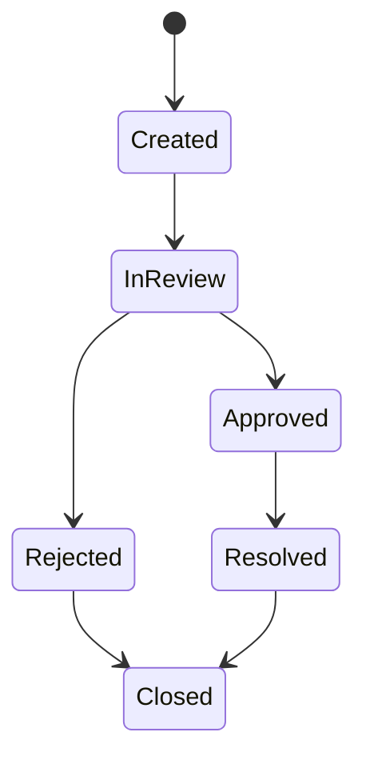

# PHASE 4: RF/MOBILE SCAN FLOW & EXCEPTION FRAMEWORK

Phase này chuẩn hóa toàn bộ thao tác kho theo hướng handheld/mobile-first và thiết lập khung xử lý ngoại lệ vận hành.

---

## 1. Mục tiêu

* Mỗi thao tác kho cốt lõi có flow quét mã rõ ràng.
* Người vận hành thao tác theo từng bước: quét, xác nhận, xử lý cảnh báo, hoàn tất.
* Mọi lỗi vận hành được gom vào exception framework thống nhất.
* Mọi thao tác scan quan trọng có audit trail, device trace và activity timeline.

---

## 2. Flow scan bắt buộc

| Flow | Mã cần quét | Kết quả |
|---|---|---|
| Nhận hàng | PO/Invoice, Item, Lot, LPN, vị trí nhận | Tạo Lot, đưa vào QC hoặc chờ cất hàng |
| QC | Lot, mẫu kiểm, vị trí QC | Hold, release, reject hoặc chuyển cách ly |
| Cất hàng | Lot/LPN, vị trí đích | Cập nhật tồn theo vị trí |
| Chuyển vị trí | Lot/LPN, vị trí nguồn, vị trí đích | Tạo movement transaction |
| Kiểm kê | Vị trí, Lot/LPN, số lượng | Ghi nhận chênh lệch |
| Picking | Pick task, vị trí, Lot/LPN | Xác nhận lấy hàng đúng rule |
| Packing | Shipment, Item/Lot/LPN, cân nặng | Đóng gói và in tem |
| RMA | Return code, Item, Lot/Serial | Tạo yêu cầu phân loại hàng trả |

---

## 3. Chuẩn UI handheld

* Mỗi màn hình chỉ phục vụ một tác vụ chính.
* Input scan luôn được focus mặc định.
* Font lớn, tương phản cao, thao tác một tay.
* Không hiển thị bảng dữ liệu lớn trên handheld.
* Phản hồi rõ bằng trạng thái: `Ready`, `Validating`, `Confirm required`, `Completed`, `Blocked`, `Exception created`.

---

## 4. Exception framework

### Nhóm lỗi bắt buộc

* Sai mã hàng.
* Sai Lot hoặc Lot không tồn tại.
* Sai vị trí nguồn/đích.
* Thiếu hàng hoặc dư hàng.
* Hàng hư, tem hư hoặc tem không đọc được.
* Mất mạng hoặc đồng bộ lỗi.
* Cân lỗi hoặc cân mất kết nối.
* In tem lỗi hoặc máy in mất kết nối.

### Vòng đời exception

### Dữ liệu tối thiểu

| Trường | Mục đích |
|---|---|
| exceptionNo | Mã ngoại lệ |
| exceptionType | Loại lỗi |
| severity | Mức độ ưu tiên |
| referenceType, referenceId | Nghiệp vụ liên quan |
| itemId, lotId, lpnId | Đối tượng hàng hóa |
| sourceLocationId, targetLocationId | Vị trí liên quan |
| reasonCodeId | Lý do chuẩn hóa |
| status | Trạng thái xử lý |
| createdBy, approvedBy, resolvedBy | Người xử lý |
| deviceId, traceId | Thiết bị và mã truy vết |

---

## 5. Queue mất kết nối tạm thời

* Lưu thao tác scan cục bộ theo thứ tự phát sinh.
* Mỗi thao tác có `clientOperationId` để chống gửi trùng.
* Khi kết nối lại, đồng bộ theo FIFO.
* Nếu dữ liệu kho đã thay đổi, chuyển thao tác sang exception thay vì tự ghi đè.
* Không cho offline với thao tác rủi ro cao: điều chỉnh tồn, duyệt exception, release QC.

---

## 6. API cần có

| API | Mục đích |
|---|---|
| `POST /api/mobile/scan/validate` | Kiểm tra mã scan theo context |
| `POST /api/mobile/tasks/{id}/complete` | Hoàn tất tác vụ scan |
| `POST /api/mobile/offline-sync` | Đồng bộ queue offline |
| `POST /api/exceptions` | Tạo exception |
| `POST /api/exceptions/{id}/approve` | Duyệt exception |
| `POST /api/exceptions/{id}/resolve` | Xử lý exception |
| `GET /api/exceptions/open` | Danh sách exception mở |

---

## 7. Tiêu chí hoàn tất

* Tất cả flow nhập, QC, cất hàng, chuyển vị trí, kiểm kê, picking, packing có flow scan.
* Sai mã, sai Lot, sai vị trí, thiếu hàng, dư hàng đều tạo exception chuẩn.
* Có audit log và trace ID cho từng thao tác scan.
* Có cơ chế offline queue tối thiểu và chống đồng bộ trùng.
* Có E2E test cho ít nhất 5 flow scan chính.
